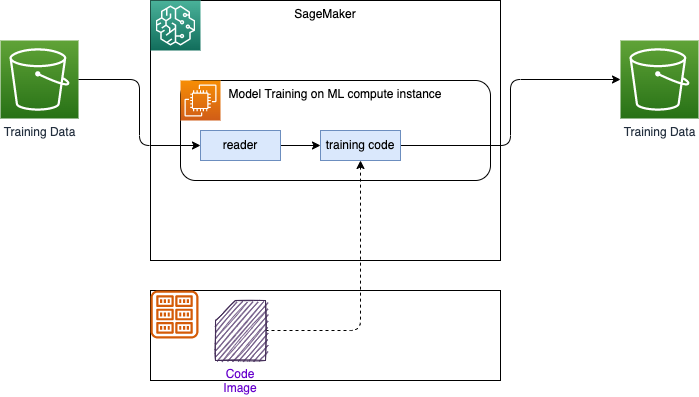
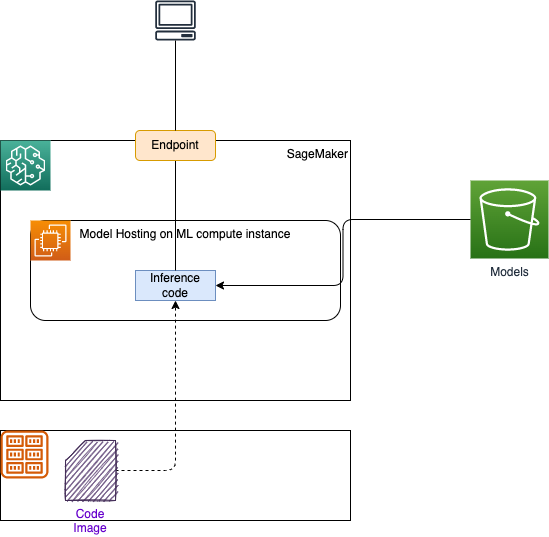
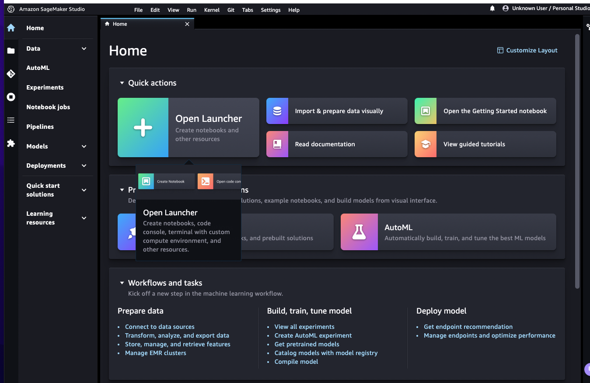

# AI and ML services introduction

## [Rekognition](https://docs.aws.amazon.com/rekognition/latest/dg/what-is.html)

For detection inside of image or video. Used for face detection, labeling, celebrity recognition...

[Code samples](https://github.com/awsdocs/aws-doc-sdk-examples/tree/main/python/example_code/rekognition#code-examples)

## [Transcribe](https://docs.aws.amazon.com/transcribe/latest/dg/what-is.html)

Audio to Text.

## [Polly](https://docs.aws.amazon.com/polly/latest/dg/what-is.html)

Text to speech. It uses speech synthesis markup language (SSML) to help us put emphasize on words, includes breathing sounds, whispering.... Also it is possible to customize the pronunciation of words and do substitution using Pronunciations lexicons.

## [Translate](https://docs.aws.amazon.com/translate/latest/dg/what-is.html)

Text translation service that uses advanced machine learning technologies to provide high-quality translation on demand.

## [Lex](https://docs.aws.amazon.com/lex/latest/dg/what-is.html)

Build conversational bots or chatbots. Lex includes speech to text, and NLU.

## [Amazon Connect](https://docs.aws.amazon.com/connect/latest/adminguide/what-is-amazon-connect.html)

Cloud contact center.

## [Comprehend](https://docs.aws.amazon.com/comprehend/latest/dg/what-is.html)

Uses natural language processing (NLP) to extract insights about the content of documents. Entities extraction,...

## [SageMaker](https://docs.aws.amazon.com/sagemaker/latest/dg/what-is.html)

Fully managed machine learning service, for developer and data scientists to develop machine learning models then directly deploy them into a production-ready hosted environment. 

Benefits:

* Labelling raw data and active learning
* Fully managed notebook
* **Amazon SageMaker Clarify** helps improve your machine learning (ML) models by detecting potential bias and helping explain the predictions that models make.

The figure below explains how SageMaker works for model training, by using S3 bucket as source of data (Ground Truth), EC2 Container registry to get predefined image, models are persisted in S3 bucket output folder:



We can create a training job with the SageMaker console or using the API.

After you train your machine learning model, you can deploy it using Amazon SageMaker deployment depending of the use cases:

* One prediction at a time, use real-time inference hosting service

    

* Workloads that tolerate cold start can use [serverless inference](https://docs.aws.amazon.com/sagemaker/latest/dg/serverless-endpoints.html)
* For large payload > 1GB, long processing, use [Asynchronous inference](https://docs.aws.amazon.com/sagemaker/latest/dg/async-inference.html)
* Prediction on a dataset use batch processing.

[Pricing information](https://aws.amazon.com/sagemaker/pricing/)


### [Simple tutorial](https://aws.amazon.com/getting-started/hands-on/build-train-deploy-machine-learning-model-sagemaker/?ref=gsrchandson)

Classical steps are:

* Create a SageMaker notebook instance - Need an IAM role to access any S3 bucket, or an existing S3 bucket - Use Jupyter notebook with Conda and Python3 - 
* Prepare the data: create S3 bucket, load csv source from public data set, build train and test data sets.
* Train the model to learn from the data

    ```python
    import sagemaker
    # Use SageMaker estimator 
    sess = sagemaker.Session()
    xgb = sagemaker.estimator.Estimator(xgboost_container, role, instance_count=1, 
                    instance_type='ml.m4.xlarge',
                    output_path='s3://{}/{}/output'.format(bucket_name, prefix),
                    sagemaker_session=sess)
    xgb.set_hyperparameters(max_depth=5, eta=0.2, gamma=4, min_child_weight=6, subsample=0.8, silent=0,
                objective='binary:logistic', num_round=100)
    # fit on the training set
    xgb.fit({'train': s3_input_train})
    ```

* Deploy the model

    ```python
    xgb_predictor = xgb.deploy(initial_instance_count=1,instance_type='ml.m4.xlarge')
    ```

* Evaluate your ML model's performance

    ```python
    from sagemaker.serializers import CSVSerializer

    test_data_array = test_data.drop(['y_no', 'y_yes'], axis=1).values #load the data into an array
    xgb_predictor.serializer = CSVSerializer() # set the serializer type
    predictions = xgb_predictor.predict(test_data_array).decode('utf-8') # predict!
    predictions_array = np.fromstring(predictions[1:], sep=',') # and turn the prediction into an array
    print(predictions_array.shape)
    ```

    It generates a confusion matrix like:

    ```sh
    Overall Classification Rate: 89.5%

    Predicted      No Purchase    Purchase
    Observed
    No Purchase    90% (10769)    37% (167)
    Purchase        10% (1133)     63% (288) 

    ```

### SageMaker Studio

A  [**Domain**](https://docs.aws.amazon.com/sagemaker/latest/dg/studio-entity-status.html) consists of an associated Amazon Elastic File System (Amazon EFS) volume; a list of authorized users; and a variety of security, application, policy, and Amazon Virtual Private Cloud (Amazon VPC) configurations. To use Studio we need to get a Domain sets up. Each user in a domain receives a personal and private home directory within the EFS for notebooks, Git repositories, and data files. Within a domain data scientists and developers can work on the same data and models.

After creating a Domain, we got a User Portal to access the environment. Members given access to Studio have a unique sign-in URL that directly opens Studio, and they sign in with their IAM Identity Center credentials.

Once a user from Identity Service is assigned to a Domain, he can start Studio.




### Deeper dive

* [x] [Onboard to Amazon SageMaker Domain Using IAM Identity Center](https://docs.aws.amazon.com/sagemaker/latest/dg/onboard-sso-users.html) to define user in IAM-IC and then use Domain in SageMaker to authorize users to login via SSO.
* [x] [Labs: Creating a scikit-learn Random Forest Classifier in AWS SageMaker](https://learn.acloud.guru/handson/1a4b7e56-0177-40a3-b03b-d6fb4457b092). Applied to company risk to churn demo in 
* [x] [Add permissions to your Amazon SageMaker Studio account](https://aws.amazon.com/getting-started/hands-on/machine-learning-tutorial-set-up-sagemaker-studio-account-permissions/) when we need to enable access from Studio to SageMakerAPI using the IAM policies `AmazonSageMakerFullAccess` and `AWSCloudFormationFullAccess`. The lab is little bit old, so now in SageMaker we need to access user via Domain.

Please ensure that the role "arn:aws:iam::4...:role/service-role/AmazonSageMaker-ExecutionRole-20221207T113525" exists and that its trust relationship policy allows the action "sts:AssumeRole" for the service principal "sagemaker.amazonaws.com". Also ensure that the role has "s3:GetObject" permissions and that the object is located in us-west-2.

## [Forecast](https://docs.aws.amazon.com/forecast/latest/dg/what-is-forecast.html)

Fully managed service that uses statistical and machine learning algorithms to deliver highly accurate time-series forecasts.

## [Kendra](https://docs.aws.amazon.com/kendra/latest/dg/what-is.html)

Highly accurate and intelligent search service that enables users to search unstructured and structured data using natural language processing and advanced search algorithms. 

## [Personalize](https://docs.aws.amazon.com/personalize/latest/dg/what-is.html)

Fully managed machine learning service that uses your data to generate item recommendations for your users.