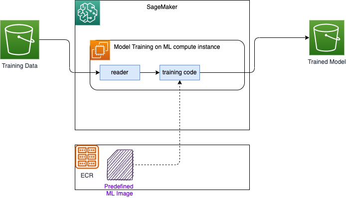
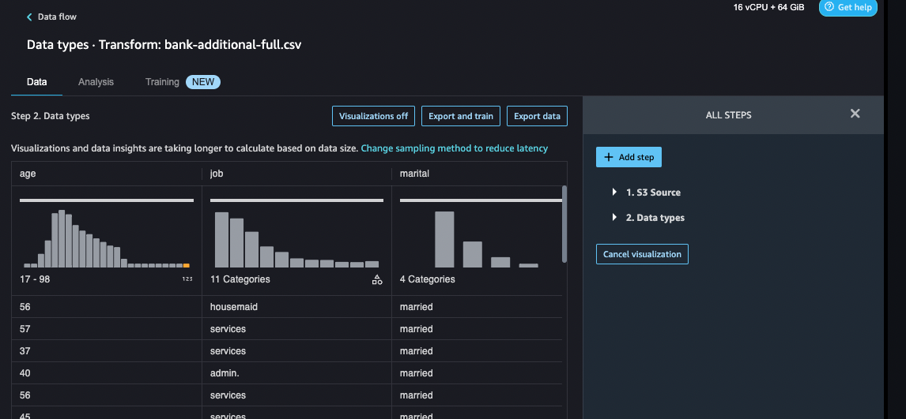
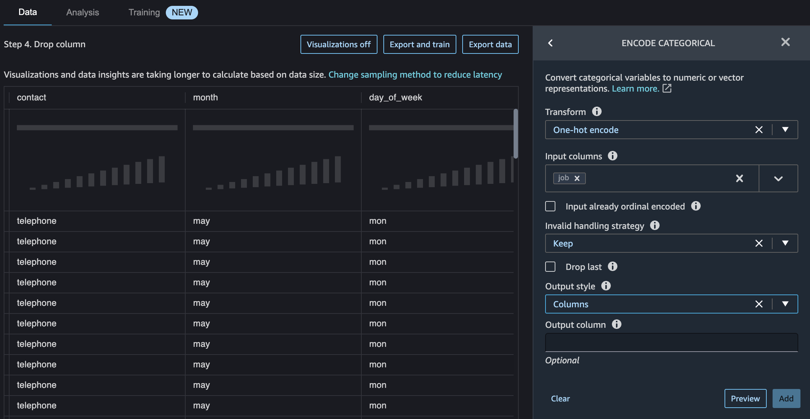
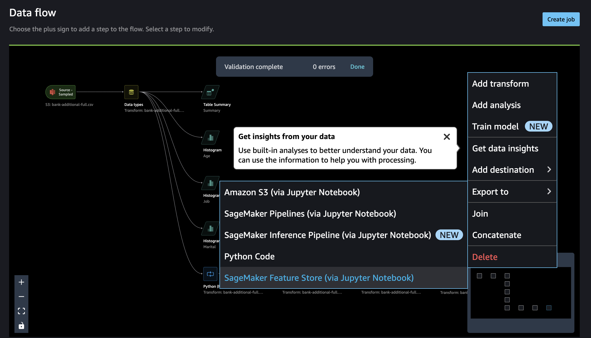

# AI and ML services introduction

## [Rekognition](https://docs.aws.amazon.com/rekognition/latest/dg/what-is.html)

For detection inside of image or video. Used for face detection, labeling, celebrity recognition...

[Code samples](https://github.com/awsdocs/aws-doc-sdk-examples/tree/main/python/example_code/rekognition#code-examples)

## [Transcribe](https://docs.aws.amazon.com/transcribe/latest/dg/what-is.html)

Audio to Text.

## [Polly](https://docs.aws.amazon.com/polly/latest/dg/what-is.html)

Text to speech. It uses speech synthesis markup language (SSML) to help us put emphasize on words, includes breathing sounds, whispering.... Also it is possible to customize the pronunciation of words and do substitution using Pronunciations lexicons.

## [Translate](https://docs.aws.amazon.com/translate/latest/dg/what-is.html)

Text translation service that uses advanced machine learning technologies to provide high-quality translation on demand.

## [Lex](https://docs.aws.amazon.com/lex/latest/dg/what-is.html)

Build conversational bots or chatbots. Lex includes speech to text, and NLU.

## [Amazon Connect](https://docs.aws.amazon.com/connect/latest/adminguide/what-is-amazon-connect.html)

Cloud contact center.

## [Comprehend](https://docs.aws.amazon.com/comprehend/latest/dg/what-is.html)

Uses natural language processing (NLP) to extract insights about the content of documents. Entities extraction,...

## [SageMaker](https://docs.aws.amazon.com/sagemaker/latest/dg/what-is.html)

Fully managed machine learning service, for developer and data scientists to develop machine learning models then directly deploy them into a production-ready hosted environment. 

Benefits:

* Labelling raw data and active learning
* Fully managed notebook
* **Amazon SageMaker Clarify** helps improve your machine learning (ML) models by detecting potential bias and helping explain the predictions that models make.

The figure below explains how SageMaker works for model training, by using S3 bucket as source of data (Ground Truth), ECR Container registry to get predefined image, models are persisted in S3 bucket output folder:



Amazon SageMaker always uses Docker containers when running scripts, training algorithms, and deploying models. We can create a training job with the SageMaker console, AWS CLI, Python notebook,  or using the SageMaker Python SDK.

After you train your machine learning model, you can deploy it using Amazon SageMaker deployment depending of the use cases:

* One prediction at a time, use real-time inference hosting service

    

* Workloads that tolerate cold start can use [serverless inference](https://docs.aws.amazon.com/sagemaker/latest/dg/serverless-endpoints.html)
* For large payload > 1GB, long processing, use [Asynchronous inference](https://docs.aws.amazon.com/sagemaker/latest/dg/async-inference.html)
* Prediction on a dataset use batch processing.

[Pricing information](https://aws.amazon.com/sagemaker/pricing/)

### SageMaker Studio

A single, web-based IDE to do all the ML development tasks. It supports the classical ML development steps of:

* Prepare Data
* Build Model using Notbook
* Train and tune
* Deploy and manage


A  [**Domain**](https://docs.aws.amazon.com/sagemaker/latest/dg/studio-entity-status.html) consists of an associated Amazon Elastic File System (Amazon EFS) volume; a list of authorized users; and a variety of security, application, policy, and Amazon Virtual Private Cloud (Amazon VPC) configurations. To use Studio, an administrator needs to get a Domain sets up. Each user in a domain receives a personal and private home directory within the EFS for notebooks, Git repositories, and data files. Within a domain data scientists and developers can work on the same data and models.

After creating a Domain, we got a User Portal to access the environment. Members given access to Studio have a unique sign-in URL that directly opens Studio, and they sign in with their IAM Identity Center credentials (SSO).

Once a user from Identity Service is assigned to a Domain, he can start Studio and reach the home page:


* A user needs to create an executable environment, for example Data Science one, with all the needed library to do Jupyter notebook with AWS SDK boto3. In the environment we can use Notbook, console or terminal. The environment is a EC2 machine (t3.medium) 

### A [Simple tutorial](https://aws.amazon.com/getting-started/hands-on/build-train-deploy-machine-learning-model-sagemaker/?ref=gsrchandson)

The classical model development and deployment steps are:

* Be sure to have an IAM Role created so SageMaker studio running in a EC2 instance can access remote AWS services, like S3...
* Inside Studio create a SageMaker notebook instance - Use Jupyter notebook with Conda and Python3 - 
* Prepare the data: create S3 bucket, load csv source as training data set, build train and test data sets by splitting the source data.
* Train the model to learn from the data. 

    ```python
    import sagemaker
    # Use SageMaker estimator 
    sess = sagemaker.Session()
    xgb = sagemaker.estimator.Estimator(xgboost_container, role, instance_count=1, 
                    instance_type='ml.m4.xlarge',
                    output_path='s3://{}/{}/output'.format(bucket_name, prefix),
                    sagemaker_session=sess)
    xgb.set_hyperparameters(max_depth=5, eta=0.2, gamma=4, min_child_weight=6, subsample=0.8, silent=0,
                objective='binary:logistic', num_round=100)
    # fit on the training set
    xgb.fit({'train': s3_input_train})
    ```

* Deploy the model

    ```python
    xgb_predictor = xgb.deploy(initial_instance_count=1,instance_type='ml.m4.xlarge')
    ```

* Evaluate your ML model's performance

    ```python
    from sagemaker.serializers import CSVSerializer

    test_data_array = test_data.drop(['y_no', 'y_yes'], axis=1).values #load the data into an array
    xgb_predictor.serializer = CSVSerializer() # set the serializer type
    predictions = xgb_predictor.predict(test_data_array).decode('utf-8') # predict!
    predictions_array = np.fromstring(predictions[1:], sep=',') # and turn the prediction into an array
    print(predictions_array.shape)
    ```

    It generates a confusion matrix like:

    ```sh
    Overall Classification Rate: 89.5%

    Predicted      No Purchase    Purchase
    Observed
    No Purchase    90% (10769)    37% (167)
    Purchase        10% (1133)     63% (288) 

    ```

### Data Wrangler

Data Wrangler is a tool to help do feature engineering, and build data workflow, from defining connection to data source, and import dataset:


To perform data analysis: looking at data types, 




Adding table summary to the flow to get means, min, max... per column like `pd.describe()` results:


We can add more analysis like histograms, or add a custom transformation containing several Python Pandas, like creating new columns, dropping columns, do one_hot_encoding for categorical data.



We can also use the Feature Store as a centralized storage for all the features potentially created by multiple teams and that can then also be retrieved consumed by multiple teams. The access is not obvious (Use + on last tranformation for example):



### Develop with sklearn library and deploy with SageMaker

A typical training script loads data from the input channels, configures training with hyperparameters, trains a model, and saves a model to model_dir so that it can be hosted later

* [SageMaker Studio Immersion Day](https://catalog.us-east-1.prod.workshops.aws/workshops/63069e26-921c-4ce1-9cc7-dd882ff62575/en-US).
* [See the tutorial: Using SKLearn with SageMaker](https://sagemaker.readthedocs.io/en/stable/frameworks/sklearn/using_sklearn.html#deploy-a-scikit-learn-model) and a code to compute a RandomForest for a SaaS company assessing the risk of their customers to churn [big-data-tenant-analytics > CompanyRisk](https://github.com/jbcodeforce/big-data-tenant-analytics/tree/main/CompanyRisk).
* [See also: Using the SageMaker Python SDK](https://sagemaker.readthedocs.io/en/stable/overview.html#using-the-sagemaker-python-sdk): SageMaker Python SDK provides several high-level abstractions for working with Amazon SageMaker.

Scripts, training and test data sets are in s3. The SDK helps to access SageMaker constructs and deploy the model as a service with reachable endpoint. The endpoint runs a SageMaker-provided Scikit-learn model server and hosts the model produced by your training script.

As SageMaker Pythin SDK uses a Docker image to create sklearn environment we can define our own image with our custom libraries via a `requirements.txt`.

We run Scikit-learn training scripts on SageMaker by creating SKLearn Estimators.

### Deeper dive

* [x] [Onboard to Amazon SageMaker Domain Using IAM Identity Center](https://docs.aws.amazon.com/sagemaker/latest/dg/onboard-sso-users.html) to define user in IAM-IC and then use Domain in SageMaker to authorize users to login via SSO.
* [x] [Labs: Creating a scikit-learn Random Forest Classifier in AWS SageMaker](https://learn.acloud.guru/handson/1a4b7e56-0177-40a3-b03b-d6fb4457b092). Applied to company risk to churn demo in [this folder](https://github.com/jbcodeforce/big-data-tenant-analytics/tree/main/CompanyRisk).
* [Using the SageMaker Python SDK](https://sagemaker.readthedocs.io/en/stable/overview.html#using-the-sagemaker-python-sdk).
* [Examples of using SageMaker Python SDK](https://github.com/aws/amazon-sagemaker-examples/blob/main/sagemaker-python-sdk/).
* [ ] [Amazon SageMaker Workshops](https://github.com/awslabs/amazon-sagemaker-workshop)
* [gitHub Amazon SageMaker Examples](https://github.com/aws/amazon-sagemaker-examples)
* [scikit_learn_data_processing_and_model_evaluation](https://github.com/aws/amazon-sagemaker-examples/blob/main/sagemaker_processing/scikit_learn_data_processing_and_model_evaluation/scikit_learn_data_processing_and_model_evaluation.ipynb)
* [x] [Add permissions to your Amazon SageMaker Studio account](https://aws.amazon.com/getting-started/hands-on/machine-learning-tutorial-set-up-sagemaker-studio-account-permissions/) when we need to enable access from Studio to SageMakerAPI using the IAM policies `AmazonSageMakerFullAccess` and `AWSCloudFormationFullAccess`. The lab is little bit old, so now in SageMaker we need to access user via Domain.

Please ensure that the role "arn:aws:iam::4...:role/service-role/AmazonSageMaker-ExecutionRole-20221207T113525" exists and that its trust relationship policy allows the action "sts:AssumeRole" for the service principal "sagemaker.amazonaws.com". Also ensure that the role has "s3:GetObject" permissions and that the object is located in us-west-2.

## [Forecast](https://docs.aws.amazon.com/forecast/latest/dg/what-is-forecast.html)

Fully managed service that uses statistical and machine learning algorithms to deliver highly accurate time-series forecasts.

## [Kendra](https://docs.aws.amazon.com/kendra/latest/dg/what-is.html)

Highly accurate and intelligent search service that enables users to search unstructured and structured data using natural language processing and advanced search algorithms. 

## [Personalize](https://docs.aws.amazon.com/personalize/latest/dg/what-is.html)

Fully managed machine learning service that uses your data to generate item recommendations for your users.