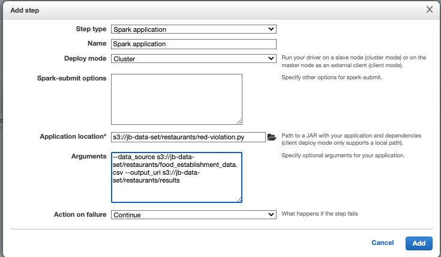

# Analytics Services

## AWS Athena

[AWS Athena](https://aws.amazon.com/athena) runs analytics directly on S3 files, using SQL language to query the files (CSV, JSON, Avro, Parquet...). `S3 Access Logs` log all the requests made to buckets, and Athena can then be used to run serverless analytics on top of the logs files. 

* No need to load the data to Athena, the query is executed on top of S3.
* Queries are done on high availability capability so will succeed, and scale based on the data size.
* No need for complex ETL jobs to prepare your data for analytics.
* Athena integrates with Amazon QuickSight for easy data visualization.
* Integrated with AWS **Glue Data Catalog**, allowing you to create a unified metadata repository across various services, crawl data sources to discover schemas and populate your Catalog with new and modified table and partition definitions, and maintain schema versioning.
* Pricing pet TB of data scanned.
* It also includes `Federated Query` to run SQL queries across data stored in relational and non-relational , object, and custom data sources. It uses the Data Source Connectors which executes a Lambda to run the Federated Query.

* Prefer using [Apache Parquet](https://parquet.apache.org/) data format for better performance and optimized cost. It is a columnar file format that provides optimizations to speed up queries and is a far more efficient file format than CSV or JSON
* Partition your data in S3 folder.

???- "CSV to Parquet"
    For Python, Pandas support it by reading the csv file into dataframe using read_csv and writing that dataframe to parquet file using `to_parquet`. [Apache Drill](https://drill.apache.org/) has also such tool. In Spark the data frame has write.parquet API. Finaly AWS Glue can also do such transformation.

### Simple demo script

* Create a S3 bucket to keep results of Athena queries.
* Create a second S3 bucket to keep source data, and upload a csv file as data source.
* Create a database in Athena:

    ```sql
    CREATE DATABASE mydatabase
    ```

* Define SQL query to create table to match the source (external table) and run it in the Editor.

    ```sql
    CREATE EXTERNAL TABLE IF NOT EXISTS tablename-datasource (
        `Date` DATE,
        Time STRING,
        Location STRING, ... 
    )
    ROW FORMAT DELIMITED
    FIELDS TERMINATED BY ','
    LINES TERMINATED BY '\n'
    LOCATION 's3://url-to-bucket'
    ```

* 

### Deeper dive

* [Product documentation](https://docs.aws.amazon.com/athena/latest/ug/what-is.html)
* [Getting started](https://docs.aws.amazon.com/athena/latest/ug/getting-started.html)
* [How do I analyze my Amazon S3 server access logs using Athena?](https://aws.amazon.com/premiumsupport/knowledge-center/analyze-logs-athena/)

## [Elastic MapReduce - EMR](https://aws.amazon.com/emr)

[EMR is a cluster](https://docs.aws.amazon.com/emr/latest/ManagementGuide/emr-overview.html) of EC2 instances which are nodes in Hadoop. There are three node types:

* **Master node**: coordinates cluster, and distribution of data and tasks among other nodes. 
* **Core node**: run tasks and store data in the Hadoop Distributed File System (HDFS) 
* **Task node**: (optional)  runs tasks and does not store data in HDFS

It comes bundled with Spark, HBase, Presto, Flink... 
When launching a cluster, it performs bootstrap actions to install custom software and applications. When the cluster is in running state, we can submit work to it. Work includes a set of steps. The cluster can auto terminate at the end of the last step.

You can submit one or more ordered steps to an Amazon EMR cluster. Each step is a unit of work that contains instructions to manipulate data for processing by software installed on the cluster.

For auto scaling of the task nodes, it uses Spot instances. Master node should be Reserved instance.

[Getting started tutorial](https://docs.aws.amazon.com/emr/latest/ManagementGuide/emr-gs.html) with Spark, Pyspark script stored in S3. The steps are summarized below and python and data are in the folder: [labs/analytics/emr-starting](https://github.com/jbcodeforce/aws-studies/tree/main/labs/analytics/emr-starting). The goal is to process food establishment inspection data.

* Create a cluster using the script `create-cluster.sh`
* In the console, once the cluster is in waiting mode, add a step with Spark Application, in cluster deployment mode, 

    

    Or run `deploy-app.sh`.

* The results looks like

    ```csv
    name,total_red_violations
    SUBWAY,322
    T-MOBILE PARK,315
    WHOLE FOODS MARKET,299
    ...
    ```

for another example see [the playground](../playground/spark-emr.md).

See [Pricing](https://docs.aws.amazon.com/emr/latest/ManagementGuide/emr-gs.html) based on EC2 type and region.

### [EMR on EKS](https://docs.aws.amazon.com/emr/latest/EMR-on-EKS-DevelopmentGuide/emr-eks.html)

Advantages:

* Run with other workload deployed on EKS. Fully managed lifecycle of the EMR jobs.
* 3x faster performance.
* Improves resource utilization and simplifies infrastructure management across multiple Availability Zones.
* Deploy in seconds instead of minutes.
* Centrally manage a common computing platform to consolidate EMR workloads with other apps. Access to built-in monitoring and logging functionality.
* Reduce operational overhead with automated Kubernetes cluster management and OS patching


* Amazon EMR uses virtual clusters to run jobs and host endpoints. A virtual cluster is a Kubernetes namespace that Amazon EMR is registered with. 

#### Deployment and setup

* [Prepare a EKS cluster](../serverless/eks.md)
* Amazon EMR on EKS needs CoreDNS for running jobs on EKS cluster. So update CoreDNS if needed.
* [Enable cluster access for Amazon EMR on EKS](https://docs.aws.amazon.com/emr/latest/EMR-on-EKS-DevelopmentGuide/setting-up-cluster-access.html) to a specific namespace by creating a k8s role, role binding to a k8s user, and map this user to the service linked role `AWSServiceRoleForAmazonEMRContainers`.
* [Enable IAM Roles for Service Accounts (IRSA) on the EKS cluster](https://docs.aws.amazon.com/emr/latest/EMR-on-EKS-DevelopmentGuide/setting-up-enable-IAM.html) by creating an OIDC identity provider
* Create a job execution role

#### Deeper dive

* [](https://www.eksworkshop.com/advanced/430_emr_on_eks/)

## [QuickSight](https://aws.amazon.com/quicksight)

Dashboard tool, serverless, machine learning powered BI service.

Integrated with RDS, Aurora, Athena, S3, RedShift, OpenSearch, Timestream, with Saleforce, Jira... It can integrate to any JDBC compliant database. It can import CSV, XLSX, JSON, TSV files and log files.

If data is imported inside QuickSight, it uses in memory computation using SPICE engine.

With enterprise edition we can define groups of users.

## [Glue](https://aws.amazon.com/glue)

* It is a serverless, managed service to do ETL to do data pipeline. You can discover and connect to over 70 diverse data sources, manage your data in a centralized data catalog, and visually create, run, and monitor ETL pipelines to load data into your data lakes.
* It can also do a data catalog, by starting some crawler to different data sources.
* To avoid reprocessing data, it use Job Bookmarks.
* Glue Elastic View is a feature to combine and replicate data across multiple data stores using SQL. It is like virtual table.
* Glue DataBrew to clean and normalize data using pre-built transformation.
* Glue Studio, GUI to create, run and monitor ETL jobs
* Glue Streaming ETL built on Apache Spark Structured Streaming to do data streaming compatible with Kafka, MSK and Kinesis data streaming.

## [Lake Formation](https://aws.amazon.com/lake-formation)

An abstraction layer on top of Glue to build data lake in days instead of month. The lake is on S3. It adds access control at the column level.

## Example of a big data ingestion pipeline

The requirements are:

* Use serverless ingestion pipeline.
* Collect and transform data in real-time.
* Support SQL query on transformed data.
* Persist SQL results into S3.
* Keep into warehouse and create dashboard.
* Data could come from IoT devices

A potential architecture will be:

