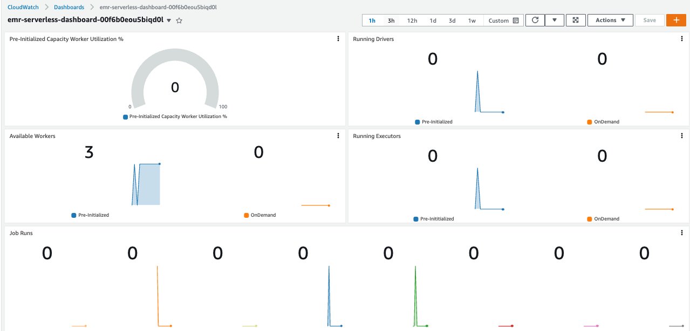
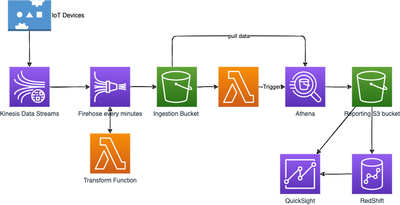

# Analytics Services

## AWS Athena

[AWS Athena](https://aws.amazon.com/athena) runs analytics directly on S3 files, using SQL language to query the files (CSV, JSON, Avro, Parquet...). `S3 Access Logs` log all the requests made to buckets, and Athena can then be used to run serverless analytics on top of the logs files. 

* No need to load the data to Athena, the query is executed on top of S3.
* Queries are done on high availability capability so will succeed, and scale based on the data size.
* No need for complex ETL jobs to prepare our data for analytics.
* Athena integrates with Amazon QuickSight for easy data visualization.
* Integrated with AWS **Glue Data Catalog**, allowing us to create a unified metadata repository across various services, crawl data sources to discover schemas and populate our Catalog with new and modified table and partition definitions, and maintain schema versioning.
* Pricing pet TB of data scanned.
* It also includes `Federated Query` to run SQL queries across data stored in relational and non-relational , object, and custom data sources. It uses the Data Source Connectors which executes a Lambda to run the Federated Query.

* Prefer using [Apache Parquet](https://parquet.apache.org/) data format for better performance and optimized cost. It is a columnar file format that provides optimizations to speed up queries and is a far more efficient file format than CSV or JSON
* Partition our data in S3 folder.

???- "CSV to Parquet"
    For Python, Pandas support it by reading the csv file into dataframe using read_csv and writing that dataframe to parquet file using `to_parquet`. [Apache Drill](https://drill.apache.org/) has also such tool. In Spark the data frame has write.parquet API. Finaly AWS Glue can also do such transformation.

### Simple demo script

* Create a S3 bucket to keep results of Athena queries.
* Create a second S3 bucket to keep source data, and upload a csv file as data source.
* Create a database in Athena:

    ```sql
    CREATE DATABASE mydatabase
    ```

* Define SQL query to create table to match the source (external table) and run it in the Editor.

    ```sql
    CREATE EXTERNAL TABLE IF NOT EXISTS tablename-datasource (
        `Date` DATE,
        Time STRING,
        Location STRING, ... 
    )
    ROW FORMAT DELIMITED
    FIELDS TERMINATED BY ','
    LINES TERMINATED BY '\n'
    LOCATION 's3://url-to-bucket'
    ```

### Lambda example

It is possible to run Athena query from Lambda function and get the result pushed in an output S3 bucket or in another place.

See the lambda code in the [labs/lambdas/s3-aurora folder](https://github.com/jbcodeforce/aws-studies/tree/main/labs/lambdas/s3-aurora).

See [boto3 Athena API.](https://boto3.amazonaws.com/v1/documentation/api/latest/reference/services/athena.html)

### Deeper dive

* [Product documentation](https://docs.aws.amazon.com/athena/latest/ug/what-is.html)
* [Getting started with Athena](https://docs.aws.amazon.com/athena/latest/ug/getting-started.html)
* [How do I analyze my Amazon S3 server access logs using Athena?](https://aws.amazon.com/premiumsupport/knowledge-center/analyze-logs-athena/)
* [See also code sample](https://docs.aws.amazon.com/athena/latest/ug/code-samples.html).
* [Calling SageMaker function from an Athena Query to do ML](https://docs.aws.amazon.com/athena/latest/ug/querying-mlmodel.html).

## [Elastic MapReduce - EMR](https://aws.amazon.com/emr)

[EMR is a cluster](https://docs.aws.amazon.com/emr/latest/ManagementGuide/emr-overview.html) of EC2 instances which are nodes in Hadoop (HDFS). We can use reserved instance and spot instances to reduce costs. There are three node types:

* **Master node**: coordinates cluster, and distribution of data and tasks among other nodes. 
* **Core node**: run tasks and store data in the Hadoop Distributed File System (HDFS) 
* **Task node**: (optional)  runs tasks and does not store data in HDFS

It comes bundled with Spark, HBase, Presto, Flink... 
When launching a cluster, it performs bootstrap actions to install custom software and applications. When the cluster is in running state, we can submit work to it. Work includes a set of steps. The cluster can auto terminate at the end of the last step.

You can submit one or more ordered steps to an Amazon EMR cluster. Each step is a unit of work that contains instructions to manipulate data for processing by software installed on the cluster.

For auto scaling of the task nodes, it uses Spot instances. Master node should be Reserved instance.

[Getting started tutorial](https://docs.aws.amazon.com/emr/latest/ManagementGuide/emr-gs.html) with Spark, Pyspark script stored in S3. The steps are summarized below and python and data are in the folder: [labs/analytics/emr-starting](https://github.com/jbcodeforce/aws-studies/tree/main/labs/analytics/emr-starting). The goal is to process food establishment inspection data.

* Create a cluster using the script `create-cluster.sh` (it uses `aws emr create-cluster ` command).
* In the console, once the cluster is in waiting mode, add a step with Spark Application, in cluster deployment mode, 

    

    Or run `deploy-app.sh` (it uses `aws emr add-steps` command).

* The results looks like

    ```csv
    name,total_red_violations
    SUBWAY,322
    T-MOBILE PARK,315
    WHOLE FOODS MARKET,299
    ...
    ```

For other examples see [the playground](../playground/spark-emr.md).

See [Pricing](https://docs.aws.amazon.com/emr/latest/ManagementGuide/emr-gs.html) based on EC2 type and region.

### [EMR Serverless](https://us-west-2.console.aws.amazon.com/emr/home?region=us-west-2#/serverless)

The newest and easiest way for data analysts and engineers to run open-source big data analytics frameworks without configuring, managing, and scaling clusters and servers.

Mostly work from EMR Studio, we can ubmit jobsv ia APIs or EMR Studio. We an also submit jobs using workflow orchestration services like AWS Step Functions, Apache Airflow, or AWS Managed Workflows for Apache Airflow.

* Logging: By default, EMR Serverless stores application logs securely in Amazon EMR managed storage for a maximum of 30 days. Before our jobs can send log data to Amazon S3, we must allow `s3:PutObject` on the `arn:aws:s3:::.../*` s3 bucket, in the permissions policy for the job runtime role. 
* Monitoring with CloudWatch custom dashboard: See the CloudFormation definition under emr-serverless and using the command `./defineCWdashboard.sh`, we can get a dashboard for the Serverless EMR application:

    

    So we need to define a dashboard per application.

    Every minute EMR Serverless emits (CPUAllocated, IdleWorkerCount,MaxCPUAllowed) metrics at the application level as well at the worker-type and capacity-allocation-type levels.

* [Tutorial - getting started](https://docs.aws.amazon.com/emr/latest/EMR-Serverless-UserGuide/getting-started.html). 

    * We need an IAM role with a custom trust policy to enable others to perform actions in this account (see role `EMRServerlessS3RuntimeRole` and security policy `EMRServerlessS3AndGlueAccessPolicy`). 
    * Use EMR Studio and create an application. We can now use Graviton as CPU

    

    * Define the PySpark script to be used and put it in a S3 bucket. For example WordCount.py
    
    ```sh
    aws s3 cp s3://us-east-1.elasticmapreduce/emr-containers/samples/wordcount/scripts/wordcount.py s3://jb-data-set/scripts/
    ```

    * Define a job using the script, using the **Spark properties** of: `--conf spark.executor.cores=1 --conf spark.executor.memory=4g --conf spark.driver.cores=1 --conf spark.driver.memory=4g --conf spark.executor.instances=1`

    

    * Once the job run status shows as Success, you can view the output of the job in the S3 bucket.
    * Log should be in logs folder.
    * Delete output from s3 bucket: `aws s3 rm s3://jb-data-set/emr-serverless-spark/ --recursive`

* **WordCount.py app with CLI:** Scripts are under [emr-serverless](https://github.com/jbcodeforce/aws-studies/tree/main/labs/analytics/emr-serverless)

    * If the application was not created before like in manual step above, use the command like (whicj is in the script `createApplication.sh`) 
    
    ```
    aws emr-serverless create-application --release-label emr-6.8.0 --type "SPARK"  --name My_First_Application
    ```
    
    * Get the application ID: `./getApplicationId.sh My_First_Application`
    * Be sure to have the wordcount.py in the scripts folder in s3 bucket
    
    ```sh
    aws s3 cp s3://us-east-1.elasticmapreduce/emr-containers/samples/wordcount/scripts/wordcount.py s3://DOC-EXAMPLE-BUCKET/scripts/
    ```
    
    * Get the role ARN 

    ```sh
    aws iam list-roles | jq -r '.Roles[] | select(.RoleName=="EMRServerlessS3RuntimeRole") | .Arn '
    ```
    * Submit the job:  `./submitJob.sh`. The output looks like:

    ```
    {
    "applicationId": "00f6b0eou5biqd0l",
    "jobRunId": "00f6b25bek7v3f0l",
    "arn": "arn:aws:emr-serverless:us-west-2:....:/applications/00f6b0eou5biqd0l/jobruns/00f6b25bek7v3f0l"
    }
    ```

### [EMR on EKS](https://docs.aws.amazon.com/emr/latest/EMR-on-EKS-DevelopmentGuide/emr-eks.html)

Advantages:

* Run with other workload deployed on EKS. Fully managed lifecycle of the EMR jobs.
* 3x faster performance.
* Improves resource utilization and simplifies infrastructure management across multiple Availability Zones.
* Deploy in seconds instead of minutes.
* Centrally manage a common computing platform to consolidate EMR workloads with other apps. Access to built-in monitoring and logging functionality.
* Reduce operational overhead with automated Kubernetes cluster management and OS patching


* Amazon EMR uses virtual clusters to run jobs and host endpoints. A virtual cluster is a Kubernetes namespace that Amazon EMR is registered with. 

#### Deployment and setup

* [Prepare a EKS cluster](../serverless/eks.md)
* Amazon EMR on EKS needs CoreDNS for running jobs on EKS cluster. So update CoreDNS if needed.
* [Enable cluster access for Amazon EMR on EKS](https://docs.aws.amazon.com/emr/latest/EMR-on-EKS-DevelopmentGuide/setting-up-cluster-access.html) to a specific namespace by creating a k8s role, role binding to a k8s user, and map this user to the service linked role `AWSServiceRoleForAmazonEMRContainers`.
* [Enable IAM Roles for Service Accounts (IRSA) on the EKS cluster](https://docs.aws.amazon.com/emr/latest/EMR-on-EKS-DevelopmentGuide/setting-up-enable-IAM.html) by creating an OIDC identity provider
* Create a job execution role

#### Deeper dive

* [](https://www.eksworkshop.com/advanced/430_emr_on_eks/)

## [QuickSight](https://docs.aws.amazon.com/quicksight/latest/user/welcome.html)

Dashboard tool, serverless, machine learning powered BI service.

Integrated with RDS, Aurora, Athena, S3, RedShift, OpenSearch, Timestream, with Saleforce, Jira... It can integrate to any JDBC compliant database. It can import CSV, XLSX, JSON, TSV files and log files.

If data is imported inside QuickSight, it uses in memory computation using SPICE (Super-fast, Parallel, In-memory Calculation Engine) engine.

The development process is described in the figure below (link to AWS doc)


* Defining a dataset and then working in removing column, applying filters, changing field names or data types, adding calculated fields, or use SQL to joins between tables.

Here is an example of integration with a table in Aurora


* Add Visual. A Visual can include multiple sheets. An Interactive Sheet is a collection of data expressed in visuals that users can interact with when the sheet is published to a dashboard. A Paginated Report is a collection of tables, charts, and visuals that are used to convey business critical information. 
* Create Dashboard.
* Share dashboard so it can be seen by end users.

With enterprise edition we can define groups of users, and share dataset, visual and dashboard with group or individual user.

The dataset can be shared between users so they can develop their own analysis. Visualizations can also be shared during development, then the readonly dashboard is shared for end users.

To get input data for a dashboard we can define parameters. Parameters can also be used for exchanging context between sheets.

QuickSight can generate smart queries that uses only required tables rather than joining in all tables defined in the dataset.

### Some how to

* Invite user using the right top menu (human icon), and Manage QuickSight, then invite people by email. Create Group, and then add users. The 3 letters to search really need to be the first 3 letters.
* Once data are in SPICE, they need to be refreshed to get the last records.
* Add trend and add X axis variable coming from the dataset and Value for Y.
* To add a widget to filter the data, use filter, select the column and add it to the current sheet (contextual menu)
* Add a transition from a sheet by passing the value of the selected elements.

### Deeper Dive

* [youtube channel for QuickSight.](https://www.youtube.com/c/AmazonQuickSight)
* [Demo Central - learning](https://democentral.learnquicksight.online/#)
* [Very good workshop. 5 stars](https://catalog.us-east-1.prod.workshops.aws/workshops/cd8ebba2-2ef8-431a-8f72-ca7f6761713d/en-US)
* [Build your first quicksight dashboard - video](https://www.youtube.com/watch?v=9pEhI2kwq7Y)
* [Embedding Amazon QuickSight dashboards in your applications.](https://www.youtube.com/watch?v=8ZzS48whR78) 
* [Embedding Analytics dashboard in application.](https://www.developer.quicksight.aws/home)

## [Glue](https://aws.amazon.com/glue)

* It is a serverless, managed service to do ETL to do data pipeline. You can discover and connect to over 70 diverse data sources, manage our data in a centralized data catalog, and visually create, run, and monitor ETL pipelines to load data into our data lakes.
* It can also do a data catalog, by starting some crawler to different data sources.
* To avoid reprocessing data, it use Job Bookmarks.
* Glue Elastic View is a feature to combine and replicate data across multiple data stores using SQL. It is like virtual table.
* Glue DataBrew to clean and normalize data using pre-built transformation.
* Glue Studio, GUI to create, run and monitor ETL jobs
* Glue Streaming ETL built on Apache Spark Structured Streaming to do data streaming compatible with Kafka, MSK and Kinesis data streaming.

## [Lake Formation](https://aws.amazon.com/lake-formation)

An abstraction layer on top of Glue to build data lake in days instead of month. The lake is on S3. It adds access control at the column level.

## Example of a big data ingestion pipeline

The requirements are:

* Use serverless ingestion pipeline.
* Collect and transform data in real-time.
* Support SQL query on transformed data.
* Persist SQL results into S3.
* Keep into warehouse and create dashboard.
* Data could come from IoT devices

A potential architecture will be:

