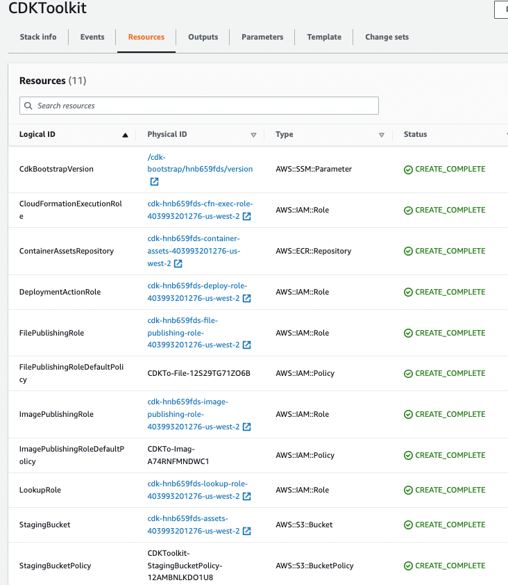

# [Cloud Development Kit - CDK](https://docs.aws.amazon.com/cdk/v2/guide/home.html)

The AWS CDK lets you build reliable, scalable, cost-effective applications in the cloud with the considerable expressive power of a programming language (Go, Java, Python, C#, JavaScript, Typescript).

Build with high-level constructs that automatically provide sensible, secure defaults for your AWS resources, defining more infrastructure with less code.

It uses AWS CloudFormation to perform infrastructure deployments predictably and repeatedly, with rollback on error. The output of an AWS CDK program is an AWS CloudFormation template.

## Install

A docker file exists under the labs folder to get an environment with nodes, python 3.9, AWS CLI, CDK CLI...

```sh
# build the docker
docker build -t jbcodeforce/aws-python .
# Start the env
./startPythonDocker.sh
# verify installation
aws s3 ls
cdk --version
```
## Concepts

A CDK app defines one or more Stacks (= CloudFormation stack). A Stack includes Constructs. Each construct defines one or more concrete AWS resources.
Constructs (and also stacks and apps) are represented as classes (types) in your programming language of choice. You instantiate constructs within a stack to declare them to AWS, and connect them to each other using well-defined interfaces.

Here is an example of constructs defined in a python class constructor for a lambda function and an API Gateway

```python
class MyLambdaStack(Stack):
    def __init__(self, scope: Construct, construct_id: str, **kwargs) -> None:
        super().__init__(scope, construct_id, **kwargs)
        my_lambda = _lambda.Function(self, 'HelloHandler',
            runtime=_lambda.Runtime.PYTHON_3_7,
            code=_lambda.Code.from_asset('lambda'),
            handler='hello.handler',
        )

        apigw.LambdaRestApi(
            self, 'Endpoint',
            handler=my_lambda,
        )
```

The AWS CDK Toolkit is a command line tool for interacting with CDK apps. Need to be in the folder of the `cdk.json` file.

```sh
cdk --version
# Get the CloudFormation template
cdk ls
```

The AWS CDK is shipped with an extensive library of constructs called the [AWS Construct Library](https://docs.aws.amazon.com/cdk/api/v2/docs/aws-construct-library.html). The construct library is divided into modules, one for each AWS service

The first time you deploy an AWS CDK app into an environment (account/region), you’ll need to install a “bootstrap stack”. This stack includes resources that are needed for the toolkit’s operation. It requires dedicated Amazon S3 buckets to store template and assets. 



* See [CDK workshops](https://cdkworkshop.com/)
* [CDK for Python API](https://docs.aws.amazon.com/cdk/api/v2/python/index.html)

## CDK Python for an EC2

* Summary of the actions to jumpstart a CDK sample app in python

```shell
# Create a python CDK project under a new created folder. The name of the folder defines the name of the app.
# It uses the sample-app template. If template is not specified the stack will have only constructor
cdk init sample-app --language python
# cdk init --language python 
# create virtual env
python3 -m venv .venv
# Active the virtual env
source .venv/bin/activate
# Install dependencies
pip install -r requirements.txt
```

* Then develop the CDK class to define the configuration like a simple EC2:

```python
from aws_cdk import (
    Stack,
    aws_ec2 as ec2)

amzn_linux = ec2.MachineImage.latest_amazon_linux(
    generation=ec2.AmazonLinuxGeneration.AMAZON_LINUX_2,
    edition=ec2.AmazonLinuxEdition.STANDARD,
    virtualization=ec2.AmazonLinuxVirt.HVM,
    storage=ec2.AmazonLinuxStorage.GENERAL_PURPOSE
)
with open("./user_data/user_data.sh") as f:
    user_data = f.read()

class Ec2Stack(Stack):
    self.instance = ec2.Instance(self, "myHttpdEC2",
                                instance_type=ec2.InstanceType("t2.micro"),
                                instance_name="mySimpleHTTPserver",
                                machine_image=amzn_linux,
                                user_data=ec2.UserData.custom(user_data),
                                )
```

See more [information on the Instance API](https://docs.aws.amazon.com/cdk/api/v2/python/aws_cdk.aws_ec2/Instance.html).

* Run the generation of the CD and then deploy to your account / region

```sh
# Synthesize the Cloud Formation template 
cdk synth
# The first time bootstrap the stack - which will create a CF CDKToolkit
cdk bootstrap
# Deploy the stack
cdk deploy
# Update the code and do a partial (hotswappable) deployment
cdk deploy --hotswap

```

* Then go to the CloudFormation console and look at the deployed stack, and resources.

See the [labs/cdk](https://github.com/jbcodeforce/aws-studies/tree/main/labs/cdk) folder for some examples of CDK stack definitions: 

| Folder | Description |
| --- | --- |
| [labs/cdk/ec2-vpc](https://github.com/jbcodeforce/aws-studies/tree/main/labs/cdk/ec2-vpc) | EC2 with VPC and public & private subnets, NAT, IGW, Bastion Host |
| [labs/cdk/cdk_workhop](https://github.com/jbcodeforce/aws-studies/tree/main/labs/cdk/cdk_workshop) | Lambda functions in python with an API gateway and TableViewer.|
| [labs ECS fargate Flask App](https://github.com/jbcodeforce/aws-studies/tree/main/labs/cdk/ecs-fargate-flask) | VPC with ECS fargate for a Flask APP where container is created during deployment | 

## Useful commands

 * `cdk ls`          list all stacks in the app
 * `cdk synth`       emits the synthesized CloudFormation template
 * `cdk deploy`      deploy this stack to your default AWS account/region
 * `cdk diff`        compare deployed stack with current state
 * `cdk docs`        open CDK documentation
 * `cdk watch`       monitors your code and assets for changes and attempts to perform a deployment automatically when a change is detected
 * `cdk destroy`    remove all the resources/stacks. Most resources will get deleted upon stack deletion. CloudWatch logs that are permanently retained

## [CDK Blueprint for EKS](https://aws.github.io/aws-eks-best-practices/)

* [Blog introduction EKS blueprint](https://aws.amazon.com/blogs/containers/bootstrapping-clusters-with-eks-blueprints/)
* [AWS CDK EKS blueprint git repo](https://aws-quickstart.github.io/cdk-eks-blueprints/)

## Other tools - samples

* [CDK API v2 for Python](https://docs.aws.amazon.com/cdk/api/v2/python/)
* [cdk-dynamo-table-viewer](https://pypi.org/project/cdk-dynamo-table-view/) An AWS CDK construct which exposes a public HTTP endpoint which displays an HTML page with the contents of a DynamoDB table in your stack.
* [AWS CDK samples in Python](https://github.com/aws-samples/aws-cdk-examples/tree/master/python)
* [Constructs HUB](https://constructs.dev/)
* [A Flask app for orders management with DynamoDB as persistence - ECR - CDK](https://github.com/jbcodeforce/python-code/tree/master/aws/dynamoDB)