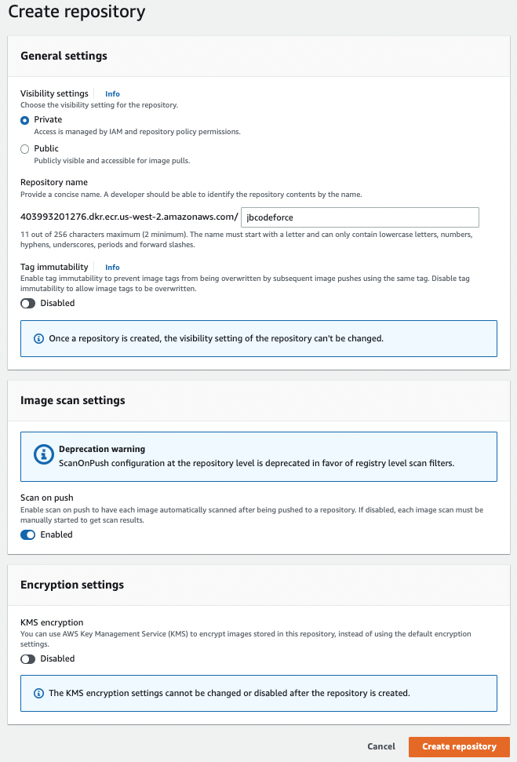

# Coding practices

## [SDK](https://aws.amazon.com/developer/tools/)

Supports a lot of languages to integrate with a lot of managed services.

## [DevOps](https://aws.amazon.com/devops/)

## [CloudFormation](https://aws.amazon.com/cloudformation)

Create and manage a collection of related AWS resources as code. The template defines AWS resources, called a stack, as Yaml or JSON. Can be uploaded from a S3 bucket or your local computer. 

Stacks are defined in region, but StackSets helps to share stacks between accounts and regions.
Stack can be created by other stack (nested).

To create a stack from our template we can use CLI, API or the Console.

Once stack is created, `Change Sets` may be applied to update the running resources. There is also the `Drift` detection feature to identify configuration changes between live resources and template. 
It is possible to use a CloudFormation public registry, with 3nd party resources published in APN.

Pay for what the resources it uses. 

## Elastic Beanstalk

[Elastic Beanstalk](https://docs.aws.amazon.com/elasticbeanstalk) is a developer centric view of the deployment of web apps on AWS using EC2, ALB, ELB, RDS, ASG...
It is a managed service and it automatically manages capacity provisioning, load balancing, scaling, health, configuration...

An application is a collection of Beanstalk components (environments, versions, configurations).

It defines two preconfigured environments:

* Web Server Tier: classical ELB, Auto scaling group and EC2s.
* Worker environment with the use of SQS queue.

It uses [CloudFormation](#cloudformation) to deploy the application and the environment.

## [Elastic Container Registry](https://docs.aws.amazon.com/ecr/)

AWS managed container image registry service that is secure, scalable, and reliable. 

An Amazon ECR **repository** contains your Docker _images_, Open Container Initiative (OCI) images, and OCI compatible artifacts. One repository per app.



Client must authenticate to Amazon ECR registries as an AWS user before it can push and pull images.

You can control access to your repositories and the images within them with repository policies.

As a developer you need AWS CLI and Docker.

[Pricing](https://aws.amazon.com/ecr/pricing/): pay for the amount of data you store in your repositories and for the data transfer from your image pushes and pulls.  50 GB per month of always-free storage for their public repositories. For private 500MB first year.
Data transfer to services within the same region is free of charge.

### Demonstration

* Create an ECR repository = to your application.

* From an EC2 instance

```sh
```

* From Laptop

```sh
aws ecr help
# Get the authentication token and authenticate the docker client
aws ecr get-login-password --region us-west-2 | docker login --username AWS --password-stdin <...>.amazonaws.com

# Can also use the docker cli, see The View push commands for your repository
docker tag jbcodeforce/autonomous-car-ride:latest <...>.amazonaws.com/jbcodeforce/autonomous-car-ride:latest
docker push  <...>.amazonaws.com/jbcodeforce/autonomous-car-ride:latest
```

## App Runner


## CodePipeline

## CodeBuild

## CodeDeploy

## CodeStar

## CloudWatch

## [AWS Proton](https://docs.aws.amazon.com/proton/latest/userguide/Welcome.html)

Automated infrastructure as code provisioning and deployment of serverless and container-based applications

## CDK