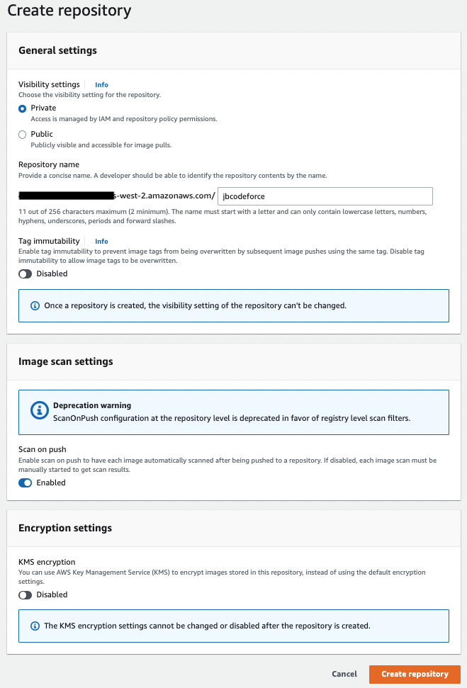

# Coding practices

## [SDK](https://aws.amazon.com/developer/tools/)

Supports a lot of languages to integrate with a lot of managed services from your business application.

## [DevOps](https://aws.amazon.com/devops/)

## [CloudFormation](./cloudFormation.md)

See [separate note](./cloudFormation.md).

## [CodeCommit](https://docs.aws.amazon.com/codecommit/)

Version control fully managed service to manage Git repositories. HA, secured, encryption at rest and in transit. 

Be sure to get the Git Credentials for the IAM user we will use to do the Git repository actions. 

* [Setup SSH connection to CodeCommit](https://docs.aws.amazon.com/codecommit/latest/userguide/setting-up-ssh-unixes.html)

## Elastic Beanstalk

[Elastic Beanstalk](https://docs.aws.amazon.com/elasticbeanstalk) is a developer centric view of the deployment of web apps on AWS using EC2, ALB, ELB, RDS, ASG...
It is a managed service and it automatically manages capacity provisioning, load balancing, scaling, health, configuration...

An application is a collection of Beanstalk components (environments, versions, configurations).

It defines two preconfigured environments:

* Web Server Tier: classical ELB, Auto scaling group and EC2s.
* Worker environment with the use of SQS queue.

It uses [CloudFormation](#cloudformation) to deploy the application and the environment.

## [Elastic Container Registry](https://docs.aws.amazon.com/ecr/)

AWS managed container image registry service that is secure, scalable, and reliable. 

An Amazon ECR **repository** contains your Docker _images_, Open Container Initiative (OCI) images, and OCI compatible artifacts. One repository per app.



Client must authenticate to Amazon ECR registries as an AWS user before it can push and pull images.

You can control access to your repositories and the images within them with repository policies.

As a developer you need AWS CLI and Docker.

[Pricing](https://aws.amazon.com/ecr/pricing/): pay for the amount of data you store in your repositories and for the data transfer from your image pushes and pulls.  50 GB per month of always-free storage for their public repositories. For private 500MB first year.
Data transfer to services within the same region is free of charge.

### Demonstration

* Create one ECR repository per app or microservice.
* From you Laptop you docker build with the ECR repo URL.

```sh
aws ecr help
# Get the authentication token and authenticate the docker client
aws ecr get-login-password --region us-west-2 | docker login --username AWS --password-stdin <...>.amazonaws.com

# Can also use the docker cli, see The View push commands for your repository
docker tag jbcodeforce/autonomous-car-ride:latest <...>.amazonaws.com/jbcodeforce/autonomous-car-ride:latest
docker push  <...>.amazonaws.com/jbcodeforce/autonomous-car-ride:latest
```

If you want to run your application using docker engine inside of EC2, create a simple EC2 and then ssh to it and add docker, and do a docker run. Here are the installation you need:

```sh
sudo apt-get update
sudo apt-get install \
    apt-transport-https \
    ca-certificates \
    curl \
    gnupg-agent \
    software-properties-common
curl -fsSL https://download.docker.com/linux/ubuntu/gpg | sudo apt-key add -
sudo apt-get install docker-ce docker-ce-cli containerd.io
apt-cache madison docker-ce
sudo apt-get install docker-ce docker-ce-cli containerd.io
sudo apt install docker.io
```

## App Runner

## [Chalice](https://aws.github.io/chalice/index.html)

A python framework to build serverless applications. We can have a REST API deployed to Amazon API Gateway and AWS Lambda in minutes.

## [Serverless Application Model](https://aws.amazon.com/serverless/sam/)

SAM is an open-source framework for building serverless applications. It provides shorthand syntax to express functions, APIs, databases, and event source mappings.
During deployment, SAM transforms and expands the SAM syntax into AWS CloudFormation syntax.

SAM CLI provides a Lambda-like execution environment that lets you locally build, test, and debug applications defined by SAM templates or through the AWS Cloud Development Kit (CDK).

* [Install](https://docs.aws.amazon.com/serverless-application-model/latest/developerguide/serverless-sam-cli-install-mac.html), which can be summarized as:

```sh
brew install aws-sam-cli
# or upgrade
brew upgrade aws-sam-cli
sam --version
```

* [Serverless pattern collection](https://serverlessland.com/patterns?framework=SAM)

## [CodePipeline](https://docs.aws.amazon.com/codepipeline/latest/userguide/welcome.html)

AWS CodePipeline is a continuous delivery service.

* [Getting started](https://docs.aws.amazon.com/codepipeline/latest/userguide/welcome.html#welcome-get-started)
* Pricing 1$ / month per pipeline. All pipelines are free for the first 30 days.

## [CodeBuild](https://docs.aws.amazon.com/codepipeline/latest/userguide/action-reference-CodeBuild.html)

AWS CodeBuild is a fully managed build service that compiles source code, runs tests, and produces software packages that are ready to deploy.

## CodeDeploy

## [CodeStar](https://aws.amazon.com/codestar/)

AWS CodeStar provides a unified user interface, enabling you to easily manage your software development activities in one place.

To start a project, you can choose from a variety of AWS CodeStar templates for Amazon EC2, AWS Lambda, and AWS Elastic Beanstalk. You have the option to choose AWS CodeCommit or GitHub to use as your project’s source control.

There is no additional charge for AWS CodeStar.

* [Getting started](https://docs.aws.amazon.com/codestar/latest/userguide/getting-started-topnode.html)
* [Product documentation](https://docs.aws.amazon.com/codestar/)

## CloudWatch

## [AWS Proton](https://docs.aws.amazon.com/proton/latest/userguide/Welcome.html)

Automated infrastructure as code provisioning and deployment of serverless and container-based applications.

## [Cloud Development Kit - CDK](https://docs.aws.amazon.com/cdk/v2/guide/home.html)

The AWS CDK lets you build reliable, scalable, cost-effective applications in the cloud with the considerable expressive power of a programming language (Go, Java, Python, C#, JavaScript, Typescript).

Build with high-level constructs that automatically provide sensible, secure defaults for your AWS resources, defining more infrastructure with less code.

It uses AWS CloudFormation to perform infrastructure deployments predictably and repeatedly, with rollback on error. The output of an AWS CDK program is an AWS CloudFormation template.

A CDK app defines one or more Stacks (= CloudFormation stack). A Stack includes Constructs. Each construct defines one or more concrete AWS resources.
Constructs (and also stacks and apps) are represented as classes (types) in your programming language of choice. You instantiate constructs within a stack to declare them to AWS, and connect them to each other using well-defined interfaces.

Here is an example of constructs defined in a python class constructor for a lambda function and an API Gateway

```python
class MyLambdaStack(Stack):
    def __init__(self, scope: Construct, construct_id: str, **kwargs) -> None:
        super().__init__(scope, construct_id, **kwargs)
        my_lambda = _lambda.Function(self, 'HelloHandler',
            runtime=_lambda.Runtime.PYTHON_3_7,
            code=_lambda.Code.from_asset('lambda'),
            handler='hello.handler',
        )

        apigw.LambdaRestApi(
            self, 'Endpoint',
            handler=my_lambda,
        )
```

The AWS CDK Toolkit is a command line tool for interacting with CDK apps. Needs to be in the folder of the `cdk.json` file.

```sh
cdk --version
# Get the CloudFormation template
cdk ls
```

The AWS CDK is shipped with an extensive library of constructs called the [AWS Construct Library](https://docs.aws.amazon.com/cdk/api/v2/docs/aws-construct-library.html). The construct library is divided into modules, one for each AWS service

The first time you deploy an AWS CDK app into an environment (account/region), you’ll need to install a “bootstrap stack”. This stack includes resources that are needed for the toolkit’s operation. It requires dedicated Amazon S3 buckets to store template and assets. 


* See [CDK workshops](https://cdkworkshop.com/)

### CDK Python for an EC2

Summary of the actions to jumpstart a sample app in python

```sh
# Create a python CDK project under a new created folder. The name of the folder defines the name of the app.
# It uses the sample-app template. If template is not specified the stack will have only constructor
cdk init sample-app --language python
# create virtual env
python3 -m venv .venv
# Active the virtual env
source .venv/bin/activate
# Install dependencies
pip install -r requirements.txt
# Synthesize the Cloud Formation template 
cdk synth
# The first time bootstrap the stack - which will create a CF CDKToolkit
cdk bootstrap
# Deploy the stack
cdk deploy
# Update the code and do a partial (hotswappable) deployment
cdk deploy --hotswap

```

Then go to the CloudFormation console and look at the deployed stack, and then resources.

See the [labs/cdk](https://github.com/jbcodeforce/aws-studies/tree/main/labs/cdk) folder for some examples of CDK stack definitions.

### Useful commands

 * `cdk ls`          list all stacks in the app
 * `cdk synth`       emits the synthesized CloudFormation template
 * `cdk deploy`      deploy this stack to your default AWS account/region
 * `cdk diff`        compare deployed stack with current state
 * `cdk docs`        open CDK documentation
 * `cdk watch`       monitors your code and assets for changes and attempts to perform a deployment automatically when a change is detected
 * `cdk destroy`    remove all the resources/stacks. Most resources will get deleted upon stack deletion. CloudWatch logs that are permanently retained

### Other tools - samples

* [cdk-dynamo-table-viewer](https://pypi.org/project/cdk-dynamo-table-view/) An AWS CDK construct which exposes a public HTTP endpoint which displays an HTML page with the contents of a DynamoDB table in your stack.
* [CDK samples in Python](https://github.com/aws-samples/aws-cdk-examples/tree/master/python)
* [Constructs HUB](https://constructs.dev/)
* [A Flask app for orders management with DynamoDB as persistence - ECR - CDK](https://github.com/jbcodeforce/python-code/tree/master/aws/dynamoDB)