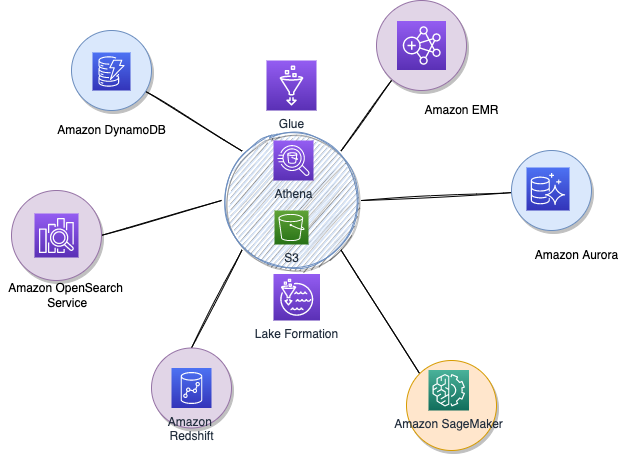

# Data Lake with AWS

Here is a mapping with AWS services to support your data strategy:

* [Amazon Redshift](./redshift.md)
* [S3](../../infra/storage/#s3-simple-storage-service)

## [EMR]()

Created in 2009, it is a managed service to run Spark, Haddop, Hive, Presto, HBase... Per-second prcing and save 50%-80% with Amazon EC2 Spot and reserved instances.

## [OpenSearch]()

Fully managed service

## [Glue](https://aws.amazon.com/glue/)

Serverless data integration and data pipeline to do ETL jobs. You can discover and connect to over 70 diverse data sources, manage your data in a centralized data catalog, and visually create, run, and monitor ETL pipelines to load data into your data lakes. Pay only for resources used while running.

* [Product documentation](https://docs.aws.amazon.com/glue/latest/dg/what-is-glue.html)
* [AWS Glue samples repository](https://github.com/aws-samples/aws-glue-samples)

## Lake Formation
