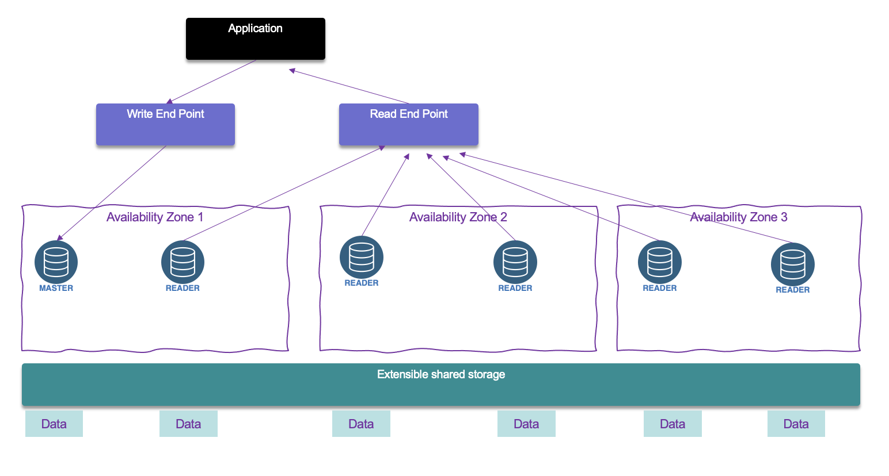

# Data services

## Relational Database Service - RDS

Managed service for SQL based database (mySQL, Postgresql, SQL server, Oracle).  Support multi AZs for DR with automatic failover to standby, app uses one unique DNS name. Continuous backup and restore to specific point of time restore. It uses gp2 or io1 EBS. Transaction logs are backed-up every 5 minutes.
Support user triggered snapshot.

* Installed in private subnet in a VPC. No public IP address. 
* Read replicas: helps to scale the read operations. Can create up to 5 replicas within AZ, cross AZ and cross region. Replication is asynch. Use cases include, reporting, analytics, ML model
* AWS charge for network when for example data goes from one AZ to another.
* Support at rest Encryption. Master needs to be encrypted to get encrypted replicas. 
* We can create a snapshot from unencrypted DB and then copy it by enabling the encryption for this snapshot. From there we can create an Encrypted DB

Our responsibility:

* Check the ports / IP / security group inbound rules in DB’s SG
* In-database user creation and permissions or manage through IAM
* Creating a database with or without public access
* Ensure parameter groups or DB is configured to only allow SSL connections

From a solution architecture point of view:

* **Operations**:  small downtime when failover happens. For maintenance, scaling in read replicas, updating underlying ec2 instance, or restore EBS, there will be manual intervention.
* **Security**: AWS responsible for OS security, we are responsible for setting up KMS, security groups, IAM policies, authorizing users in DB, enforcing SSL.
* **Reliability**: Multi AZ feature helps to address it, with failover mechanism in case of failures
* **Performance**: depends on EC2 instance type, EBS volume type, ability to add Read Replicas. Doesn’t auto-scale, adapt to workload manually. 

## Aurora

Proprietary SQL database, work using postgresql and mysql drivers. It is cloud optimized and claims 5x performance improvement over mySQL on RDS, and 3x for postgresql. 

Can grow up to 64 TB. Sub 10ms replica lag, up to 15 replicas.

Failover in Aurora is instantaneous. It’s HA (High Availability) native. Use 1 master - 5 readers to create 6 copies over 3 AZs. 3 copies of 6 need for reads. Peer to peer replication. Use 100s volumes. Autoscaling on the read operation. 

 

It is CQRS at DB level, and read can be global. Use writer end point and reader endpoint.

It also supports one write with multiple reader and parallel query, multiple writes and serverless to automate scaling down to zero (No capacity planning needed and pay per second).

With Aurora global database one primary region is used for write and then up to 5 read only regions with replica lag up to 1 s. Promoting another region (for disaster recovery) has an RTO of < 1 minute

* **Operations**:  less operation, auto scaling storage.
* **Security**: AWS responsible for OS security, we are responsible for setting up KMS, security groups, IAM policies, authorizing users in DB, enforcing SSL.
* **Reliability**: Multi AZ, HA
* **Performance**: 5x performance, up to 15 read replicas.

## ElastiCache

Get a managed Redis or Memcached cluster. Applications queries ElastiCache, if not available, get from RDS and store in ElastiCache. Key-Value store.
It can be used for user session store so user interaction can go to different application instances.

**Redis** is a multi AZ with Auto-Failover, supports read replicas to scale and for high availability. It can persist data using AOF persistence, and has backup and restore features.

**Memcached** is a multi-node for partitioning of data (sharding), and no persistence, no backup and restore. It is based on a multi-threaded architecture.

Some patterns for ElastiCache:

* **Lazy Loading**: all the read data is cached, data can become stale in cache
* **Write Through**: Adds or update data in the cache when written to a DB (no stale data)
* **Session Store**: store temporary session data in a cache (using TTL features)

Sub millisecond performance, in memory read replicas for sharding. 

## DynamoDB

AWS proprietary NoSQL database, Serverless, provisioned capacity, auto scaling, on demand capacity. Highly Available, Multi AZ  in an AWS Region by default, Read and Writes are decoupled, and DAX can be used for read cache. Data is stored on solid-state disks (SSDs).

A table is a collection of items, and each item is a collection of attributes. DynamoDB uses primary keys to uniquely identify each item in a table and secondary indexes to provide more querying flexibility

The read operations can be eventually consistent or strongly consistent.

DynamoDB Streams to integrate with AWS Lambda.

## DocumentDB

## Neptune - GraphDB

## Amazon QLDB
