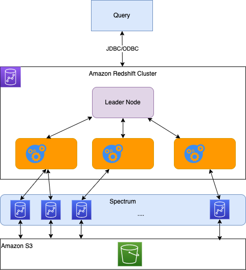

# Amazon RedShift

[Redshift](https://aws.amazon.com/redshift/) is the cloud data warehouse managed services, with no data movement or data transformation. 

Amazon Redshift uses SQL to analyze structured and semi-structured data across data warehouses, operational databases, and data lakes, using AWS-designed hardware and machine learning to deliver the best price performance at any scale.

It is based on Postgresql but is not used for OLTP. It is used for analytical processing and data warehousing, scale to Peta Bytes. It is Columnar storage of data. It uses massively parallel query execution.

Data can be loaded from S3, DynamoDB, DMS and other DBs. It can scale from 1 to 128 nodes, and each node has 160GB per node. Redshift spectrum performs queries directly on top of S3.

The cluster architecture is based on a leader node to support query planning and aggregate results, and compute nodes to perform the queries and send results back.

* Provision node size in advance, and we can use Reserved Instances for cost saving.
* RedShift is not multi-AZ, but we can use snapshots to do point-in-time backup and store in S3. Snapshots are incremental. And backup can be restored in a new cluster.
* For DR purpose snapshot can be copied to another region.
* RedShift Spectrum helps to query data already in S3 without loading them. The query is submitted to thousands of redshift spectrum nodes.

* Redshift Spectrum pushes many compute-intensive tasks, such as predicate filtering and aggregation, down to the Redshift Spectrum layer. Thus, Redshift Spectrum queries use much less of your cluster's processing capacity than other queries. 
