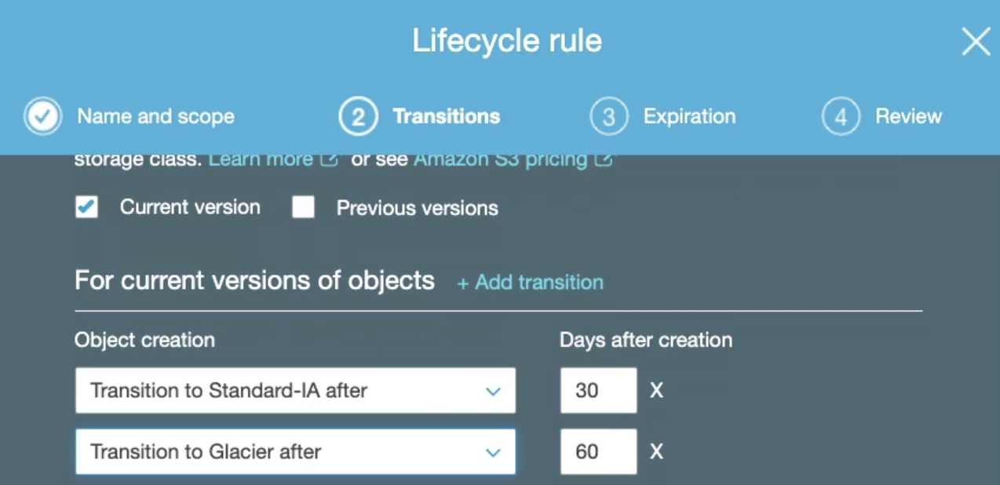
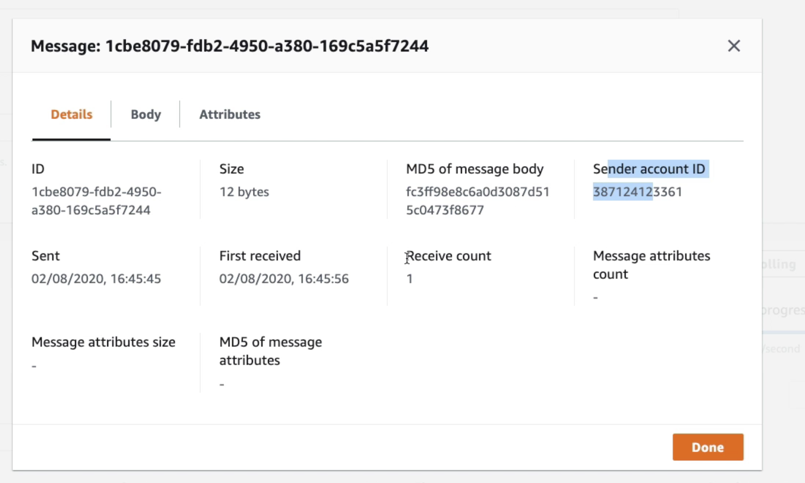
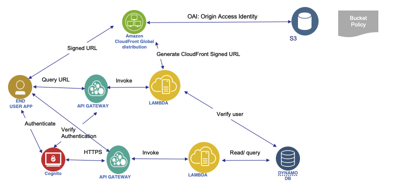
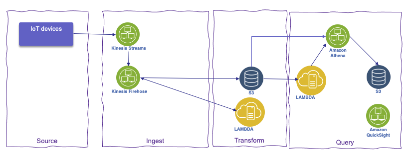

# Amazon Web Service Studies

* Created in 2002, and launched as AWS in 2004 with SQS as first service offering, 2006 to businesses.
* 2003 amazon.com was $5.2B retail businesses. 7800 employees

## Why cloud

* Moving from capex to variable expense
* Economy of scale: EC2 instance with different pricing model. Usage from hundreds of thousands of customers is aggregated in the cloud
* Elactic capacity: pay for what you use. Scale up and down so no need to guessed capacity.
* Speed and agility to define infrastructure in minutes not weeks
* Focus on business apps, not IT infrastructure and data centers.
* Global reach in a minutes

!!! note
    * The cloud transition has happened much faster because it yields great value and has fewer blockers, and bigger customer gains drive higher volume reinvestments into the platform.
    * In 2014, every day, AWS adds enough new server capacity to support Amazon's global infrastructure when it was at $7B annual

## Use cases

* Enable to build scalable apps, adaptable to business demand
* Extend Enterprise IT
* Support flexible big data analytics

## Cloud Value Frameworks

Four business value pilars:

* Cost savings: Total Cost Ownership. -50% is classical 
* Staff productivity:  62% improvement 
* Operational resilience: -32% downtime
* Business Agility: 47% improvement 


([IDC numbers](https://aws.amazon.com/resources/analyst-reports/?audit=2019q1&analyst-reports-main.sort-by=item.additionalFields.datePublished&analyst-reports-main.sort-order=desc&awsf.analyst-reports-flag=*all&awsf.tech-category=*all&awsf.analyst-reports-use-case=*all&awsf.analyst-reports-industry=*all&awsf.analyst-reports-firm=*all&awsf.analyst-reports-region=*all&awsf.analyst-reports-year=*all))

### Cost saving

* Understand the true cost of existing IT capabilities
* ROI = Cost saving / (sunk cost + migration cost)

    * For sunk cost: assess the hardware depreciation and the potential recovery value by reselling data center or hardware.
    * Migration costs: more difficult to assess, but we can use the break event migration cost per server by defining a target ROI. Now only one unknown in the previous equation: migration cost = Cost Savings / ROI - sunk cost. 

* OPEX

For actual cost, we need to consider:

* server cost with HW and SW license
* storage cost with HW and SW license
* network cost with HW and SW license
* Facilities cost for each of those machines: power, cooling, space
* SRE cost
* Extras: like project management, training, legal, advisors, contractors, cost of capital
* Think about standard depreciation of 3 or 5 years. Match to 3 year reserved instances
* Use Reserved instance volume to assess discount
* User realistic metrics and ratios like VM density,  servers, racks...)
* Explore current CPU and memory usage
* Apply cost saving by using automation and configuration as code.
* Cost assessment can take from 3 weeks to multi months.
* [Migration Evaluator](https://aws.amazon.com/migration-evaluator/) to do on-premise server analysis to optimize cloud migration planning.

### Cloud readiness

* human skills and experience required to transition to the cloud
* application readiness to migrate: dependencies, integrations, translation.
* each stakeholders (devOps, operations, CFO, procurement) have their point of view

### Additional impacts

* cost of delays - risk premium
* competition - competitve ability
* governance and compliance

### Operational resilience

It really means security and up time.
Impact for downtime is direct cost on business revenue, but also cost get back up: which include 3nd party fee, equipment replacement, recovery activities, investigation cost.... Customer churns, company's reputation...

## Infrastructure

AWS is a [global infrastructure](https://infrastructure.aws) with 27 regions and 2 to 6 availability zones per region. Ex: us-west-1-2a. 

AZ is one or more DC with redundant power, networking and connectivity. Isolated from disasters. Interconnected with low latency network. 


AWS services are local or global:

* EC2 is a regional service. Region-scoped services come with availabiltiy and resiliency. 
* IAM is a global service.

**AWS Local Zone** location is an extension of an AWS Region where you can run your latency sensitive application in geography close to end-users.

**AWS Wavelength** enables developers to build applications that deliver single-digit millisecond latencies to mobile devices and end-users. 
AWS infrastructure deployments that embed AWS compute and storage services within the telecommunications providers’ datacenters at the edge of the 5G networks, and seamlessly access the breadth of AWS services in the region.

Choose an AWS region, depending of your requirements like:

* compliance with data governance and legal requirements
* close to users to reduce latency
* [availability of service within a region](https://aws.amazon.com/about-aws/global-infrastructure/regional-product-services/) 
* pricing

## Interact with AWS

* Management console: services are placed in categories: compute, serverless, database, analytics...
* [CLI](https://aws.amazon.com/cli/)
* [SDK](https://aws.amazon.com/developer/tools/) for C++, Go, Java, JavaScript, .NET, Node.js, PHP, Python, and Ruby

## Organization

When you work with the AWS Cloud, managing security and compliance is a [shared responsibility](https://aws.amazon.com/compliance/shared-responsibility-model/) between AWS and you:

* aws is the security **of** the cloud
* you are responsible for the security **in** the cloud: secure workloads and applications that you deploy onto the cloud.

Helps to group accounts, and simplify account creation. Consolidate billing.

Concepts:

* root user: a single sign-in identity that has complete access to all AWS services and resources in the account
* Organization unit (OU)
* account be part of 1 OU
* Define service control policies

[Organization console](https://us-east-1.console.aws.amazon.com/organizations/v2/home?region=us-east-1#)

## IAM Identity and Access Management

* Help to control access to AWS services


* This is global services so defined at the account level and cross regions
* Define user (physical person), group and roles, and permissions (policies)

* Do not use root user, but create user and always use them when login. `jerome` and `mathieu` are users
* get user as administrator, meaning it will be part of an admin group with admin priviledges, like `AdmintratorAccess`

* Assign users to groups (`admin` and `developers`) and assign policies to groups and not to individual user.
* Groups can only contain users, not other groups
* Users can belong to multiple groups

* Users are defined as global service encompasses all regions
* AWS Account has a unique ID but can be set with an alias (e.g.`jbcodeforce`) so to sign in to the console the URL becomes
[https://jbcodeforce.signin.aws.amazon.com/console](https://jbcodeforce.signin.aws.amazon.com/console)

* Policies are written in JSON, to define permissions `Allow`, `Deny` for users to access AWS services, groups and roles

```json
{
    "Version": "2012-10-17",
    "Statement": [
        {
            "Effect": "Allow",
            "Action": [
                "iam:List*"
            ],
            "Resource": "*"
        }
    ]
}
```

* Policy applies to Principal: account/user/role, list the actions (what is allowed or denied) on the given resources
* Least privilege permission: Give users the minimal amount of permissions they need to do their job
* Policy can define the password type `> Account settings > Password policy`, and when users are allowed to change the password.

* Multi Factor Authentication -  always protect root account. MFA = password + device we own. The device could be a universal 2nd factor security key. (ubikey) 
* Authy is a multi-device service. We can have multiple users on the same device
* IAM is not used for website authentication and authorization
* For identity federation, SAML standard is used

### IAM Roles

* To get AWS services doing work on other service, we use IAM Role. Roles are assigned per application, or EC2 or lambda function...


* Maintaining roles is more efficient than maintaining users.  When you assume a role, IAM dynamically provides temporary credentials that expire after a defined period of time, between 15 minutes and 36 hours.

* When connected to an EC2 machine via ssh or using EC2 instance connect, we need to set the IAM roles for who can use the EC2. A command like `aws iam list-users` will not work until a role it attached.

To authorize access to a EC2 instance, we use IAM Roles. The DemoEC2Role, for example, is defined to access EC2 in read only:


This role is then defined in the EC2 / Security  > attach IAM role.

### Security tools

* In IAM, use `> Credentials report` to download account based report.
* In IAM, use `> Users > select one user (jerome) and then Access Advisor`: 
Access Advisor shows the services that this user can access and when those services were last accessed

## AWS CLI

We can access AWS using the CLI or the SDK which both use access keys generated from the console (> Users > jerome > Security credentials > Access Keys).

The keys are saved in `~/.aws/credentials`

[aws-cli version 2](https://github.com/aws/aws-cli/tree/v2)

```sh
aws --version
# get your users
aws iam list-users
```

With Cloudshell we can use aws cli and then have file that will be kept in the filesystems of the cloud shell.

[aws-shell] is also available to facilitate the user experience.

## Relational Database Service - RDS

Managed service for SQL based database (mySQL, Postgresql, SQL server, Oracle). Must provision EC2 instance and EBS volume.  Support multi AZs for DR with automatic failover to standby, app uses one unique DNS name. Continuous backup and restore to specific point of time restore. It uses gp2 or io1 EBS. Transaction logs are backed-up every 5 minutes.
Support user triggered snapshot.

* Read replicas: helps to scale the read operations. Can create up to 5 replicas within AZ, cross AZ and cross region. Replication is asynch. Use cases include, reporting, analytics, ML model
* AWS charge for network when for example data goes from one AZ to another.
* Support at rest Encryption. Master needs to be encrypted to get encrypted replicas. 
* We can create a snapshot from unencrypted DB and then copy it by enabling the encryption for this snapshot. From there we can create an Encrypted DB

Our responsibility:

* Check the ports / IP / security group inbound rules in DB’s SG
* In-database user creation and permissions or manage through IAM
* Creating a database with or without public access
* Ensure parameter groups or DB is configured to only allow SSL connections

From a solution architecture point of view:

* **Operations**:  small downtime when failover happens. For maintenance, scaling in read replicas, updating underlying ec2 instance, or restore EBS, there will be manual intervention.
* **Security**: AWS responsible for OS security, we are responsible for setting up KMS, security groups, IAM policies, authorizing users in DB, enforcing SSL.
* **Reliability**: Multi AZ feature helps to address it, with failover mechanism in case of failures
* **Performance**: depends on EC2 instance type, EBS volume type, ability to add Read Replicas. Doesn’t auto-scale, adapt to workload manually. 

## Aurora

Proprietary SQL database, work using postgresql and mysql driver. It is cloud optimized and claims 5x performance improvement over mySQL on RDS, and 3x for postgresql. 

Can grow up to 64 TB. Sub 10ms replica lag, up to 15 replicas.

Failover in Aurora is instantaneous. It’s HA (High Availability) native. Use 1 master - 5 readers to create 6 copies over 3 AZs. 3 copies of 6 need for reads. Peer to peer replication. Use 100s volumes. Autoscaling on the read operation. 

 

It is CQRS at DB level, and read can be global. Use writer end point and reader endpoint.

It also supports one write with multiple reader and parallel query, multiple writes and serverless to automate scaling down to zero (No capacity planning needed and pay per second).

With Aurora global database one primary region is used for write and then up to 5 read only regions with replica lag up to 1 s. Promoting another region (for disaster recovery) has an RTO of < 1 minute

* **Operations**:  less operation, auto scaling storage.
* **Security**: AWS responsible for OS security, we are responsible for setting up KMS, security groups, IAM policies, authorizing users in DB, enforcing SSL.
* **Reliability**: Multi AZ, HA
* **Performance**: 5x performance, up to 15 read replicas.

## ElastiCache

Get a managed Redis or Memcached cluster. Applications queries ElastiCache, if not available, get from RDS and store in ElastiCache. Key-Value store.
It can be used for user session store so user interaction can go to different application instances.

**Redis** is a multi AZ with Auto-Failover, supports read replicas to scale and for high availability. It can persist data using AOF persistence, and has backup and restore features.

**Memcached** is a multi-node for partitioning of data (sharding), and no persistence, no backup and restore. It is based on a multi-threaded architecture.

Some patterns for ElastiCache:

* **Lazy Loading**: all the read data is cached, data can become stale in cache
* **Write Through**: Adds or update data in the cache when written to a DB (no stale data)
* **Session Store**: store temporary session data in a cache (using TTL features)

Sub millisecond performance, in memory read replicas for sharding. 

## DynamoDB

AWS proprietary NoSQL database, Serverless, provisioned capacity, auto scaling, on demand capacity. Highly Available, Multi AZ by default, Read and Writes are decoupled, and DAX can be used for read cache. 

The read operations can be eventually consistent or strongly consistent.

DynamoDB Streams to integrate with AWS Lambda.

## Route 53

It is a managed Domain Name System. DNS is a collection of rules and records which helps clients understand
how to reach a server through URLs. Here is a quick figure to summary the process

 

DNS records Time to Live (TTL), is set to get the web browser to keep the DNS resolution in cache. High TTL is around 24 hours, low TTL at 60s will make more DNS calls. TTL should be set to strike a balance between how long the value should be cached vs how much pressure should go on the DNS. Need to define the TTL for the app depending on the expected deployment model.

A hosted zone is a container that holds information about how we want to route traffic for a domain. Two types are supported: public or private within a VPC.

Route 53 is a registrar. We can buy domain name.

Use `dig <hostname>` to get the DNS resolution record.

### CNAME vs Alias

[CNAME](https://en.wikipedia.org/wiki/CNAME_record) is a DNS record to maps one domain name to another. CNAME should point to a ALB. **Alias** is used to point a hostname of an AWS resource and can work on root domain (domainname.com).

### Routing

A simple routing policy to get an IP @ from a hostname could not have health check defined. 

The **weighted** routing policy controls the % of the requests that go to specific endpoint. Can do blue-green traffic management. It can also help to split traffic between two regions. It can be associated with Health Checks

The **latency** routing Policy redirects to the server that has the least latency close to the client. Latency is evaluated in terms of user to designated AWS Region.

**Health check** monitors the health and performance of the app servers or endpoints and assess DNS failure. We can have HTTP, TCP or HTTPS health checks. We can define from which region to run the health check. They are charged per HC / month. It is recommended to have one HC per app deployment. It can also monitor latency.

The **failover** routing policy helps us to specify a record set to point to a primary and then a secondary instance for DR. 

The **Geo Location** routing policy is based on user's location, and we may specify how the traffic from a given country should go to this specific IP. Need to define a “default” policy in case there’s no match on location.

The **Multi Value** routing policy is used to access multiple resources. The record set, associates a Route 53 health checks with records. The client on DNS request gets up to 8 healthy records returned for each Multi Value query. If one fails then the client can try one other IIP @ from the list.

## Some application patterns

For solution architecture, we need to assess cost, performance, reliability, security and operational excellence.

### Stateless App

The step to grow a stateless app: add vertical scaling by changing the EC2 profile, but while changing, user has out of service. Second step is to scale horizontal, each EC2 instance has static IP address and DNS is configured with 'A record' to get each EC2 end point. But if one instance is gone, the client App will see it down until TTL expires.

The reference architecture includes DNS record set with alias record (to point to ALB. Using alias as ALB address may change over time) with TTL of 1 hour. Use load balancers in 3 AZs (to survive disaster) to hide the horizontal scaling of EC2 instances (managed with auto scaling group) where the app runs. Health checks are added to keep system auto adaptable and hide system down, and restricted security group rules to control EC2 instance accesses. ALB and EC instances are in multi different AZs. The EC instances can be set up with reserved capacity to control cost.

 

### Stateful app

In this case we will add the pattern of shopping cart. If we apply the same architecture as before, at each interaction of the user, it is possible the traffic will be sent to another EC2 instance that started to process the shopping cart. Using ELB with stickiness will help to keep the traffic to the same EC2, but in case of EC2 failure we still loose the cart. An alternate is to use user cookies to keep the cart at each interaction. It is back to a stateless app as state is managed by client and cookie. For security reason the app needs to validate the cookie content. cookie has a limit of 4K data.

Another solution is to keep session data into an elastic cache, like Redis, and use the sessionId as key and persisted in a user cookie. So EC2 managing the interaction can get the cart data from the cache using the sessionID. It can be enhanced with a RDS to keep user data. Which can also support the CQRS pattern with read replicas. Cache can be update with data from RDS so if the user is requesting data in session, it hits the cache.

 

Cache and database are set on multi AZ, as well as EC2 instance and load balancer, all to support disaster. Security groups need to be defined to get all traffic to the ELB and limited traffic between ELB and EC2 and between EC2 and cache and EC2 and DB.

Another example of stateful app is the ones using image stored on disk. In this case EC2 EBS volume will work only for one app instance, but for multi app scaling out, we need to have a Elastic FS which can be Multi AZ too.

### Deploying app

The easiest solution is to create AMI containing OS, dependencies and app binary. This is completed with User Data to get dynamic configuration. Database data can be restored from Snapshot, and the same for EFS data.

[Elastic Beanstalk](https://aws.amazon.com/elasticbeanstalk/) is a developer centric view of the app, hiding the complexity of the IaaS. From one git repository it can automatically handle the deployment details of capacity provisioning, load balancing, auto-scaling, and application health monitoring. 

## S3

[Amazon S3](https://s3.console.aws.amazon.com/s3/get-started?region=us-west-1) allows people to store objects (files) in **buckets** (directories), which must have a globally unique name (cross users!). They are defined at the region level. **Object** in a bucket, is referenced as a **key** which can be seen as a file path in a file system. The max size for an object is 5 TB but big file needs to be uploaded in multipart using 5GB max size.

S3 supports versioning at the bucket level. So file can be restored from previous version, and even deleted file can be retrieved from a previous version.

### Use cases

* Backup and restore
* DR
* Archive
* [Data lakes](https://aws.amazon.com/big-data/datalakes-and-analytics/)
* Hybrid cloud storage: seamless connection between on-premises applications and S3 with AWS Storage Gateway.
* Cloud-native application data


[GETTIG started](https://docs.aws.amazon.com/AmazonS3/latest/userguide/GetStartedWithS3.html)
### Security control

Objects can also be encrypted, and different mechanisms are available:

* **SSE-S3**: server-side encrypted S3 objects using keys handled & managed by AWS using AES-256 protocol must set `x-amz-server-side-encryption: "AES256"` header in the POST request.
* **SSE-KMS**: leverage AWS Key Management Service to manage encryption keys. `x-amz-server-side-encryption: "aws:kms"` header. Server side encrypted. It gives user control of the key rotation policy and audit trail.
* **SSE-C**: when we want to manage our own encryption keys. Server-side encrypted. Encryption key must be provided in HTTP headers, for every HTTP request made. HTTPS is mandatory
* **Client Side Encryption**: encrypt before sending object.


Explicit DENY in an IAM policy will take precedence over a bucket policy permission.

### S3 Website

We can have static web site on S3. Once html pages are uploaded, setting the properties as static web site from the bucket. The bucket needs to be public, and have a security policy to allow any user to `GetObject` action. The URL may look like: `<bucket-name>.s3-website.<AWS-region>.amazonaws.com`

* **Cross Origin resource sharing CORS**: The web browser requests won’t be fulfilled unless the other origin allows for the requests, using CORS Headers `Access-Control-Allow-Origin`. If a client does a cross-origin request on our S3 bucket, we need to enable the correct CORS headers: this is done by adding a security policy with CORS configuration like:

```xml
<CORSConfiguration>
    <CORSRule>
        <AllowedOrigin>enter-bucket-url-here</AllowedOrigin>
        <AllowedMethod>GET</AllowedMethod>
        <MaxAgeSeconds>3000</MaxAgeSeconds>
        <AllowedHeader>Authorization</AllowedHeader>
    </CORSRule>
</CORSConfiguration>
```

Finally S3 is eventually consistent.

#### S3 replication

Once versioning enabled, a bucket can be replicated in the same region or cross regions. S3 replication is done on at least 3 AZs. Each AZ can be up to 8 data centers. One DC down does not impact S3 availability. The replication is done asynchronously. SRR is for log aggregation for example, while CRR is used for compliance and DR or replication across accounts. Delete operations are not replicated.

### S3 Storage classes

When uploading a document into an existing bucket we can specify the storage class for keep data over time. Different levels are offered with different cost and SLA.

 

To prevent accidental file deletes, we can setup MFA Delete to use MFA tokens before deleting objects.

Amazon **Glacier** is for archiving, like writing to tapes. 

We can transition objects between storage classes. For infrequently accessed object, move them to STANDARD_IA. For archive objects, that we don’t need in real-time, use GLACIER or DEEP_ARCHIVE. Moving objects can be automated using a lifecycle configuration

At the bucket level, a user can define lifecycle rules for when to transition an object to another storage class.

 

To improve performance, a big file can be split and then uploaded with local connection to the closed edge access and then use AWS private network to copy between buckets in different region.

[S3 to Kafka lab](https://ibm-cloud-architecture.github.io/refarch-eda/use-cases/connect-s3/)

## AWS Athena

[AWS Athena](https://aws.amazon.com/athena) runs analytics directly on S3 files, using SQL language to query the files (CSV, JSON, Avro, Parquet...). S3 Access Logs log all the requests made to buckets, and Athena can then be used to run serverless analytics on top of the logs files. Queries are done on high availability capability so will succeed, and scale based on the data size.

No need for complex ETL jobs to prepare your data for analytics.

Integrated with AWS **Glue Data Catalog**, allowing you to create a unified metadata repository across various services, crawl data sources to discover schemas and populate your Catalog with new and modified table and partition definitions, and maintain schema versioning.

## AWS CLI

The cli needs to be configured: `aws configure` with the credential, key and region to access. Use IAM user to get a new credentials key.

When using CLI in a EC2 instance always use an IAM role to control security credentials. This role can come with a policy authorizing exactly what the EC2 instances should be able to do. Also within a EC2 instance, it is possible to use the URL http://169.254.169.254/latest/meta-data to get information about the EC2. We can retrieve the IAM Role name from that metadata.

## CloudFront

CDN service with DDoS protection. It caches data to the edge to improve web browsing and app performance. 216 Edge locations.

The origins of those files are S3 buckets, Custom resource accessible via HTTP. CloudFront keeps cache for the data read. For the edge to access the S3 bucket, it uses an origin access identity (OAI), managed as IAM role.

For EC2 instance, the security group needs to accept traffic from edge location IP addresses.

It is possible to control with geo restriction.

It also supports the concept of signed URL. When you want to distribute content to different user groups over the world, attach a policy with:

* URL expiration
* IP ranges to access the data from
* Trusted signers (which AWS accounts can create signed URLs)
* How long should the URL be valid for?
* Shared content (movie, music): make it short (a few minutes)
* Private content (private to the user): you can make it last for years
* Signed URL = access to individual files (one signed URL per file)
* Signed Cookies = access to multiple files (one signed cookie for many files)

## Storage

### Snowball

Move TB of data in and out AWS using physical device to ship data. The edge has 100TB and compute power to do some local processing on data. Snow mobile is a truck with 100 PB capacity. Once on site, it is transferred to S3.

Snowball Edge brings computing capabilities to allow data pre-processing while it's being moved in Snowball, so we save time on the pre-processing side as well.

## Hybrid cloud storage

Storage gateway expose an API in front of S3. Three gateway types:

* **file**: S3 bucket accessible using NFS or SMB protocols. Controlled access via IAM roles. File gateway is installed on-premise and communicate with AWS.
* **volume**: this is a block storage using iSCSI protocol. On-premise and visible as a local volume backed by S3.
* **tape**: same approach but with virtual tape library. Can go to S3 and Glacier.

### Storage comparison

* S3: Object Storage
* Glacier: Object Archival
* EFS: Network File System for Linux instances, POSIX filesystem
* FSx for Windows: Network File System for Windows servers
* FSx for Lustre: High Performance Computing Linux file system
* EBS volumes: Network storage for one EC2 instance at a time
* Instance Storage: Physical storage for your EC2 instance (high IOPS)
* Storage Gateway: File Gateway, Volume Gateway (cache & stored), Tape Gateway
* Snowball / Snowmobile: to move large amount of data to the cloud, physically
* Database: for specific workloads, usually with indexing and querying

## Integration and middleware: SQS, Kinesis Active MQ

### SQS: Standard queue

Oldest queueing service on AWS. The default retention is 4 days up to 14 days. low latency < 10ms. Duplicate messages is possible and out of order too. Consumer deletes the message. It is auto scaling.

Specific SDK to integrate to SendMessage...

Consumers receive, process and then delete. Parallelism is possible on the different messages. The consumers can be in an auto scaling group so with CloudWatch, it is possible to monitor the queue size / # of instances and on the CloudWatch alarm action, trigger scaling. Max mesage size is 256KB. 

Message has metadata out of the box. After a message is polled by a consumer, it becomes invisible to other consumers. By default, the “message visibility timeout” is 30 seconds, which means the message has 30 seconds to be processed (Amazon SQS prevents other consumers from receiving and processing the message). After the message visibility timeout is over, the message is “visible” in SQS, so it may be processed twice. But a consumer could call the ChangeMessageVisibility API to get more time. When the visibility timeout is high (hours), and the consumer crashes then the re-processing of all the message will take time. If it is set too low (seconds), we may get duplicates

 

Encryption in fight via HTTPS, at rest encryption with KMS keys. Comes with monitoring.

If a consumer fails to process a message within the Visibility Timeout, the message goes back to the queue. But if we can set a threshold of how many times a message can go back to the queue. After the MaximumReceives threshold is exceeded, the message goes into a dead letter queue (DLQ) (which has a limit of 14 days to process).

 

Delay queues let you postpone the delivery of new messages to a queue for a number of seconds. If you create a delay queue, any messages that you send to the queue remain invisible to consumers for the duration of the delay period. The default (minimum) delay for a queue is 0 seconds. The maximum is 15 minutes

Queue can be set as FIFO to guaranty the order: limited to throughput at 300 msg/s without batching or 3000 msg/s with batching. I can also support exactly once. It can be set to remove duplicate by looking at the content.

### Simple Notification Service is for topic pub/sub

SNS supports up to 10,000,000 subscriptions per topic, 100,000 topics limit. The subscribers can publish to topic via SDK and can use different protocols like: HTTP / HTTPS (with delivery retries – how many times), SMTP,  SMS, ... The subscribers can be a SQS, a Lambda, Emails...
Many AWS services can send data directly to SNS for notifications: CloudWatch (for alarms), Auto Scaling Groups notifications, Amazon S3 (on bucket events), CloudFormation.

SNS can be combined with SQS: Producers push once in SNS, receive in all SQS queues that they subscribed to. It is fully decoupled without any data loss. SQS allows for data persistence, delayed processing and retries. SNS cannot send messages to SQS FIFO queues.

### Kinesis

It is like a managed alternative to Kafka. It uses the same principle and feature set.

 

Data can be kept up to 7 days. hability to replay data, multiple apps consume the same stream. Only one consumer per shard

* **Kinesis Streams**: low latency streaming ingest at scale. They offer patterns for data stream processing.
* **Kinesis Analytics**: perform real-time analytics on streams using SQL
* **Kinesis Firehose**: load streams into S3, Redshift, ElasticSearch. No administration, auto scaling, serverless.

One stream is made of many different shards (like Kafka partition). Capacity of 1MB/s or 1000 messages/s at write PER SHARD, and 2MB/s at read PER SHARD. Billing is per shard provisioned, can have as many shards as we want. Batching available or per message calls.

captured Metrics are: # of incoming/outgoing bytes, # incoming/outgoing records, Write / read provisioned throughput exceeded, and iterator age ms.

It offer a CLI to get stream, list streams, list shard...

### EventBridge

[EventBridge](https://aws.amazon.com/eventbridge/) is a serverless event bus that makes it easier to 
build event-driven applications at scale using events generated from your applications, integrated Software-as-a-Service (SaaS) applications, and AWS services.

You can ingest, filter, transform and deliver events without writing custom code. 

Integrate schema registry stores a collection of easy-to-find event schemas and enables you to download code bindings for those schemas in your IDE so you can represent events as a strongly-typed objects in your code

## Serverless 

Serveless on AWS is supported by a lot of services:

* **AWS Lambda**: Limited by time - short executions, runs on-demand, and automated scaling. Pay per call, duration and memory used.
* **DynamoDB**: no sql db, with HA supported by replication across three AZs. millions req/s, trillions rows, 100s TB storage. low latency on read. Support event driven programming with streams: lambda function can read the stream (24h retention). Table oriented, with dynamic attribute but primary key. 400KB max size for one document. It uses the concept of Read Capacity Unit and Write CU. It supports auto-scaling and on-demand throughput. A burst credit is authorized, when empty we get ProvisionedThroughputException. Finally it use the DynamoDB Accelerator to cache data to authorize micro second latency for cached reads. Supports transactions and bulk tx with up to 10 items. 
* AWS **Cognito**: gives users an identity to interact with the app.
* AWS **API Gateway**: API versioning, websocket support, different environment, support authentication and authorization. Handle request throttling. Cache API response. SDK. Support different security approaches:

    * IAM:
        * Great for users / roles already within your AWS account
        * Handle authentication + authorization
        * Leverages Sig v4
    * Custom Authorizer:
        * Great for 3rd party tokens
        * Very flexible in terms of what IAM policy is returned
        * Handle Authentication + Authorization
        * Pay per Lambda invocation
    * Cognito User Pool:
        * You manage your own user pool (can be backed by Facebook, Google login etc…)
        * No need to write any custom code
        * Must implement authorization in the backend
* Amazon S3
* AWS SNS & SQS
* AWS Kinesis Data Firehose
* Aurora Serverless
* Step Functions
* Fargate

Lambda@Edge is used to deploy Lambda functions alongside your CloudFront CDN, it is for building more responsive applications, closer to the end user. Lambda is deployed globally. Here are some use cases: Website security and privacy, dynamic webapp at the edge, search engine optimization (SEO), intelligent route across origins and data centers, bot mitigation at the edge, real-time image transformation, A/B testing, user authentication and authorization, user prioritization, user tracking and analytics.

### Serverless architecture patterns

#### Few write / Lot of reads app (ToDo)

The mobile application access application via REST HTTPS through API gateway. This use serverless and users should be able to directly interact with s3 buckets.  They first get JWT token to authenticate and the API gateway validates such token. The Gateway delegates to a Lambda function which goes to Dynamo DB.

 

Each of the component supports auto scaling. To improve read throughput cache is used with DAX. Also some of the REST request could be cached in the API gateway. As the application needs to access S3 directly, Cognito generates temporary credentials with STS so the application can authenticate to S3. User's credentials are not saved on the client app. Restricted policy is set to control access to S3 too.

To improve throughput we can add DAX as a caching layer in front of DynamoDB: this will also reduce the sizing for DynamoDB. Some of the responses can also be cached at the API gateway level.

#### Serverless hosted web site (Blog)

The public web site should scale globally, focus to scale on read, pure static files with some writes. To secure access to S3 content, we use Origin Access Identity and Bucket policy to authorize read only from OAI.


To get a welcome message sent when a user register to the app, we can add dynamoDB streams to get changes to the dynamoDB and then calls a lambda that will send an email with the Simple Email Service.

DynamoDB Global Table can be used to expose data in different regions by using DynamoDB streams.

#### Microservice

Services use REST api to communicate. The service can be dockerized and run with ECS. Integration via REST is done via API gateway and load balancer.


#### Paid content

User has to pay to get content (video). We have a DB for users. This is a Serverless solution. Videos are saved in S3. To serve the video, we use Signed URL. So a lambda will build those URLs.



CloudFront is used to access videos globally. OAI for security so users cannot bypass it. We can't use S3 signed URL as they are not efficient for global access.

#### Software update distribution

The EC2 will be deployed in multi-zones and all is exposed with CloudFront to cache.

#### Big Data pipeline

The solution applies the traditional collect, inject, transform and query pattern.



IoT Core allows to collect data from IoT devices. Kinesis is used to get data as streams, and then FireHose upload every minute to S3. A Lambda can already do transformation from FireHose. As new files are added to S3 bucket, it trigger a Lambda to call queries defined in Athena. Athena pull the data and build a report published to another S3 bucket that will be used by QuickSight to visualize the data.

## Other Database considerations

### Redshift

It is based on Postgresql. but not used for OLTP, it is used for analytical processing and data warehousing, scale to PBs. It is Columnar storage of data. It uses massively parallel query execution.

Data can be loaded from S3, DynamoDB, DMS and other DBs. It can scale from 1 to 128 nodes, and each node has 160GB per node.

The architecture is based on a leader node to support query planning and aggregate results, and compute nodes to perform the queries and send results back.

Redshift spectrum performs queries directly on top of S3.

