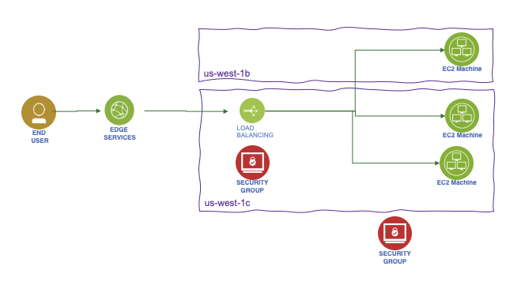

# Major infrastructure services

## Amazon Elastic Compute Cloud - EC2 components

* EC2 is a renting machine
* Amazon EC2 instances are a combination of virtual processors (vCPUs), memory, network, and, in some cases, instance storage and graphics processing units (GPUs).
* Only for what you used
* Storing data on virtual drives: [EBS](#EBS)
* Distribute load across machines using ELB
* Auto scale the service via group: ASG

EC2 can have MacOS, Linux ad Windows OS.
Amazon Machine Image: AMI, image for OS and preinstalled softwares. Amazon Linux 2 for linux base image.

 

When creating an instance, we can select the OS, CPU, RAM, the VPC, the AZ subnet, and the storage (EBS) 
for root folder to get the OS, the network card, and the firewall rules as security group. 
The security group helps to isolate the instance, for example, authorizing ssh on port 22 and HTTP port 80.
Get the public ssh key, and when the instance is started, use: `ssh -i EC2key.pem  ec2-user@ec2-52-8-75-8.us-west-1.compute.amazonaws.com ` to connect to the EC2.
The `.pem` file need to be restricted with `chmod 0400`

Can also use **EC2 Instance Connect** to open a terminal in the web browser. Still needs to get SSH port open.

### EC2 life cycle


1. When you launch an instance, it enters the pending state. Billing is not started
1. During rebooting, instance remains on the same host computer, and maintains its public and private IP address, in addition to any data on its instance store.
1. When you terminate an instance, the instance stores are erased, and you lose both the public IP address and private IP address of the machine. Storage for any Amazon EBS volumes is still charged

### Playing with Apache HTTP

The following script can be added as `User Data` (Under Advanced Details while configuring new EC2 instance) so when the instance starts it executes this code.


```shell
# Swap to root
sudo su
# update OS
yum update -y
# Get Apache HTTPd
yum install -y httpd.x86_64
# Start the service
systemctl start httpd.service
# Enable it cross restart
systemctl enable httpd.service
> Created symlink from /etc/systemd/system/multi-user.target.wants/httpd.service to /usr/lib/systemd/system/httpd.service
# Get the availability zone
EC2-AZ=$(curl -s http://169.254.169.254/latest/meta-data/placement/availability-zone)
# Change the home page by changing /var/www/html/index.html
echo "<h3>Hello World from $(hostname -f) in AZ= $EC2_AZ </h3>" > /var/www/html/index.html
```


### EC2 types

EC2 has a section to add `User data`, which could be used to define a bash script to install dependent software
 and to start some services at boot time.

EC2 **instance types** (see [ec2instances.info](https://www.ec2instances.info) or the reference [aws ec2/instance-types](https://aws.amazon.com/ec2/instance-types/)) includes:

* R: (memory) applications that needs a lot of RAM – in-memory caches
* C: (Compute Optimized) applications that needs good CPU – compute / databases, ETLm media transcoding, High Perf web servers, scientific modeling
* M:  applications that are balanced (think “medium”) – general / web app
* I: (storage) applications that need good local I/O (instance storage) – databases, NoSQL, cache like Redis, data warehousing, distributed file systems
* G: applications that need a GPU
* T2/T3 for burstable instance: When the machine needs to process something unexpected (a spike in
load for example), it can burst. Use burst credits to control CPU usage.

### EC2 Nitro

Next generation of EC2. It uses new virtualization schema. Supports IPv6, better I/O on EBS and better security.  Name starts with C5, D5,...

vCPU represents thread running on core CPU. You can optimize vCPU allocation on the EC2 instance, once created, by updating the launch configuration.

### Launch types

* **On demand**: short workload, predictable pricing, pay per second after first minute.
* **Reserved** for one or 3 years, used for long workloads like database. Get discounted rate from on-demand.
* **Convertible reserved** instance for changing resource capacity over time.
* **Scheduled reserved** instance for job based workload.
* **Spot instance** for very short - 90% discount on on-demand - used for work resilient to failure like batch job, data analysis, image processing,...

    * Define a **max spot price** and get the instance while the current spot price < max. The hourly spot price varies based on offer and capacity. 
    * if the current spot price > max, then instance will be stopped
    * with spot block we can define a time frame without interruptions.
    * The expected state is defined in a 'spot request' which can be cancelled. One time or persistent request types are supported. Cancel a spot request does not terminate instances, but need to be the first thing to do and then terminate the instances.
    * Spot fleets allow to automatically request spot instance with the lowest price.
    
* **Dedicated hosts** to book entire physical server and control instance placement. # years. BYOL. 

Use **EC2 launch templates** to automate instance launches, simplify permission policies, and enforce best practices across the organization. (Look very similar to docker image)

### AMI

Bring our own image. Shareable on amazon marketplace. Can be saved on S3 storage. By default, our AMIs are private, and locked for our account / region.

AMI are built for a specific AWS region. But they can be copied and shared [See AWS doc - copying an AMI](https://docs.aws.amazon.com/AWSEC2/latest/UserGuide/CopyingAMIs.html).

### EC2 Hibernate

The in memory state is preserved, persisted to a file in the root EBS volume. It helps to make the instance startup time quicker. The root EBS volume is encrypted.
Constrained by 150GB RAM. No more than 60 days.

### Basic Fault Tolerance

The following diagram illustrates some fault tolerance principles offered by the basic AWS services:


* AMI defines image for the EC2 with static or dynamic configuration. From one AMI, we can scale by adding new EC2 based on same image.
* Instance failure can be replaced by starting a new instance from the same AMI
* Auto scaling group defines a set of EC2 instances, and can start new EC2 instance automatically
* To minimize down time, we can have one EC2 instance in standby, and use elastic IP addresses. 
* Data is saved on EBS and replicated to other EBS inside the same availabiltiy zone.
* Snapshot backup can be done to replicate data between AZs, and persisted for long retention in S3. 
* Need to flush data from memory to disk before any snapshot
* Auto scaling adjusts the capacity of EC2 and EC2 instance within the group
* Applications can be deployed between AZs.
* Elastic Load Balancer balances traffic among servers in multiple AZs and DNS will route traffic to the good server.
* Data can be replicated between regions
* Elastic IP addresses are static and defined at the AWS account level. New EC2 instance can be reallocated to Elastic IP @, but they are mapped by internet gateway to the private address of the EC2. The service may be down until new EC2 instace is restarted.
* ELB ensures higher fault tolerance for EC2s, containers, lambdas, IP addresses  and physical servers
* Application LB load balances at the HTTP, HTTPS level, and within a VPC based on the content of the request.
* NLB is for TCP, UDP, TLS routing and load balancing.  


## Security group

Define inbound and outbound security rules.  It is like a virtual firewall inside an EC2 instance. SGs regulate access to ports, authorized IP ranges IPv4 and IPv6, control inbound and outbound network. By default all inbound traffic is denied and outbound authorized.

* They contain `allow rules` only.
* Can be attached to multiple EC2 instances and to load balancers
* Locked down to a region / VPC combination
* Live outside of the EC2
* Define one separate security group for SSH access where you can authorize only one IP@
* Connect refused is an application error or the app is not launched - Spinning is an access rules error.
* Instances with the same security group can access each other
* Security group can reference other security groups, IP address, CIDR but no DNS server

 

Important Ports:

* 22 for SSH and SFTP
* 21 for FTP
* 80 for HTTP
* 443 for https
* 3389: Remote desktop protocol

## Networking

IPv4 allows 3.7 billions of different addresses. Private IP @ is for private network connections. Internet gateway has public and private connections. Public IP can be geo-located. When connected to an EC2 the prompt lists the private IP (`ec2-user@ip-172-31-18-48`). Private IP stays stable on instance restart, while public may change.

With Elastic IP address, we can mask an EC2 instance failure by rapidly remapping the address to another instance. But better to use DNS.
Elastic IP is a public IPv4 that you own as long as you want and you can attach it to one EC2 instance at a time.

### Virtual Private Cloud

A virtual private cloud (VPC) is a virtual network dedicated to your AWS account. 
It is logically isolated from other virtual networks in the AWS Cloud. You can launch your AWS resources, such as Amazon EC2 instances,
 within your VPC. You can specify an IP address range for the VPC, add subnets, associate security groups, ACL, and configure route tables.

VPC Helps to:

* Assign static IP addresses, potentially multiple addresses for the same instance
* Change security group membership for your instances while they're running
* Control the outbound traffic from your instances (egress filtering) in addition to controlling the inbound traffic to them (ingress filtering)
* Network Access Control List can be defined at the VPC level, so will be shared between subnets. The default network ACL is configured to allow all traffic to flow in and out of the subnets with which it is associated. Each network ACL also includes a rule whose rule number is an asterisk. This rule ensures that if a packet doesn't match any of the other numbered rules, it's denied. 
* Default VPC includes an internet gateway 

The following diagram illustrates classical VPC, as defined years ago, with one vpc, 2 availability zones, 2 subnets with EC2 instances within those subnets and AZs. Subnets are defined within a VPC and an availability zone. It defines an IP CIDR range.

{ width="600" }


* non-default subnet has a private IPv4 address, but no public IPv4 
* By default, AWS create a VPC with default subnets, one per AZs, which each one is a public subnet, because the main route table sends the subnet's traffic that is destined for the internet to the internet gateway.
* AWS reserves five IP addresses in each subnet. These IP addresses are used for routing, Domain Name System (DNS), and network management.
* You can enable internet access for an EC2 instance launched into a non-default subnet by attaching an internet gateway to its VPC. 
* You can make a default subnet into a private subnet by removing the route from the destination 0.0.0.0/0 to the internet gateway

Route tables defines `172.31` as local with `/20` CIDR address range, internal to the VPC. Default route to internet goes to the IGW, which has an elastic IP address assigned to it.


Because the VPC is cross AZs, we need a router to route between subnets. (See [TCP/IP summary](../architecture/tcpip.md))

Alternatively, to allow an instance in your VPC to initiate outbound connections to the internet but prevents unsolicited inbound connections from the internet, you can use a network address translation (NAT) service for IPv4 traffic. NAT maps multiple private IPv4 addresses to a single public IPv4 address. 

A NAT device has an Elastic IP address and is connected to the internet through an internet gateway. An internet gateway performs network address translation (NAT) for instances that have been assigned public IPv4 addresses.


** figure: Full VPC diagram**

You can have [VPC end point service]() to access a [lot of AWS services](https://docs.aws.amazon.com/vpc/latest/privatelink/aws-services-privatelink-support.html), like S3, privately as those services will be in your VPC. TCP traffic is isolated. It is part of a larger offering called [AWS PrivateLink](https://docs.aws.amazon.com/vpc/latest/privatelink/what-is-privatelink.html) establishes private connectivity between VPCs and services hosted on AWS or on-premises, without exposing data to the internet (No internet gateway, no NAT, no public IP @).

You can optionally connect your VPC to your own corporate data center using an IPsec AWS managed VPN connection, making the AWS Cloud an extension of your data center. A VPN connection consists of a virtual private gateway (VGW) attached to your VPC and a customer gateway located in your data center. 

A virtual private gateway is the VPN concentrator on the Amazon side of the VPN connection. 
A customer gateway is a physical device or software appliance on your side of the VPN connection.

The last elements are the Routing tables. As illustrated in the following diagram, main routing table address internal to the VPC traffic, while custom tables defines how inbound and outbound traffic can be structured within a subnet. 


Security group policies are at the EC2 instance, and define firewall configuration.

As seen in "Full VPC diagram", the `VPC peering` helps to connect between VPCs in different region, or within the same region. And [Transit GTW](https://docs.aws.amazon.com/vpc/latest/tgw/what-is-transit-gateway.html) is used to interconnect your virtual private clouds (VPCs) and on-premises networks

### Elastic Network Insterfaces

ENI is a logical component in a VPC that represents a virtual network card. It has the following attributes:

* One primary private IPv4, one or more secondary IPv4
* One Elastic IP (IPv4) per private IPv4
* One Public IPv4
* One or more security groups
* A MAC address
* We can create ENI independently and attach them on the fly (move them) on EC2 instances for failover 
* Bound to a specific availability zone (AZ)

[New ENI doc.](https://aws.amazon.com/blogs/aws/new-elastic-network-interfaces-in-the-virtual-private-cloud/)

## Placement groups

Define strategy to place EC2 instances:

* **Cluster**: groups instances into a low-latency group in a single Availability Zone
    * highest performance while talking to each other as when performing big data analysis
* **Spread**: groups across underlying hardware (max 7 instances per group per AZ)
    * Reduced risk is simultaneous failure
    * EC2 Instances are on different physical hardware
    * Application that needs to maximize high availability
    * Critical Applications where each instance must be isolated from failure from each other
* **Partition**: spreads instances across many different partitions (which rely on different sets of racks) within an AZ.
    * Partition is a set of racks
    * Up to 100s of EC2 instances
    * The instances in a partition do not share racks with the instances in the other partitions
    * A partition failure can affect many EC2s but won’t affect other partitions
    * EC2 instances get access to the partition information as metadata
    * HDFS, HBase, Cassandra, Kafka

Access from network and policies menu, define the group with expected strategy, and then it is used when creating the EC2 instance by adding the instance to a placement group.

## Elastic Load balancer

Route traffic into the different EC2 instances. Elastic Load Balancing scales your load balancer capacity automatically in response to changes in incoming traffic.

It also exposes a single point of access (DNS) to the deployed applications. In case of EC2 failure, it can route to a new instance, transparently and across multiple AZs. It uses health check (/health on the app called the `ping path`) to assess instance availability. It also provides SSL termination. It supports to separate private (internal) to public (external) traffic.

 

Need to enable availability zone to be able to route traffic between target groups in different AZs.

When you create a load balancer, you must choose whether to make it an internal load balancer or an internet-facing load balancer. 
Internet-facing load balancer have public IP addresses. The DNS name of an internet-facing load balancer is publicly resolvable to the public IP addresses of the nodes. Internal load balancer have only private IP addresses.  Internal load balancers can only route requests from clients with access to the VPC for the load balancer.


Four types of ELB supported:

* **Classic** load balancer: older generation. TCP and HTTP layer. For each instance created, update the load balancer configuration so it can route the traffic.
* **Application load balancer**: HTTP, HTTPS (layer 7), Web Socket. 

    * It specifies availability zones: it routes traffic to the targets in these Availability Zones. Each AZ has one subnet. To increase availability, we need at least two AZs.
    * It uses target groups, to group applications
    * route on URL, hostname and query string
    * Get a fixed hostname
    * the application do not see the IP address of the client directly (ELB does a connection termination), but ELB put it in the header `X-Forwarded-For`, `X-Forwarded-Port` and `X-Forwarded-Proto`.
    * Great for microservices or for container based apps.
    * Free to get started

* **Gateway LB**: also use target group.
* **Network load balancer**: TCP, UDP (layer 4), TLS

    * handle millions request/s
    * reach less than 100ms latency while ALB is at 400ms
    * use to get a public static IP address per availability zone
    * Routes each individual TCP connection to a single target for the life of the connection
    * not free


To route traffic, first the DNS name of the load balancer is resolved. (They are part of the `amazaonaws.com` domain). 1 to many IP Addresses are sent back to the client. With NLBs, Elastic Load Balancing creates a network interface for each Availability Zone that you enable. Each load balancer node in the Availability Zone uses this network interface to get a static IP address. ELB scales your load balancer and updates the DNS entry. The time to live is set to 60s. 

To control that only the load balancer is sending traffic to the application, we need to set up an application security group on HTTP, and HTTPS with the source being the security group id of the ELB. LBs can scale but need to engage AWS operational team.

HTTP 503 means LB is at capacity or target app is not registered. Verify security group in case of no communication between LB and app.

Target group defines protocol to use, health check checking and what applications to reach (instance, IP or lambda). 

Example of listener rule for an ALB:

 

ALB and Classic can use [HTTP connection multiplexing](https://www.haproxy.com/blog/http-keep-alive-pipelining-multiplexing-and-connection-pooling/) to keep one connection with the backend application. Connection multiplexing improves latency and reduces the load on your applications.

### Load balancer stickiness

Used when the same client needs to interact with the same backend instance. A cookie, with expiration date, is used to identify the client. The classical gateway or ALB manages the routing. This could lead to unbalance traffic so overloading one instance. 
With ALB, stickness is configured in the target group properties.

### Cross Zone Load Balancing

Each load balancer instance distributes traffic evenly across all registered instances in all availability zones. If one AZ has 2 targets and another one has 8 targets, then with cross-zone, the LBs in each availability zone will route to any instance, so each will receive 10% of the traffic. Without that, the 2 targets zone will receive 25% traffic each, and the instance on the othe AZ only 6.25% of the traffic. This is the default setting for ALB and free of charge. It is disabled by default for NLB.

### TLS - Transport Layer Security,

An SSL/TLS Certificate allows traffic between clients and load balancer to be encrypted in transit (in-flight encryption).

* Load balancer uses an X.509 certificate (SSL/TLS server certificate). 
* Manage certificates using ACM (AWS Certificate Manager)
* When defining a HTTPS listener in a LB, we must specify a default certificate for the HTTPS protocol, while defining the routing rule to a given target group. Need multiple certs to support multiple domains. 
* Clients can use SNI (Server Name Indication) to specify the hostname they reach. The ALB or NLB will get the certificate for this host to support the TLS handshake. 

### Connection draining

This is a setting to control connection timeout and reconnect when an instance is not responding. It is to set up the time to complete “in-flight requests”. When an instance is "draining", ELB stops sending new requests to the instance. The time out can be adjusted, depending of the application, from 1 to 3600 seconds, default is 300 seconds, or disabled (set value to 0).

### Auto Scaling Group (ASG)

The goal of an ASG is to scale out (add EC2 instances) to match an increased load, or scale in (remove EC2 instances) to match a decreased load. It helps to provision and balance capacity across Availability Zones to optimize availability.
It can also ensure we have a minimum and a maximum number of machines running. It detects when an instance is unhealthy. 

Automatically Register new instances to a load balancer.

[ASG](https://us-west-1.console.aws.amazon.com/ec2autoscaling/home?region=us-west-1#/) has the following attributes:

* AMI + Instance Type with EC2 User Data (Can use template to define instances)
* EBS Volumes
* Security Groups
* SSH Key Pair
* Min Size / Max Size / Initial Capacity to control number of instances 
* Network + Subnets Information to specify where to run the EC2 instances.
* Load Balancer Information, with target groups to be used as a grouping of the newly created instances
* Scaling Policies help to define rules to manage instance life cycle, based for example on CPU usage or network bandwidth used. 

 

* when creating scaling policies, **CloudWatch** alarms are created. Ex: "Create an alarm if: CPUUtilization < 36 for 15 data points within 15 minutes".
* ASG tries the balance the number of instances across AZ by default, and then delete based on the age of the launch configuration
* The capacity of our ASG cannot go over the maximum capacity we have allocated during scale out events
* when an ALB validates an health check issue it terminates the EC2 instance.


## EBS Volume

Elastic Block Store Volume is a network drive attached to the instance. It is locked to an AZ, and uses provisioned capacity in GBs and IOPS.

* Create a EBS while creating the EC2 instance and keep it not deleted on shutdown
* Once logged, add a filesystem, mount to a folder and modify boot so the volume is mounted at start time. Which looks like:

```shell
# List existing block storage, verify our created storage is present
lsblk
# Verify file system type
sudo file -s /dev/xdvf
# Create a ext4 file system on the device 
sudo mkfs -t ext4 /dev/xvdb
# make a mount point
sudo mkdir /data
sudo mount  /dev/xvdb /data
# Add entry in /etc/fstab with line like:
/dev/xvdb /data ext4 default,nofail 0 2
```

* EBS is already a redundant storage, replicated within an AZ.
* EC2 instance has a logical volume that can be attached to two or more EBS RAID 0 volumes, where write operations are distributed among them. It is used to increate IOPS without any fault tolerance. If one fails, we lost data. It could be used for database with built-in replication or Kafka.
* RAID 1 is for better fault tolerance: a write operation is going to all attached volumes.

### Volume types

* **GP2**: used for most workload up to 16 TB at 16000 IOPS max  (3 IOPS per GB brustable to 3000)
* **io 1**: critical app with large database workloads. max ratio 50:1 IOPS/GB. Min 100 iops and 4G to 16T
* **st 1**: Streaming workloads requiring consistent, fast throughput at a low price. For Big data, Data warehouses, Log processing, Apache Kafka
* **sc 1**: throughput oriented storage.  500G- 16T, 500MiB/s. Max IOPs at 250. Used for cold HDD, and infrequently accessed data.

Encryption has a minimum impact on latency. It encrypts data at rest and during snapshots.

Instance store is a volume attached to the instance, used for root folder. It is a ephemeral storage but has millions read per s and 700k write IOPS. It provides the best disk performance and can be used to have high performance cache for our applications.


If we need to run a high-performance database that requires an IOPS of 210,000 for its underlying filesystem, we need instance store and DB replication in place.

### Snapshots

Used to backup disk and stored on S3.
Snapshot Lifecycle policies helps to create snapshot with scheduling it by defining policies.
To move a volume to another AZ or data center we can create a volume from a snapshot.

### Elastic File System

Managed Network FS for multi AZs. (3x gp2 cost), controlled by using security group. This security group needs to add in bound rule of type NFS connected / linked to the SG of the EC2.
Only Linux based AMI. Encryption is supported using KMS.
1000 concurrent clients
10GB+/s throughput, bursting or provisioned.
Support different performance mode, like max I/O or general purpose
Support storage tiers to move files after n days, infrequent EFS-IA for files rarely accessed.
Use amazon EFS util tool in each EC2 instance to mount the EFS to a target mount point.