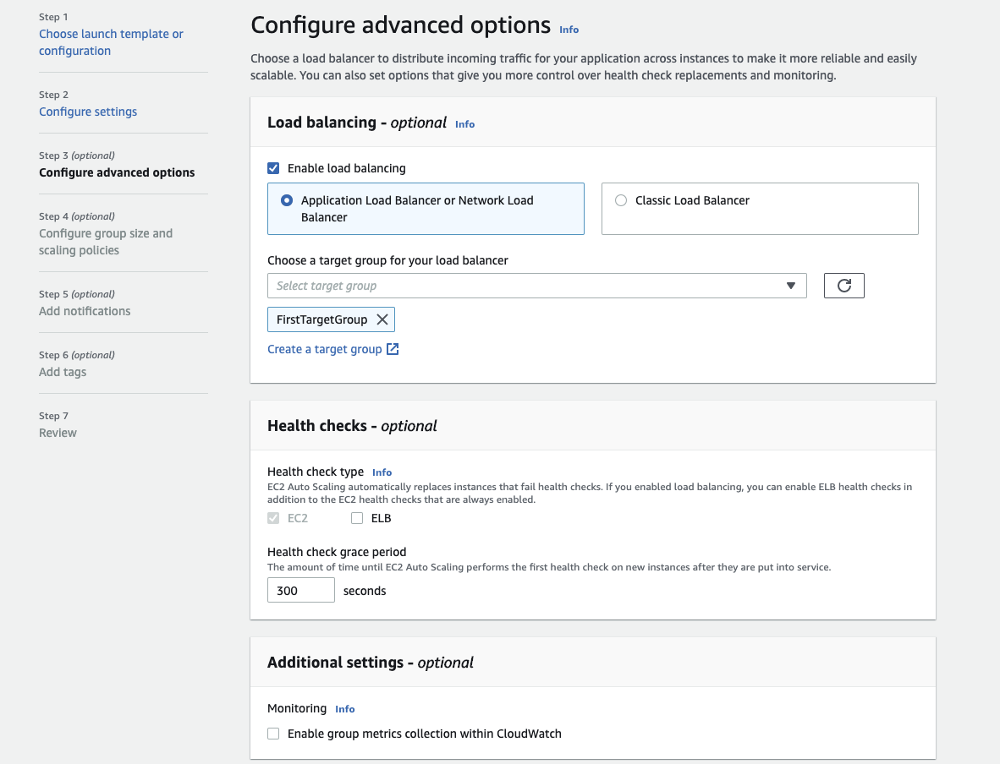

# Major infrastructure services

## Amazon Elastic Compute Cloud - EC2 components

* EC2 is a renting machine.
* Amazon EC2 instances are a combination of virtual processors (vCPUs), memory, network, and, in some cases, instance storage and graphics processing units (GPUs).
* Only size for what we plan to use.
* Storing data on virtual drives: [EBS](./storage/#amazon-elastic-block-storage-ebs).
* Distribute load across machines using [ELB](#elastic-load-balancers).
* Auto scale the service via group: [ASG](#auto-scaling-group-asg).

EC2 can have MacOS, Linux or Windows OS.
Amazon Machine Image (AMI) is the OS image with preinstalled softwares. Amazon Linux 2 for linux base image. See `AMI Catalog` within our region to get what AMI could be installed.

 

 **Figure 1: EC2 instance**

When creating an instance, we can select the OS, CPU, RAM, the VPC, the AZ subnet, the storage (EBS) 
for root folder, the network card, and the firewall rules defined as [Security Group](#security-group). 
The security group helps to isolate the instance, for example, authorizing traffic for ssh on port 22 and HTTP on port 80.
Get the public ssh key, and when the instance is started, use a command like: `ssh -i EC2key.pem  ec2-user@ec2-52-8-75-8.us-west-1.compute.amazonaws.com ` to connect to the EC2 via ssh. The `.pem` file needs to be restricted with `chmod 0400`

We can also use **EC2 Instance Connect** to open a terminal in the web browser. Still needs to get SSH port accessible in the security group.

See [this EC2 playground for demonstrating the deployment of a HTTP server.](../../playground/gettingstarted/#amazon-elastic-compute-cloud-ec2-components)

### EC2 life cycle

1. When we launch an instance, it enters in the `pending` state. Billing is not started.
1. During rebooting, instance remains on the same host computer, and maintains its public and private IP address, in addition to any data on its instance store.
1. When we `terminate` an instance, the instance stores are erased, and we lose both the public IP address and private IP address of the machine. Storage for any Amazon EBS volumes is still charged.

When we launch a new EC2 instance, the EC2 service attempts to place the instance in such a way that all of our instances are spread out across underlying hardware to minimize correlated failures. We may use placement groups to influence the placement of a group of interdependent instances to meet the needs of our workload.

### EC2 types

EC2 has a section to add `User data`, which could be used to define a bash script to install dependent software
 and to start some services at boot time.

EC2 **instance types** like t2.micro or c5.2xlarge define CPU, memory... (see [ec2instances.info](https://www.ec2instances.info) or the reference [AWS ec2/instance-types](https://aws.amazon.com/ec2/instance-types/)). The first letter defines the class as:

* R: (memory) applications that needs a lot of RAM – in-memory caches.
* C: (Compute Optimized) applications that needs good CPU – compute / databases, ETL media transcoding, High Perf web servers, scientific modeling.
* M:  applications that are balanced (think “medium”) – general / web app.
* I: (storage) applications that need good local I/O (instance storage) – databases, NoSQL, cache like Redis, data warehousing, distributed file systems.
* G: applications that need a GPU.
* T2/T3 for burstable instance: When the machine needs to process something unexpected (a spike in load for example), it can burst. Use burst credits to control CPU usage.

[Graviton](https://aws.amazon.com/ec2/graviton/) processors are designed by AWS for cloud workloads to optimize cost and energy consumption. (t4g.*, M6g.*, C7*) 

### [EC2 Nitro System](https://aws.amazon.com/ec2/nitro/)

Next generation of EC2. It uses new virtualization infrastructure and hypervisor. Supports IPv6, better I/O on EBS and better security.  Name type starts with C5, D5,...

vCPU represents thread running on core CPU. We can optimize vCPU allocation on the EC2 instance, once created, by updating the launch configuration.

### Launch types

* **On demand**: short workload, predictable pricing, pay per second after first minute. No long term commitment.
* **Reserved** for one or 3 years term, used for long workloads like database. Get discounted rate from on-demand. Up to 72% discount. We can buy and sell it in the marketplace.
* **Convertible reserved** instance for changing resource capacity over time.
* **Scheduled reserved** instance for job based workload.
* **Dedicated hosts** to book entire physical server and control instance placement. # years. **BYOL**. (Used to port Microsoft license) Can be on-demand or reserved. Most expensive solution. Use for example in the case where we deploy a database technology on an EC2 instance and the vendor license bills we based on the physical cores. Baremetal is part of this option.
* **Capacity reservations**: reserve capacity in a specific AZ for any duration
* **Spot instance** for very short - 90% discount on on-demand - used for work resilient to failure like batch job, data analysis, image processing, stateless, containerized...

    * Define a **max spot price** and get the instance while the current spot price < max price wanting to pay. The hourly spot price varies based on offer and capacity. 
    * if the current spot price > max, then instance will be stopped in a 2 minutes.
    * with **spot block** we can define a time frame without interruptions from 1 to 6 hours.
    * The expected state is defined in a 'spot request' which can be cancelled. One time or persistent request types are supported. Cancel a spot request does not terminate instance, but need to be the first thing to do and then terminate the instances.
    * **Spot fleets** allow to automatically request spot instance and on-demand instance with the lowest price to meet the target capacity within the price constraints.

Use **EC2 launch templates** to automate instance launches, to simplify permission policies, and to enforce best practices across the organization. (Look very similar to docker image)

### Metadata

When in a EC2 instance shell, we can get access to EC2 metadata by going to the URL: **http://169.254.169.254/latest/meta-data/**

### AMI

Bring our own image. Shareable on Amazon Marketplace. Can be saved on S3 storage. By default, our AMIs are privates, and locked for our account / region.

AMIs can be copied and shared [See AWS doc - copying an AMI](https://docs.aws.amazon.com/AWSEC2/latest/UserGuide/CopyingAMIs.html).

### EC2 Hibernate

The in memory state is preserved, persisted to a file in the root EBS volume. It helps to make the instance startup time quicker. The root EBS volume needs to be encrypted.

* Memory is constrained by 150GB RAM. 
* No more than 60 days.
* No instance store volume possible.

### Basic Fault Tolerance

The following diagram illustrates some fault tolerance principles offered by the basic AWS services:

{ width=700 }

**Figure 2**

* AMI defines image for the EC2 with static or dynamic configuration. From one AMI, we can scale by adding new EC2 based on same image.
* Instance failure can be replaced by starting a new instance from the same AMI.
* Auto Scaling Group defines a set of EC2 instances, and can start new EC2 instance automatically.
* Auto scaling adjusts the capacity of EC2 and EC2 instance within the group.
* To minimize down time, we can have one EC2 instance in `Standby` mode, and use elastic IP addresses to be reassigned in case of the primary EC2 failure. 
* Data is saved on EBS and replicated to other EBS inside the same availabiltiy zone.
* Snapshot backup can be done to replicate data between AZs and/or regions, and persisted for long retention in S3. 
* Need to flush data from memory to disk before any snapshot.
* Applications can be deployed between AZs.
* Elastic Load Balancer balances traffic among servers in multiple AZs and [DNS](./route53.md) will route traffic to the good server.
* Elastic IP addresses are static and defined at the AWS account level. New EC2 instance can be reallocated to Elastic IP @, but they are mapped by internet gateway to the private address of the EC2. The service may be down until new EC2 instace is restarted.
* ELB ensures higher fault tolerance for EC2s, containers, lambdas, IP addresses  and physical servers.
* Application LB load balance at the HTTP, HTTPS level, and within a VPC based on the content of the request.
* NLB is for TCP, UDP, TLS routing and load balancing.  

### Placement groups

Define strategy to place EC2 instances:

* **Cluster**: groups instances into a low-latency group in a single Availability Zone.
    * Highest performance while talking to each other as when performing big data analysis.
* **Spread**: groups across underlying hardware (max 7 instances per group per AZ).
    * Reduced risk is simultaneous failure.
    * EC2 Instances are on different physical hardware.
    * Application that needs to maximize high availability.
    * Critical Applications where each instance must be isolated from failure from each other.
* **Partition**: spreads instances across many different partitions (which rely on different sets of racks) within an AZ.
    * Partition is a set of racks.
    * Up to 100s of EC2 instances.
    * The instances in a partition do not share racks with the instances in the other partitions.
    * A partition failure can affect many EC2s but won’t affect other partitions.
    * EC2 instances get access to the partition information as metadata.
    * HDFS, HBase, Cassandra, Kafka

Access from network and policies menu, define the group with expected strategy, and then it is used when creating the EC2 instance by adding the instance to a placement group.

### EC2 Instance Store

* When disk performance is a strong requirement, use EC2 Instance Store. Millions IOPS read or even write.
* It loses data when stopped
* Good use for buffer, cache, scratch data, or distributed systems with their own replication like Kafka.
* Backup and replication are the user's responsability

## Security group

Define inbound and outbound security rules.  It is like a virtual firewall inside an EC2 instance. SGs regulate access to ports, authorized IP ranges IPv4 and IPv6, control inbound and outbound network. By default all inbound traffic is denied and outbound authorized.

* They contain `allow rules` only.
* Can be attached to multiple EC2 instances and to load balancers
* Locked down to a region / VPC combination
* Live outside of the EC2
* Define one separate security group for SSH access where we can authorize only one IP@
* Connect refused is an application error or the app is not launched - Spinning is an access rules error.
* Instances with the same security group can access each other
* Security group can reference other security groups, on IP address using CIDR in the form 192.45.23.12/32 but not any DNS server.

 

**Figure 3: security group with inbound rules**

Important Ports:

* 22 for SSH (Secure Shell) and SFTP
* 21 for FTP
* 80 for HTTP
* 443 for https
* 3389: Remote desktop protocol

## Auto Scaling Group (ASG)

The goal of an ASG is to scale out (add EC2 instances) to match an increased load, or scale in (remove EC2 instances) to match a decreased load. It helps to provision and balance capacity across Availability Zones to optimize availability.
It can also ensure we have a minimum and a maximum number of machines running. It detects when an instance is unhealthy. 

Automatically Register new instances to a load balancer.

[ASG](https://us-west-1.console.aws.amazon.com/ec2autoscaling/home?region=us-west-1#/) has the following attributes:

* AMI + Instance Type with EC2 User Data (Can use template to define instances)
* EBS Volumes
* Security Groups
* SSH Key Pair
* Min Size / Max Size / Initial Capacity to control number of instances 
* Network + Subnets Information to specify where to run the EC2 instances.
* Load Balancer Information, with target groups to be used as a grouping of the newly created instances
* Scaling Policies help to define rules to manage instance life cycle, based for example on CPU usage or network bandwidth used. 

 

* It is not possible to modify a launch configuration once it is created. If we need to change the EC2 instance type for example, we need to create a new launch configuration to use the correct instance type. Modify the Auto Scaling group to use this new launch configuration. Delete the old launch configuration as it is no longer needed.
* When creating scaling policies, **CloudWatch** alarms are created. Ex: "Create an alarm if: CPUUtilization < 36 for 15 data points within 15 minutes".
* Target tracking scaling: we want average CPU to be under 40%.
* Scheduled action: increase capacity after 5 PM.
* Predictive scaling by looking at historical behavior to build forecast rules.
* ASG tries to balance the number of instances across AZs by default, and then delete based on the age of the launch configuration.
* The capacity of our ASG cannot go over the maximum capacity we have allocated during scale out events.
* Cool down period is set to 5 mn and will not change the number of instance until this period.
* When an ALB validates an health check issue it terminates the EC2 instance.

## [CloudFront](https://aws.amazon.com/cloudfront/)

Content Delivery Network service with DDoS protection. It caches data to the edge to improve web browsing and application performance. 410+ Edge locations. This is a global service. 

The origins of those files are S3 bucket objects, or Custom Origin resource accessible via HTTP (ALB, EC2...). 

CloudFront keeps cache for the data read. For the edge to access the S3 bucket, it uses an origin access identity (OAI), managed as IAM role.

For EC2 instance, the security group needs to accept traffic from edge location IP addresses.

It is possible to control with geographic restriction using whitelist or blacklist.

It also supports the concept of signed URL. When we want to distribute content to different user groups over the world, attach a policy with:

* URL expiration
* IP range to access the data from
* Trusted signers (which AWS accounts can create signed URLs)
* How long should the URL be valid for?
* Shared content (movie, music): make it short (a few minutes)
* Private content (private to the user): we can make it last for years
* Signed URL = access to individual files (one signed URL per file)
* Signed Cookies = access to multiple files (one signed cookie for many files)

When the backend content is modified, CloudFront will not get it until its TTL has expired. But we can force an entire cache refresh with CloudFront Invalidation.

## [AWS Outposts](https://docs.aws.amazon.com/outposts/latest/userguide/what-is-outposts.html)

Outpost is fully managed service that extends AWS infrastructure, services, APIs, and tools to customer premises. It is a Rack with n server blades installed by AWS team, on site, and then maintained by AWS. 

An Outpost is a pool of AWS compute and storage capacity deployed at a customer site. It extends a VPC from one AWS region, it is owned by one AZ and you can use it for increasing resilience.

See [pricing for rack](https://aws.amazon.com/outposts/rack/pricing/)

## High Performance Computing (HCP)

The services that helps to desing HPC solutions are:

* For data management and transfer:

    * [Direct Connect](./networking.md/#direct-connect): move GB of data over private secure network
    * [Snowball and & snowmobile]() at PB data level
    * [DataSync]() move large dataset between on-premises and S3, FSx for Windows, EFS

* Computation and network:

    * EC2 instance type using CPU or GPU optimized.
    * Spot fleet and spot instances for cost savings and using Auto Scaling Group.
    * Cluster Placement groups in same rack and AZ to get best network performance.
    * Enhanced Networking (SR-IOV): with high bandwidth, higher PPS, lower latency. 
    * Elastic Network Adapter (ENA) is up to 100 Gbps.
    * Intel 82599 VF up to 10 Gbps (more legacy solution).
    * Elastic Fabric Adapter (EFA), dedicated ENA for HPC, only for Linux. Improve inter-node communication, for tightly coupled workload. It leverages Message Passing Interface standard to bypass the Linux kernel to provide low-latency transport.

* Storage:

    * Instance storage with EBS scale to 256k IOPS with io2 Block Express or instance store to scale to millions of IOPS.
    * Metwork storage: S3, EFS and FSx for Lustre

* Automate and orchestrate

    * AWS Batch to support multi-node parallel jobs. Easily schedule jobs and launch EC2 instance accordingly.
    * ParallelCluster: open source project for cluster management, using infrastructure as code, and EFA

## Simple Email Service - SES

Fully managed service to send and receive emails. Used to send email from applications using API, SMTP or AWS console.

## [Amazon PinPoint](https://docs.aws.amazon.com/pinpoint/latest/userguide/welcome.html)

Marketing communication services, SMS, email, push, voice, and in-app messaging. It supports customer segmentation and personalized messages. 

## [Systems Manager](https://docs.aws.amazon.com/systems-manager/latest/userguide/what-is-systems-manager.html)

Ability to control AWS infrastructure like EC2, with an unified user's experience. It includes a set of services like Session Manager, Patch Manager, Run Commands, or define maintenance windows.  

Automation is a why to simplfy maintenance and deployment tasks of EC2 instances, like automating runbooks.

## [Cost Explorer](https://docs.aws.amazon.com/cost-management/latest/userguide/ce-what-is.html)

Tool to view and analyze our costs and usage.

## [Trusted Advisor](https://docs.aws.amazon.com/awssupport/latest/user/trusted-advisor.html)

Trusted Advisor inspects your AWS environment, and then makes recommendations when opportunities exist to save money, improve system availability and performance, or help close security gaps.