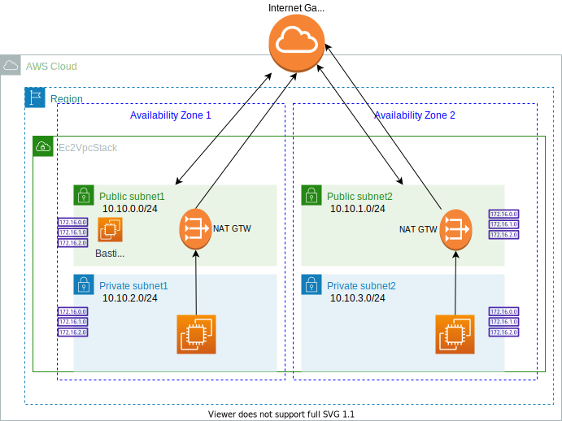
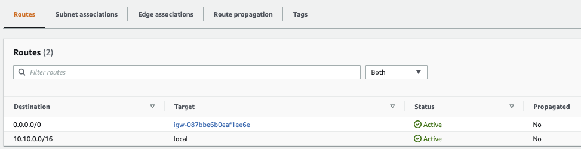
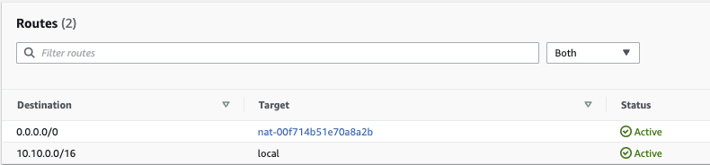
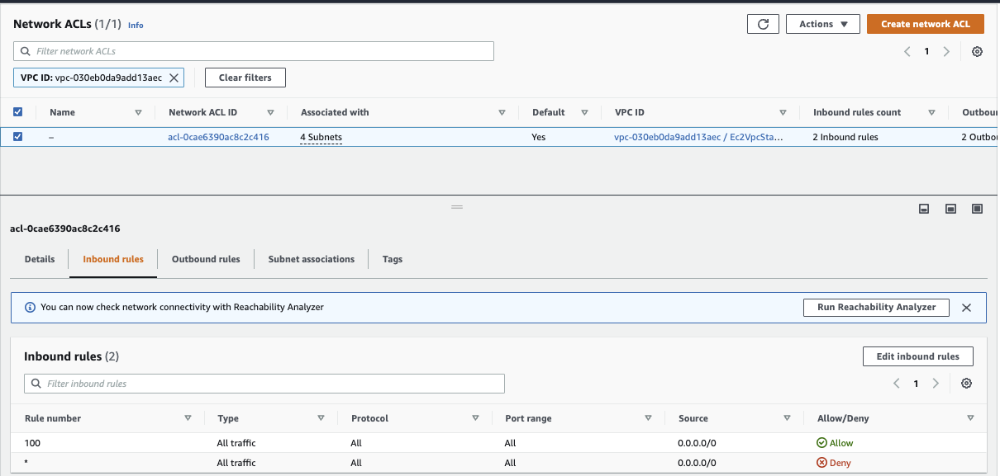

# Major infrastructure services

## Amazon Elastic Compute Cloud - EC2 components

* EC2 is a renting machine.
* Amazon EC2 instances are a combination of virtual processors (vCPUs), memory, network, and, in some cases, instance storage and graphics processing units (GPUs).
* Only size for what we plan to use.
* Storing data on virtual drives: [EBS](./storage/#amazon-elastic-block-storage-ebs).
* Distribute load across machines using [ELB](#elastic-load-balancers).
* Auto scale the service via group: [ASG](#auto-scaling-group-asg).

EC2 can have MacOS, Linux or Windows OS.
Amazon Machine Image (AMI) is the OS image with preinstalled softwares. Amazon Linux 2 for linux base image. See `AMI Catalog` within our region to get what AMI could be installed.

 

 **Figure 1: EC2 instance**

When creating an instance, we can select the OS, CPU, RAM, the VPC, the AZ subnet, the storage (EBS) 
for root folder, the network card, and the firewall rules defined as [Security Group](#security-group). 
The security group helps to isolate the instance, for example, authorizing traffic for ssh on port 22 and HTTP on port 80.
Get the public ssh key, and when the instance is started, use: `ssh -i EC2key.pem  ec2-user@ec2-52-8-75-8.us-west-1.compute.amazonaws.com ` to connect to the EC2 via ssh. The `.pem` file need to be restricted with `chmod 0400`

We can also use **EC2 Instance Connect** to open a terminal in the web browser. Still needs to get SSH port accessible in the security group.

See [this EC2 playground for demonstrating the deployment of a HTTP server.](../../playground/gettingstarted/#amazon-elastic-compute-cloud-ec2-components)

### EC2 life cycle

1. When we launch an instance, it enters in the `pending` state. Billing is not started.
1. During rebooting, instance remains on the same host computer, and maintains its public and private IP address, in addition to any data on its instance store.
1. When we `terminate` an instance, the instance stores are erased, and we lose both the public IP address and private IP address of the machine. Storage for any Amazon EBS volumes is still charged.

### EC2 types

EC2 has a section to add `User data`, which could be used to define a bash script to install dependent software
 and to start some services at boot time.

EC2 **instance types** like t2.micro or c5.2xlarge define CPU, memory... (see [ec2instances.info](https://www.ec2instances.info) or the reference [AWS ec2/instance-types](https://aws.amazon.com/ec2/instance-types/)). The first letter defines the class as:

* R: (memory) applications that needs a lot of RAM – in-memory caches.
* C: (Compute Optimized) applications that needs good CPU – compute / databases, ETL media transcoding, High Perf web servers, scientific modeling.
* M:  applications that are balanced (think “medium”) – general / web app.
* I: (storage) applications that need good local I/O (instance storage) – databases, NoSQL, cache like Redis, data warehousing, distributed file systems.
* G: applications that need a GPU.
* T2/T3 for burstable instance: When the machine needs to process something unexpected (a spike in load for example), it can burst. Use burst credits to control CPU usage.

[Graviton](https://aws.amazon.com/ec2/graviton/) processors are designed by AWS for cloud workloads to optimize cost and energy consumption. (t4g.*, M6g.*, C7*) 

### [EC2 Nitro System](https://aws.amazon.com/ec2/nitro/)

Next generation of EC2. It uses new virtualization infrastructure and hypervisor. Supports IPv6, better I/O on EBS and better security.  Name type starts with C5, D5,...

vCPU represents thread running on core CPU. We can optimize vCPU allocation on the EC2 instance, once created, by updating the launch configuration.

### Launch types

* **On demand**: short workload, predictable pricing, pay per second after first minute. No long term commitment.
* **Reserved** for one or 3 years term, used for long workloads like database. Get discounted rate from on-demand. Up to 72% discount. We can buy and sell it in the marketplace.
* **Convertible reserved** instance for changing resource capacity over time.
* **Scheduled reserved** instance for job based workload.
* **Dedicated hosts** to book entire physical server and control instance placement. # years. BYOL. (Used to port Microsoft license) Can be on-demand or reserved. Most expensive solution. Use for example in the case where we deploy a database technology on an EC2 instance and the vendor license bills we based on the physical cores.
* **Capacity reservations**: reserve capacity in a specific AZ for any duration
* **Spot instance** for very short - 90% discount on on-demand - used for work resilient to failure like batch job, data analysis, image processing, stateless, containerized...

    * Define a **max spot price** and get the instance while the current spot price < max price wanting to pay. The hourly spot price varies based on offer and capacity. 
    * if the current spot price > max, then instance will be stopped in a 2 minutes.
    * with **spot block** we can define a time frame without interruptions from 1 to 6 hours.
    * The expected state is defined in a 'spot request' which can be cancelled. One time or persistent request types are supported. Cancel a spot request does not terminate instance, but need to be the first thing to do and then terminate the instances.
    * **Spot fleets** allow to automatically request spot instance and on-demand instance with the lowest price to meet the target capacity within the price constraints.

Use **EC2 launch templates** to automate instance launches, to simplify permission policies, and to enforce best practices across the organization. (Look very similar to docker image)

### Metadata

When in a EC2 instance shell, we can get access to EC2 metadata by going to the URL: **http://169.254.169.254/latest/meta-data/**

### AMI

Bring our own image. Shareable on Amazon Marketplace. Can be saved on S3 storage. By default, our AMIs are privates, and locked for our account / region.

AMIs can be copied and shared [See AWS doc - copying an AMI](https://docs.aws.amazon.com/AWSEC2/latest/UserGuide/CopyingAMIs.html).

### EC2 Hibernate

The in memory state is preserved, persisted to a file in the root EBS volume. It helps to make the instance startup time quicker. The root EBS volume needs to be encrypted.

* Memory is constrained by 150GB RAM. 
* No more than 60 days.
* No instance store volume possible.

### Basic Fault Tolerance

The following diagram illustrates some fault tolerance principles offered by the basic AWS services:

{ width=700 }

**Figure 2**

* AMI defines image for the EC2 with static or dynamic configuration. From one AMI, we can scale by adding new EC2 based on same image.
* Instance failure can be replaced by starting a new instance from the same AMI.
* Auto Scaling Group defines a set of EC2 instances, and can start new EC2 instance automatically.
* Auto scaling adjusts the capacity of EC2 and EC2 instance within the group.
* To minimize down time, we can have one EC2 instance in `Standby` mode, and use elastic IP addresses to be reassigned in case of the primary EC2 failure. 
* Data is saved on EBS and replicated to other EBS inside the same availabiltiy zone.
* Snapshot backup can be done to replicate data between AZs and/or regions, and persisted for long retention in S3. 
* Need to flush data from memory to disk before any snapshot.
* Applications can be deployed between AZs.
* Elastic Load Balancer balances traffic among servers in multiple AZs and [DNS](./route53.md) will route traffic to the good server.
* Elastic IP addresses are static and defined at the AWS account level. New EC2 instance can be reallocated to Elastic IP @, but they are mapped by internet gateway to the private address of the EC2. The service may be down until new EC2 instace is restarted.
* ELB ensures higher fault tolerance for EC2s, containers, lambdas, IP addresses  and physical servers.
* Application LB load balance at the HTTP, HTTPS level, and within a VPC based on the content of the request.
* NLB is for TCP, UDP, TLS routing and load balancing.  

### Placement groups

Define strategy to place EC2 instances:

* **Cluster**: groups instances into a low-latency group in a single Availability Zone.
    * Highest performance while talking to each other as when performing big data analysis.
* **Spread**: groups across underlying hardware (max 7 instances per group per AZ).
    * Reduced risk is simultaneous failure.
    * EC2 Instances are on different physical hardware.
    * Application that needs to maximize high availability.
    * Critical Applications where each instance must be isolated from failure from each other.
* **Partition**: spreads instances across many different partitions (which rely on different sets of racks) within an AZ.
    * Partition is a set of racks.
    * Up to 100s of EC2 instances.
    * The instances in a partition do not share racks with the instances in the other partitions.
    * A partition failure can affect many EC2s but won’t affect other partitions.
    * EC2 instances get access to the partition information as metadata.
    * HDFS, HBase, Cassandra, Kafka

Access from network and policies menu, define the group with expected strategy, and then it is used when creating the EC2 instance by adding the instance to a placement group.

### EC2 Instance Store

* When disk performance is a strong requirement, use EC2 Instance Store. Millions IOPS read or even write.
* It loses data when stopped
* Good use for buffer, cache, scratch data, or distributed systems with their own replication like Kafka.
* Backup and replication are the user's responsability

## Security group

Define inbound and outbound security rules.  It is like a virtual firewall inside an EC2 instance. SGs regulate access to ports, authorized IP ranges IPv4 and IPv6, control inbound and outbound network. By default all inbound traffic is denied and outbound authorized.

* They contain `allow rules` only.
* Can be attached to multiple EC2 instances and to load balancers
* Locked down to a region / VPC combination
* Live outside of the EC2
* Define one separate security group for SSH access where we can authorize only one IP@
* Connect refused is an application error or the app is not launched - Spinning is an access rules error.
* Instances with the same security group can access each other
* Security group can reference other security groups, on IP address using CIDR in the form 192.45.23.12/32 but not any DNS server.

 

**Figure 3: security group with inbound rules**

Important Ports:

* 22 for SSH (Secure Shell) and SFTP
* 21 for FTP
* 80 for HTTP
* 443 for https
* 3389: Remote desktop protocol

## Networking

All regions are interconnected via private AWS fiber links. This drives better availability, higher performance, lower jitter and reduced costs.
Each region has redundant path to transit centers, which connect to private links to other AWS regions, and to AWS Direct Connect customers' data centers, internet via peering and paid transit. The connections be AZs is a metro area over DWDM (Dense wavelength division multiplexing) links. 82k fibers in a region. single digit milisecond latency. 25Tbps peak inter AZs traffic. 

IPv4 allows 3.7 billions of different addresses. Private IP @ is for private network connections. Internet gateway has public and private connections. Public IP can be geo-located. When connected to an EC2 the prompt lists the private IP (`ec2-user@ip-172-31-18-48`). Private IP stays stable on instance restart, while public may change.

With Elastic IP address, we can mask an EC2 instance failure by rapidly remapping the address to another instance. But better to use DNS.
Elastic IP is a public IPv4 that we own as long as we want and we can attach it to one EC2 instance at a time. It is not free.

### Virtual Private Cloud

A virtual private cloud (VPC) is a virtual network dedicated to our AWS account. All new accounts have a default VPC. 
It is logically isolated from other virtual networks in the AWS Cloud. We can launch our AWS resources, such as Amazon EC2 instances, within our VPC. New EC2 instances are launched into the default VPC if no subnet is specified. 

When defining new VPC, we can specify CIDR, add subnets, associate security groups, ACL, and configure route tables.

**Figure 4: VPC**

By default, AWS creates a VPC with default public subnets, one per AZs, which each one is a public subnet, because the main route table sends the subnet's traffic that is destined for the internet to the internet gateway.

VPC Helps to:

* Assign static IP addresses, potentially multiple addresses for the same EC2 instance.
* Change security group membership for our instances while they're running.
* Control the outbound traffic from our instances (egress filtering) in addition to controlling the inbound traffic to them (ingress filtering).
* We can have multiple VPCs per region (max to 5 but this is a soft limit). 5 maximum CIDR per VPC. 
* The IP range is min /28 and max /16. 

Default VPC includes an **Internet Gateway**. Internet gateway is a managed service and automatically scales, redundant and highly available.

Network Access Control List can be defined at the VPC level, so will be shared between subnets. The default network ACL is configured to allow all traffic to flow in and out of the subnets which it is associated. Each network ACL also includes a rule whose rule number is an asterisk. This rule ensures that if a packet doesn't match any of the other numbered rules, it's denied. 

The following diagram illustrates classical VPC, as defined years ago, with one vpc, 2 availability zones, 2 subnets with EC2 instances within those subnets and AZs. An internet gateway connected to a router. Subnets are defined within a VPC and in one availability zone. It defines an IP CIDR range: we should have less IP on public subnet as they are used for ELB.

{ width="600" }

**Figure 5: EC2s in public subnets**

* *A subnet is assigned a /24 CIDR block, which means 8 bits encoding (32-24), but AWS uses 5 IP addresses in each subnet for gateway, LB,... so the number of available addresses is 256 - 5 = 251. To identify a single 32 bit IPv4 address, we can use /32 CIDR convention* 
* Internet Gateway needs to be defined to new created VPC to get internet hosts being able to access EC2s in it. And Route Tables need to be defined: one public associated with the public subnets and one private associated with private subnets.
* Non-default subnet has a private IPv4 address, but no public IPv4.
* We can make a default subnet into a private subnet by removing the route from the destination 0.0.0.0/0 to the Internet Gateway.
* EC2 Instances should have either public IP or elastic IP and subnet must have a route to the internet gateway. The figure 5 above illustrates a route coming from any IP @ (0.0.0.0/0) goes to the internet gateway (`igw-id`). Any host in the private network 172.31.0.0/16 can communicate with other hosts in the local network.
* Route tables defines `172.31` as local with `/20` CIDR address range, internal to the VPC. Default route to internet goes to the IGW, which has an elastic IP address assigned to it.
* Because the VPC is cross AZs, we need a router to route between subnets. (See [TCP/IP summary](https://jbcodeforce.github.io/architecture/tcpip))

#### Extended picture

**Figure 6: Full VPC diagram**

We need to have [VPC endpoint service](https://wa.aws.amazon.com/wellarchitected/2020-07-02T19-33-23/wat.concept.vpc-endpoint.en.html) to access a [lot of AWS services](https://docs.aws.amazon.com/vpc/latest/privatelink/aws-services-privatelink-support.html), like S3, privately as those services will be in our VPC. We need to ensure there is one interface endpoint for each availability zone. We need to pick a subnet in each AZ and add an interface endpoint to that subnet. 

TCP traffic is isolated. It is part of a larger offering called [AWS PrivateLink](https://docs.aws.amazon.com/vpc/latest/privatelink/what-is-privatelink.html) to establish private connectivity between VPCs and services hosted on AWS or on-premises, without exposing data to the internet (No internet gateway, no NAT, no public IP @).

CIDR Blocks should not overlap between VPCs for setting up a peering connection. Peering connection is allowed within a region, across regions, across different accounts

We can optionally connect our VPC to our own corporate data center using an IPsec AWS managed VPN connection, making the AWS Cloud an extension of our data center. A VPN connection consists of a virtual private gateway (VGW) attached to our VPC and a customer gateway located in our data center. 

A virtual private gateway is the VPN concentrator on the Amazon side of the VPN connection. 
A customer gateway is a physical device or software appliance on our side of the VPN connection.

As seen in Figure 6 "Full VPC diagram", the `VPC peering` helps to connect between VPCs in different region, or within the same region. And [Transit GTW](https://docs.aws.amazon.com/vpc/latest/tgw/what-is-transit-gateway.html) is used to interconnect our virtual private clouds (VPCs) and on-premises networks. In fact Transit Gateway is a more modern and easier approach to link VPCs. Using Transit Gateway route tables, We can control the traffic flow between VPCs. The peering connection would work; however, it requires a lot of point-to-point connections.

#### Routing Tables

The last elements are the Routing tables. As illustrated in the following diagram, main routing table addresses internal to the VPC traffic, while custom tables define how inbound and outbound traffic can be structured within a subnet. 

**Figure 7: Routing tables**

Security group policies are at the EC2 instance level, and define firewall configuration.

#### Hands-on work

The CDK example in [the ec2-vpc folder](https://github.com/jbcodeforce/aws-studies/tree/main/labs/cdk/ec2-vpc) supports the following diagram:

**Figure 6: More classical VPC**

* We can enable internet access for an EC2 instance launched into a non-default subnet by attaching an internet gateway to its VPC and configure routing tables for each subnets. The routes needs to define that traffic from internet goes to the IGW. The following route is associated to the public subnet-1:

    

* Alternatively, to allow an instance in our VPC to initiate outbound connections to the internet but prevents unsolicited inbound connections from the internet, we can use a network address translation (NAT) service for IPv4 traffic. NAT maps multiple private IPv4 addresses to a single public IPv4 address. 
* In the private subnet, outbound to reach the internet has to go to the NAT Gateway, while traffic from machines in the subnets stays local.

    

* To use the **Bastion Host**, we attach a security group to authorize SSH and outbound HTTP traffic. CDK creates this SG automatically. So we can Instance Connect to this instance, and within the termnal a ping to amazon.com will work. The bastion has a public IP address, and the VPC has a IGW with a route table.

    

* In the EC2 instance running in the private network, we need to add a Security Group with an inbound rule to specify SSH trafic from the SG of the Bastion. With this settings a SSH to the Bastion, then a copy of the pem file in the bastion host and a command like: `ssh ec2-user@10.10.2.239 -i ec2.pem` on the private IP @ of the EC2 instance (10.10.2.239) will make the connection from Bastion to EC2.

    

* IPv6 uses Egress only Internet Gateway for outbound requests from a private Subnet. For IPv4 oubtound internet traffic from a private subnet, we can use a NAT instance or NAT Gateway.
* NAT gateway is deployed inside a subnet and it can scale only inside that subnet. For fault tolerance, it is recommended that we deploy one NAT gateway per availability zone.
* As we have set up a NAT Gateway in each public subnet, and the route in the private network route all IP to the NAT gateway, we can ping from the EC2 running in the private subnet to the internet:

    

* Here is the two NAT gateways:

    

* A NAT device has an Elastic IP address and is connected to the internet through an internet gateway.

#### Deeper Dive

* [VPC FAQs](https://aws.amazon.com/vpc/faqs/)
* [NAT gateway](https://docs.aws.amazon.com/vpc/latest/userguide/vpc-nat-gateway.html)

### Elastic Network Insterfaces

ENI is a logical component in a VPC that represents a virtual network card. It has the following attributes:

* One primary private IPv4, one or more secondary IPv4
* One Elastic IP (IPv4) per private IPv4
* One Public IPv4
* One or more security groups
* A MAC address
* We can create ENI independently and attach them on the fly (move them) on EC2 instances for failover 
* Bound to a specific availability zone (AZ), We cannot attach ENI to an EC2 instance in a different AZ. 

[New ENI doc.](https://aws.amazon.com/blogs/aws/new-elastic-network-interfaces-in-the-virtual-private-cloud/)

### Bastion Host

The goal is to be able to access any EC2 instances running in the private subnets from outside of the VPC, using SSH. The bastion is running on public subnet, and then connected to the private subnets. The security group for the Bastion Host authorizies inbound on port 22 from restricted public CIDR.
Security group of the EC2 instance allows the SG of the bastion host to accept connection on port 22.

### [NAT Gateway](https://docs.aws.amazon.com/vpc/latest/userguide/vpc-nat-gateway.html)

Use a NAT gateway so that instances in a private subnet can connect to services outside our VPC but external services cannot initiate a connection with those instances.

Charged for each hour that our NAT gateway is available and each Gigabyte of data that it processes.

It is created in a specified AZ and uses an Elastic IP and can only be used by EC2 in other subnets. The route is from the private subnet to the NATGW to the IGW. To get HA we need one NATG per AZ. 

The bandwidth is from 5 Gbps to  automatic scale up 45Gbps.

### Network ACLs

Define traffic rule at the subnet level. One NACL per subnet. A NACL specifies rules with number that defines evaluation priority. The last rule is an asterisk and denies a request in case of no rule matches.  

It is used to block a specific IP address at the subnet level.

Here is a complete figure to explain the process: A client app is initiating a connection to a DB and with a ephemeral port to receive the response.

### VPC peering

The goal of VPC peering is to connect two VPCs using AWS network and let them behave as if they were in the same network. The CICDs do not overlap. 

It could be used to connect VPC cross Regions and event cross Accounts.

Once the VPC peering connection is defined, we still need to specify the route to the CIDR to reach the VPC peering created.

## Elastic Load balancers

Route traffic into the different EC2 instances. Elastic Load Balancing scales our load balancer capacity automatically in response to changes in incoming traffic. It is a managed service!

It also exposes a single point of access (DNS) to the deployed applications. In case of EC2 failure, it can route to a new instance, transparently and across multiple AZs. It uses health check (/health on the app called the `ping path`) to assess instance availability. It also provides SSL termination. It supports to separate private (internal) to public (external) traffic.

 

Need to enable availability zone to be able to route traffic between target groups in different AZs.

When We create a load balancer, We must choose whether to make it an internal load balancer or an internet-facing load balancer. 
Internet-facing load balancer have public IP addresses. The DNS name of an internet-facing load balancer is publicly resolvable to the public IP addresses of the nodes. Internal load balancer have only private IP addresses.  Internal load balancers can only route requests from clients with access to the VPC of the load balancer.

For certain needs, it also support stickness cookie to route to the same EC2 instance.
ELB has security group defined for HTTP and HTTPS traffic coming from the internet, but the EC2 security group defines HTTP traffic to the ELB only.

Four types of ELB supported:

* **Classic** load balancer: older generation. TCP and HTTP layer. For each instance created, update the load balancer configuration so it can route the traffic.
* **Application load balancer**: HTTP, HTTPS (layer 7), Web Socket. 

    * It specifies availability zones: it routes traffic to the targets in these Availability Zones. Each AZ has one subnet. To increase availability, we need at least two AZs.
    * It uses target groups, to group applications. So it can target containers running in one EC2 instance.
    * route on URL, hostname and query string
    * Get a fixed hostname in DNS
    * the application do not see the IP address of the client directly (ELB does a connection termination), but ELB puts client information in the header `X-Forwarded-For` (IP @), `X-Forwarded-Port` (port #) and `X-Forwarded-Proto` (protocol).
    * Great for microservices or for container based apps (ECS).
    * Support dynamic port mapping for ECS container.
    * Support HTTP/2 and WebSocket

!!! info
    Target group: group EC2 instances by specifying Auto Scaling Group, but they also be task or containers in ECS, or lambda function. Health check is done at the target group level.

* **Network load balancer**: TCP, UDP (layer 4), TLS

    * handle millions request/s
    * reach less than 100ms latency while ALB is at 400ms
    * use to get one public static IP address per availability zone
    * Routes each individual TCP connection to a single target for the life of the connection
    * not free
    * Can reach target groups of EC2s, IP @, cloud be ALB.
    * Health check is based on TCP, HTTP, and HTTPS
    * For NLB we need to add a rule in a the security group attached to the EC2 to get HTTP:80 to anywhere 

* **Gateway LB**: 
    
    * used to analyze in traffic before routing to applications
    * apply firewalls rules, intrusion detection, deep packet inspection, 
    * works at layer 3: IP packet 
    * combine NLB and gateway service
    * also use target groups.
    * use the Geneve protocol (support network virtualization use cases for data center ) on port 6081 

To route traffic, first the DNS name of the load balancer is resolved. (They are part of the `amazaonaws.com` domain). 1 to many IP Addresses are sent back to the client. With NLBs, Elastic Load Balancing creates a network interface for each Availability Zone that We enable. Each load balancer node in the Availability Zone uses this network interface to get a static IP address. ELB scales our load balancer and updates the DNS entry. The time to live is set to 60s. 

To control that only the load balancer is sending traffic to the application, we need to set up an application **security group** on HTTP, and HTTPS with the source being the security group id of the ELB. LBs can scale but need to engage AWS operational team.

HTTP 503 means LB is at capacity or target app is not registered. Verify security group in case of no communication between LB and app.

Target group defines protocol to use, health check checking and what applications to reach (instance, IP or lambda). 

Example of listener rule for an ALB:

 

ALB and Classic can use [HTTP connection multiplexing](https://www.haproxy.com/blog/http-keep-alive-pipelining-multiplexing-and-connection-pooling/) to keep one connection with the backend application. Connection multiplexing improves latency and reduces the load on our applications.

### Load balancer stickiness

Used when the same client needs to interact with the same backend instance. A cookie, with expiration date, is used to identify the client. The classical LB or ALB manages the routing. This could lead to unbalance traffic so overloading one instance. 
With ALB, stickness is configured in the target group properties.

Two types of cookie:

* Application-based cookie: generated by the target app. The cookie name is specific to the target group. 
* duration-based cookie: generated by the Load Balancer
* The following cookie names are reserved by the ELB (AWSALB, AWSALBAPP, AWSALBTG).

### Cross Zone Load Balancing

Each load balancer instance distributes traffic evenly across all registered instances in all availability zones. If one AZ has 2 targets and another one has 8 targets, then with cross-zone, the LBs in each availability zone will route to any instance, so each will receive 10% of the traffic. Without that, the 2 targets zone will receive 25% traffic each, and the instance on the othe AZ only 6.25% of the traffic. This is the default setting for ALB and free of charge. It is disabled by default for NLB.

### TLS - Transport Layer Security,

An SSL/TLS Certificate allows traffic between clients and load balancer to be encrypted in transit (in-flight encryption).

* Load balancer uses an X.509 certificate (SSL/TLS server certificate). 
* Manage our own certificates using ACM (AWS Certificate Manager)
* When defining a HTTPS listener in a LB, we must specify a default certificate for the HTTPS protocol, while defining the routing rule to a given target group. Need multiple certs to support multiple domains. 
* Clients can use SNI (Server Name Indication) to specify the hostname they want to reach. The ALB or NLB will get the certificates for each host to support the TLS handshake. 

### Connection draining

This is a setting to control connection timeout and reconnect when an instance is not responding. It is to set up the time to complete “in-flight requests”. When an instance is "draining", ELB stops sending new requests to the instance. The time out can be adjusted, depending of the application, from 1 to 3600 seconds, default is 300 seconds, or disabled (set value to 0).

It is called `Deregistration Delay` in NLB & ALB.

## Auto Scaling Group (ASG)

The goal of an ASG is to scale out (add EC2 instances) to match an increased load, or scale in (remove EC2 instances) to match a decreased load. It helps to provision and balance capacity across Availability Zones to optimize availability.
It can also ensure we have a minimum and a maximum number of machines running. It detects when an instance is unhealthy. 

Automatically Register new instances to a load balancer.

[ASG](https://us-west-1.console.aws.amazon.com/ec2autoscaling/home?region=us-west-1#/) has the following attributes:

* AMI + Instance Type with EC2 User Data (Can use template to define instances)
* EBS Volumes
* Security Groups
* SSH Key Pair
* Min Size / Max Size / Initial Capacity to control number of instances 
* Network + Subnets Information to specify where to run the EC2 instances.
* Load Balancer Information, with target groups to be used as a grouping of the newly created instances
* Scaling Policies help to define rules to manage instance life cycle, based for example on CPU usage or network bandwidth used. 

 

* when creating scaling policies, **CloudWatch** alarms are created. Ex: "Create an alarm if: CPUUtilization < 36 for 15 data points within 15 minutes".
* Target tracking scaling: we want average CPU to be under 40%
* Scheduled action: increase capacity after 5 PM
* Predictive scaling by looking at historical behavior to build forecast rules
* ASG tries to balance the number of instances across AZs by default, and then delete based on the age of the launch configuration
* The capacity of our ASG cannot go over the maximum capacity we have allocated during scale out events
* Cool down period is set to 5 mn and will not change the number of instance until this period.
* when an ALB validates an health check issue it terminates the EC2 instance.

## [CloudFront](https://aws.amazon.com/cloudfront/)

Content Delivery Network service with DDoS protection. It caches data to the edge to improve web browsing and application performance. 410+ Edge locations. This is a global service. 

The origins of those files are S3 bucket objects, or Custom Origin resource accessible via HTTP (ALB, EC2...). 

CloudFront keeps cache for the data read. For the edge to access the S3 bucket, it uses an origin access identity (OAI), managed as IAM role.

For EC2 instance, the security group needs to accept traffic from edge location IP addresses.

It is possible to control with geographic restriction using whitelist or blacklist.

It also supports the concept of signed URL. When we want to distribute content to different user groups over the world, attach a policy with:

* URL expiration
* IP range to access the data from
* Trusted signers (which AWS accounts can create signed URLs)
* How long should the URL be valid for?
* Shared content (movie, music): make it short (a few minutes)
* Private content (private to the user): we can make it last for years
* Signed URL = access to individual files (one signed URL per file)
* Signed Cookies = access to multiple files (one signed cookie for many files)

When the backend content is modified, CloudFront will not get it until its TTL has expired. But we can force an entire cache refresh with CloudFront Invalidation.

## Global Accelerator

The goal is to expose quickly an application to the WW. The problem is the number of internet hops done to access the target public ALB. The solution is to get as fast as possible to a AWS network endpoint (Edge location) and use AWS backbone.

With Anycast IP a client is routed to the nearest server. All servers hold the same IP address. So for each application, we create 2 Anycast IP, and the traffic is sent to the edge locations.

Improves performance for wide range of applications TCP or UDP.
