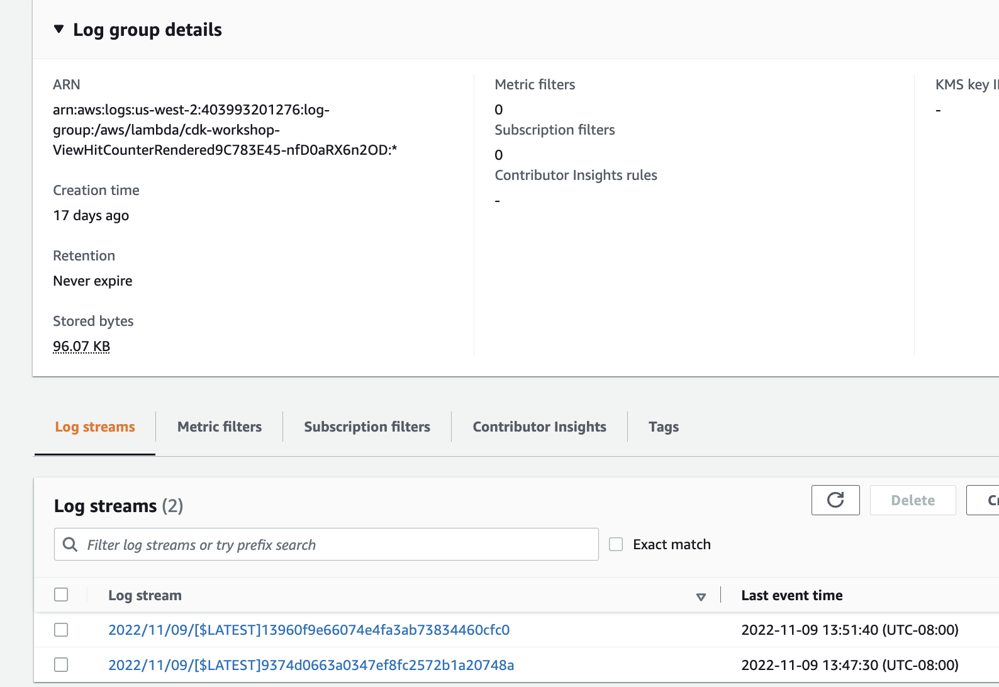
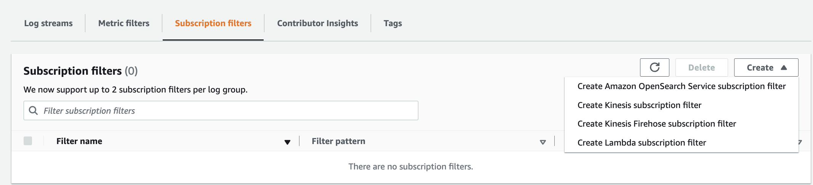

# Monitoring and Audit

## CloudWatch

### [CloudWatch Metrics](https://docs.aws.amazon.com/cloudwatch/)

CloudWatch provides metrics for every services in AWS. Metric represents a variable to measure like CPU utilization, Network inbound traffic... 

Metrics are within a VPC so belong to namespaces. They have timestamps and heve up to 10 attributes or dimensions.

### CloudWatch Logs

Concepts:

* Log groups to groups logs, representing an application.

    

* Log streams: instances within an application / log files or containers.

    

Priced for retention period, so expiration policies can be defined. 

CloudWatch can send logs to S3, Kinesis Firehose, Kinesis Data Streams, Lambda,... 

Can define filters to reduce logs or trigger CloudWatch alarms, or add insights to query logs and for Dashboards. Here are simple filter:

Use Subscription Filter to get near real-time logs to targeted sink:

Logs Insights helps to define query to search within the logs. 

### CloudWatch Agent

By default EC2 instances do not send logs to CloudWatch. We need to run agent on EC2 to push log files we want. We need to use an IAM role that let the EC2 instance be able to send logs to CW.

The new Unified Agent send logs and system-level metrics. 

### CloudWatch Alarms

Alarms are used to trigger notification from any metrics. The states of an alarm are: OK, INSUFFICIENT_DATA, ALARM. A period specifies the lenght of time in seconds to evaluate the metric.

The target of the alarm may be to stop, reboot, terminate, recover of an EC2 instance, trigger an Auto Scaling Action for EC2, or send notification to SNS.
