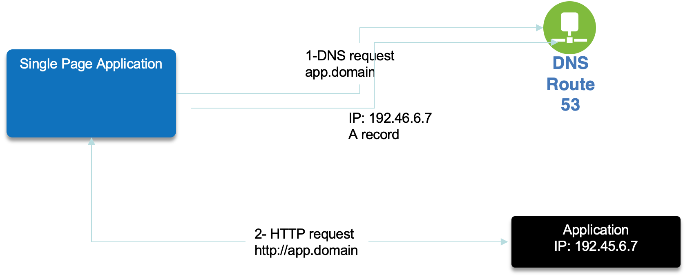
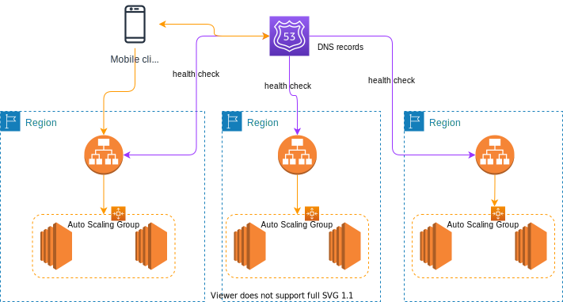

# [Route 53](https://aws.amazon.com/route53/features/)

A highly available, scalable, fully managed, and authoritative (we can update DNS records) DNS. It is also a Domain Registra. 
Supports a lot of routing types to respond to DNS query by taking into account % of traffic, latency, healthchecks...

It uses the concept of `hosted zone` which is a "container" that holds information about how you want to route traffic for a domain or subdomain. The zone can be public (internet facing) or private (inside VPC). Need a DNS domain.

A domain is at least 12$ a year and Route 53 fees is $0.5 per month per hosted zone. See [Pricing page](https://aws.amazon.com/route53/pricing/).

## DNS

DNS is a collection of rules and records which helps client apps understand how to reach a server through URLs. Here is a quick figure to summarize the process, which in fact should also have the root server (for the `.com`... resolution) and TLD server (for `amazon` or `google`). The SLD server is the one presented in the figure.

 

## Records

Record defines how to route traffic for a domain. Each record contains:

* a Domain name.
* record type A (IPv4) or AAAA(IPv6), CNAME, NS.
* value.
* routing policy.
* Time to Live (TTL): is set to get the web browser to keep the DNS resolution in cache. High TTL is around 24 hours, low TTL, at 60s, will make more DNS calls. TTL should be set to strike a balance between how long the value should be cached vs how much pressure should go on the DNS. Need to define the TTL for the app depending on the expected deployment model.

A hosted zone is a container that holds information about how we want to route traffic for a domain. Two types are supported: public or private within a VPC.

### CNAME vs Alias

[CNAME](https://en.wikipedia.org/wiki/CNAME_record) is a DNS record to maps one domain name to another. CNAME should point to a ALB. Works on non root domain.

**Alias** is used to point a hostname of an AWS resource and can work on root domain (domainname.com). The alias record target could be: ELB, CloudFront distributions, API gateway, Elastic Beanstalk environments, S3 Websites, VPC Interface endpoints, global accelerator, route 53 record (in the same hosted zone). EC2 DNS name could not be a target of alias.

Use `dig <hostname>` to get the DNS resolution record from a Mac or for linux EC2 do the following.

```sh
sudo yum install -y bind-utils
nslookup domainname.com
# or
dig domainname.com
```

## Demonstrate 



* Create three EC2 t2.micro instances, in different region, using security group to authorize SSH and HTTP from anywhere, with the following User data, so the returned HTML page includes the region name:

```
#!/bin/bash
yum update -y
yum install -y httpd
systemctl start httpd
systemctl enable httpd
EC2_AVAIL_ZONE=$(curl -s http://169.254.169.254/latest/meta-data/placement/availability-zone)
echo "<h1>Hello World from $(hostname -f) in AZ $EC2_AVAIL_ZONE </h1>" > /var/www/html/index.html
```

* Add at least one ALB to route to instances in an AZ
* Define a domain name (5$ to 12$ a year)
* Create a hosted zone in Route 53.
* Define DNS records in Route 53 for each ALB and EC2 IP @ based on a subdomain name, using one of the type as specified in next section.

## Routing policies

It defines how Route 53 responds to DNS queries. It can be used to apply A/B testing, or looking query.

Eight routing types:

1. A **simple** routing policy to get an IP @ from a single resource (still can specify multiple IP@ to be returned in the response, and the client will pick one of the address randomly). There is no health check associated to this record. 
1. The **weighted** routing policy controls the % of the requests that go to specific endpoint. Can do blue-green traffic management. It can also help to split traffic between two regions. It can be associated with Health Checks
1. The **latency** routing Policy redirects to the server that has the least latency close to the client. Latency is based on traffic between users to AWS Regions.
1. **Health check** monitors the health and performance of the public resources and assesses DNS failure with automatic failover. We can have HTTP, TCP or HTTPS health checks. We can define from which region to run the health check. They are charged per HC / month. 15 Health checkers exist WW. Send every 30s. Need at least 18% health checkers reporting the endpoint is healthy. HTTP RC code 2xx or 3xx. It is recommended to have one HC per app deployment. It can also monitor latency. To assess private endpoint within a VPC, we need to add a CloudWatch metric and alarm, then create a Health Check to the alarm itself.
1. The **failover** routing policy helps us to specify a record set to point to a primary and then a secondary instance for DR purpose. 
1. The **Geo Location** routing policy is based on user's location, and we may specify how the traffic from a given country should go to a specific IP@. Need to define a “default” policy in case there’s no match on location. It is interesting for website localization, restrict content distribution, load balancing,...
1. **Geoproximity** takes into account the user and AWS resources locations. It also supports shifting more traffic to resources based on the defined bias. It is part of **Route 53 Traffic Flow**.
1. The **Multi Value** routing policy is used to access multiple resources. The record set, associates a Route 53 health checks with the records. The client on DNS request gets up to 8 healthy records returned for each Multi Value query. If one fails then the client can try one other IIP @ from the list.

We can use Route 53 health checking to configure active-active and active-passive failover configurations. We configure active-active failover using any routing policy (or combination of routing policies) other than failover, and we configure active-passive failover using the failover routing policy.
In active-active failover, all the records that have the same name, the same type (such as A or AAAA), and the same routing policy (such as weighted or latency) are active unless Route 53 considers them unhealthy. With Active-Active Failover, it uses all available resources all the time without a primary nor a secondary resource.

If you used another domain registra, it is possible to get the list of AWS DNS server associated to the hosted public zone, and then configure your registra for the NS records to go to those DNS servers. 

