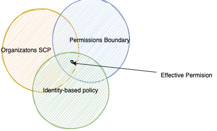

# Security

## Introduction

With the AWS Cloud, managing security and compliance is a [shared responsibility](https://aws.amazon.com/compliance/shared-responsibility-model/) between AWS and the customer:

* [AWS is responsible of security **of** the cloud](https://aws.amazon.com/security/) and offers the most flexible and secure cloud computing environment available today. AWS is responsible for patching their managed services and infrastructure security.
* Customers are responsible for the security **in** the cloud: secure workloads and applications that are deployed onto the cloud. When using EC2, we are responsible to patch OS for security (but AWS helps by providing patched AMIs, or tools such as [Systems Manager](https://aws.amazon.com/systems-manager), or [Inspector](https://aws.amazon.com/inspector/) for continuous vulnerability testing).

AWS runs highly secured data centers. Multiple geographic regions and Availability Zones allow customers to remain resilient in the face of most failure modes, from system failure to natural disasters. 

For highly regulated industry, AWS helps by getting more than 50 certifications for the infrastructure, globally but also regionaly for specific countries. At global, these include the [ISO 27001](https://www.iso.org/isoiec-27001-information-security.html), SOC 1 and 2 certifications. For regional in the USA, AWS aligns with [FISMA](https://www.cisa.gov/federal-information-security-modernization-act) and [FedRAMP](https://www.gsa.gov/technology/government-it-initiatives/fedramp), in UK with Cyber Essentials, in Australia with IRA... The audits are done by a 3nd party and we can find reports in [aws/artifact](https://aws.amazon.com/artifact/).

[AWS Compliance Center is a central location to research cloud-related regulatory requirements](https://aws.amazon.com/financial-services/security-compliance/compliance-center/)

Fine-grain identity and access controls combined with continuous monitoring for near real-time security information ([CloudTrail](https://aws.amazon.com/cloudtrail/)) ensures that the right resources have the right access at all times, wherever the information is stored

## Encryption

Encryption is widely available through a lot of services and features on top of the platform. We will be able to develop application that can encrypt data at rest, or in transit as it flows over the network between services. S3 storage or EBS block attached storage, has single click option to do encryption at rest with keys (using KMS).


The managed service, [AWS Key Management Service](https://aws.amazon.com/kms/), helps centrally managing our own keys. It is integrated into a lot of services and the keys never leave AWS [FIPS 140-validated](https://en.wikipedia.org/wiki/FIPS_140-2) Hardware Security Modules unencrypted. User controls access and usage of the keys.

## Organizations

[AWS Organizations](https://us-east-1.console.aws.amazon.com/organizations) helps to centraly manage multiple AWS accounts, group accounts, and simplify account creation. Using accounts helps to isolate AWS resources. It is a global service.

### Concepts


* The main account is the management account where other added accounts are members.
* An organization is a hierarchical structure (a tree) with a root and Organization Units (OU), and AWS accounts.
* The `root` user is a single sign-in identity that has complete access to all AWS services and resources in any accounts.
* Organization unit (OU) contains AWS Accounts or other OUs. It can have only one parent.


* OU can be per team, per line of business.
* AWS Organizations uses [IAM service-linked roles](https://docs.aws.amazon.com/organizations/latest/userguide/orgs_integrate_services.html#orgs_integrate_services-using_slrs) to enable trusted services to perform tasks on your behalf in your organization's member accounts.
* We can create service control policies (SCPs) cross AWS accounts to deny access to AWS services for individuals or group of accounts in an OU. 
* AWS Organization exposes APIs to automate account management.
* It helps consolidating billing accross all the accounts and user can get pricing benefits from aggregate usage. Shared reserved instances and Saving Plans discounts apply across accounts. Can define Blocklist or Allowlist strategies.
* There is no cost to use AWS Organizations.
* We can invite an existing AWS account to our organization. But payment changes of ownership. 

### Advantages

* Better isolation than VPC.
* Can use tagging for billing purpose.
* Enable CloudTrail for all accounts and get report in S3.
* Can define service control policies (SCP) as IAM policies applied to OU or Accounts to restric Users and Roles. Explicit allow. The root OU will have `FullAWSAccess` SCP. 


### Deeper Dive

* [Presentation on organizations](https://broadcast.amazon.com/videos/192190)
* [User guide](https://docs.aws.amazon.com/organizations/latest/userguide/orgs_introduction.html)
* [Organization API](https://docs.aws.amazon.com/organizations/latest/APIReference/API_Organization.html)

## IAM Identity and Access Management

* Helps to control access to AWS services.


* This is a global service, defined at the account level, cross regions.
* IAM helps us to define users (physical person), groups and roles, and permissions (policies).


* Do not use root user, but create user and always use them when login. `jerome`, `aws-jb`  and `mathieu` are users.
* Administrator users are part of an admin group with admin priviledges, like `AdministratorAccess`.
* Assign users to groups (`admin` and `developers`) and assign policies to groups and not to individual user.
* Groups can only contain users, not other groups.
* Users can belong to multiple groups.
* AWS Account has a unique ID but can be set with an alias (e.g.`jbcodeforce` or `boyerje`). The console URL includes the user 
[https://jbcodeforce.signin.aws.amazon.com/console](https://jbcodeforce.signin.aws.amazon.com/console)
or [https://boyerje.signin.aws.amazon.com/console](https://boyerje.signin.aws.amazon.com/console) use `aws-jb`.

* Policies are written in JSON, to define permissions `Allow`, `Deny` for users to access AWS services, groups and roles...
* It must define an ID, a version and statement(s):

    ```json
    {
        "Version": "2012-10-17",
        "Statement": [
            {
                "Effect": "Allow",
                "Action": [
                    "iam:List*"
                ],
                "Resource": "*"
            }
        ]
    }
    ```

    Another example to control access to IAM:

    

* Policy applies to **Principal**: account/user/role, list the **actions** (what is allowed or denied) on the given **resources**.
* Use the `Least privilege permission` approach: Give users the minimal amount of permissions they need to do their job.
* As soon as there is a deny in the chain of policy evaluation, then allows will not work. See the diagram below from [the product documentation](https://docs.aws.amazon.com/IAM/latest/UserGuide/reference_policies_evaluation-logic.html).


* Policy can define the password type `> Account settings > Password policy`, and when users are allowed to change the password.
* Inline policy can be defined at the user level, but it is recommended to use Group and Group level policies. As user can be part of multi groups, she/he will heritate to the different policies of those groups.
* IAM is not used for website authentication and authorization.
* For identity federation, use SAML standard.

We can test Policies with the [policy simulator](https://policysim.aws.amazon.com/home/index.jsp?#).

### Multi Factor Authentication - MFA

* Multi Factor Authentication is used to verify a human is the real user of a service
 
    * Always protect root account. 
    * MFA = password + device we own. 
    * The device could be a universal 2nd factor security key. (ubikey) 

* [Authy](https://authy.com/) is a multi-device service with free mobile app. We can have multiple users on the same device.

### IAM Roles

* To get AWS services doing work on other service, we need to use IAM Role. Roles are assigned per application, or per EC2 or lambda function...


* Maintaining roles is more efficient than maintaining users.  When you assume a role, IAM dynamically provides temporary credentials that expire after a defined period of time, between 15 minutes to 36 hours.
* IAM role does not create static access key, so no risk to have the key stolen.

* When connected to an EC2 machine via ssh or using EC2 Instance Connect tool, we need to set the IAM roles for who can use the EC2. A command like `aws iam list-users` will not work until a role is attached. For example, the `DemoEC2Role` role is defined to let IAM access in read only:


This role is then defined in the EC2 / Security  > attach IAM role, and now read-only commands with `aws iam` will work.

When user, application or service assumes a role, it takes the permissions assigned to the role, and loose its original permissions. While when we use resource-based policy, the principal doesn't have to give up his permissions. For example if a user in Account A need to scan DynamoDB table in account A and dumpt it in S3 bucket in account B, then it is important to use resource-based policy for S3 bucket, so user does not loose its access to dynamoDB.

This is also used for EventBridge to access lambda, SNS, SQS, cloudWatch logs, API gateway...

### Permissions boundary

Set a permissions boundary to control the maximum permissions this user can have. This is at user's or role level, and we define policy for example to authorize him to do anything on EC2, CloudWatch or S3. 

The effective permission of a user is the join between Organization SCP, Permissions Boundary, and identity based policies.



This is used to:

* Delegate responsibilities to non-admin within their permission boundaries to create specific resources, like IAM user
* Allow developers to self-assign policies and manage their own permissions, while makine sre they can increase their privileges.
* Restrict one user

### Security tools

* In IAM, use `> Credentials report` to download account based report.
* In IAM, use `> Users > select one user (aws-jb) and then Access Advisor tab`: 
Access Advisor shows the services that the selected user can access and when those services were last accessed
* [Amazon GuardDuty](https://aws.amazon.com/guardduty/) is a security tool to continuously monitor your AWS accounts, instances, containers, users, and storage for potential threats.

### IAM Deeper dive

* [Policy evaluation logic](https://docs.aws.amazon.com/IAM/latest/UserGuide/reference_policies_evaluation-logic.html)


## [Amazon Cognito](https://docs.aws.amazon.com/cognito/latest/developerguide/what-is-amazon-cognito.html)

Amazon Cognito offers Authentication and Authorization features, it has **User pools** and **Identity pools**. Scalable and highly available, managed service. Allows user to add user registration, sign in, and define access control.

* Supports standards based identity providers like OAuth 2.0, SAML, OIDC.
* **User pools** are user directories that provide sign-up and sign-in options for your app or mobile users. 
* User pool is for sign-in functionality, and it integrates with API Gateway and ALB. 
* **Identity pools** provide AWS credentials to grant your users access to your API, other AWS services via IAM permissions.


* Free tier of 50,000 MAUs for users who sign in directly to Cognito User Pools and 50 MAUs for users federated through SAML 2.0 based identity providers.
* Users can sign in through social identity providers like Google, Facebook, and Amazon. They can also sign in through enterprise providers like ADFS and Okta with SAML 2.0 and OpenID Connect authentication.
* Use Amazon Cognito's built-in UI and options for federating with multiple identity providers to add user sign-in, sign-up into an application. 
* use [AWS Amplify](https://docs.amplify.aws/) and the [aws-amplify-vue](https://docs.amplify.aws/start/) module to provide basic user sign up, sign in, and sign out functionality.


### Examples

* Configure how user login:


* Then define if you want to use MFA, get an option to reset password..
* Configure sign-up and message delivery. We can disable auto sign-up and sending email.

## [IAM Identity Center](https://docs.aws.amazon.com/singlesignon/index.html)

Single sign-on for all AWS accounts within AWS Organizations, cloud applications, SAML2.0-enabled applications, EC2 Windows instances. 

The identity provider can be an identity store in IAM Identity center or an Active Directory, OneLogin, Okta...

* [API reference](https://docs.aws.amazon.com/singlesignon/latest/APIReference/welcome.html)


## Security FAQ

???- "Sensitive data in the cloud can be accessed by everyone"
    AWS storage managed services are secured by default. You control who can access your data. For example, in S3 bucket, objects, by default are only available by the owner who created them. IAM policies define access to buckets, and in S3 itself you can define policies. Some policies can be defined at the Account level to forbid to define public bucket. From detection services like `CloudTrail` and `CloudWatch` Events you can route events to security team or respond in real-time to those events with code in a Lambda function.

???- "Integrate with existing Directory?"
    IAM can integrate with your existing directory where you can map IAM groups to directory group membership.

???- "Running intrusion/penetration testing and vulnerability scan"
    You can run any of those tests on your own workloads and the following services:
    
    * Amazon EC2 instances
    * NAT Gateways
    * Elastic Load Balancers
    * Amazon RDS
    * Amazon CloudFront
    * Amazon Aurora
    * Amazon API Gateways
    * AWS Fargate
    * AWS Lambda and Lambda Edge functions
    * Amazon Lightsail resources
    * Amazon Elastic Beanstalk environments

    You need to sign a "Seek approval" document so AWS can understand what you are doing and is not searching for malicious activities on your account or triggers security alarms. To integrate Penetration tests in your CI/CD [Amazon Inspector](https://aws.amazon.com/inspector) is an automated vulnerability management service that continually scans AWS workloads for software vulnerabilities and unintended network exposure.

???- "Specifics business oriented accreditations"
    The workload is certified by your 3nd party auditor. AWS provides the accreditation doc for infrastructure and hosting operations. You have full visibility into the logical infrastructure via API calls, so your auditors can get information on items like security group (firewall) rules or RDS configuration via API calls, or account access information through our API auditing service, `CloudTrail`.

???- "How does IDS/IPS works on AWS?"
    Intrusion Detection and Prevention can be achieved in number of ways. There are tools/services like `Guard Duty`, 3rd party solution (AWS marketplace) as well architecture best practices. Amazon VPC traffic mirroring is a “virtual fiber tap” that gives you direct access to the network packets flowing through your VPC. 

???- "Encrypted traffic between instances?"
    Within the AWS network, you'll be hosted in a Virtual Private Cloud (VPC) and all traffic between your instances stay within your VPC. Other customers cannot see your traffic. Configuring inter-instance traffic encryption would be the same as on-premises.

???- "Does AWS provide DDoS protection?"
    [AWS Shield Standard](https://aws.amazon.com/shield/) is automically provided to all AWS customers and AWS Shield advanced service can be bought for additional features. AWS Shield is a managed Distributed Denial of Service events protection service that safeguards applications running on AWS.

???- "How to be sure to data is really deleted"
    You own the data inside AWS. But on delete operation the data is destroyed and wiped out. When destroying physical hardware, AWS follows the NIST 888 requirements, and it is done in a secure zone in the data center. Audits are done by 3nd party vendor, and compliances are reported in [Artifact](https://aws.amazon.com/artifact).

???- "Is serverless secured?"
    Roles are defined to define who can push code, access it, and fine grained control of the serverless execution. All serverless managed services inherit from the underlying platform security control. As an example, Lambda execution are authenticated, authorized and are made visible to the SREs via the commong logging mechanism.

## Learn more

* [Data Safe cloud checklist](https://aws.amazon.com/campaigns/cloud-security/data-safe-cloud-checklist/)
* [Top security myth - dispelled](https://www.youtube.com/watch?v=MxDO78BYsU0)