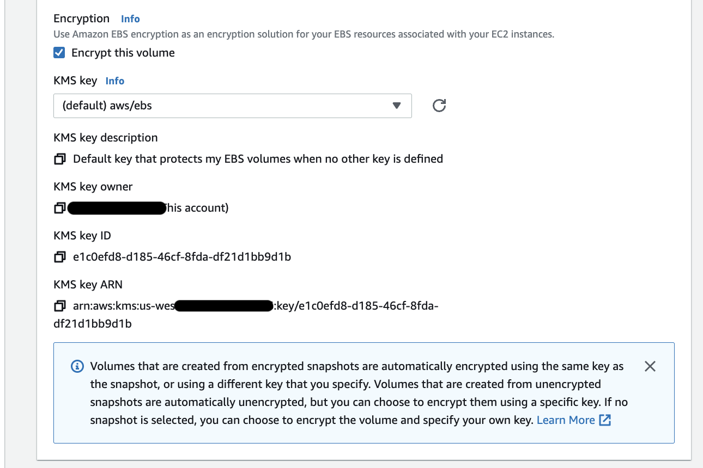
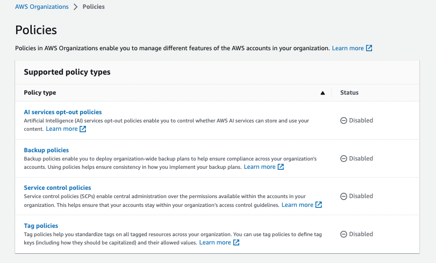
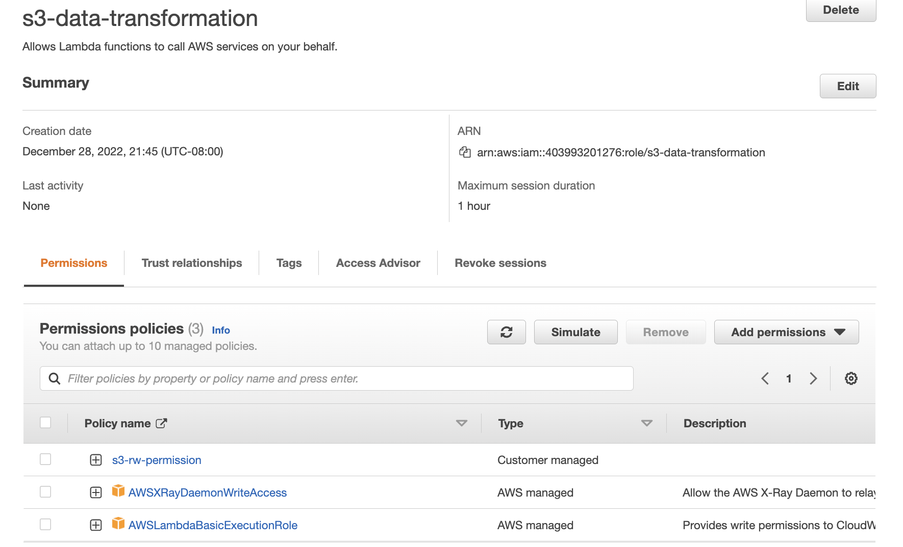

# Security

!!! Info
    Updated 1/09/2023

## Introduction

With the AWS Cloud, managing security and compliance is a [shared responsibility](https://aws.amazon.com/compliance/shared-responsibility-model/) between AWS and the customer:

* [AWS is responsible of security **of** the cloud](https://aws.amazon.com/security/) and offers the most flexible and secure cloud computing environment available today. AWS is responsible for patching their managed services and infrastructure security.
* Customers are responsible for the security **in** the cloud: secure workloads and applications that are deployed onto the cloud. When using EC2, we are responsible to patch OS for security (but AWS helps by providing patched AMIs, or tools such as [Systems Manager](https://aws.amazon.com/systems-manager), or [Inspector](https://aws.amazon.com/inspector/) for continuous vulnerability testing).

AWS runs highly secured data centers. Multiple geographic regions and Availability Zones allow customers to remain resilient in the face of most failure modes, from system failure to natural disasters. 

For highly regulated industry, AWS helps by getting more than 50 certifications for the infrastructure, globally but also regionaly for specific countries. At global, these include the [ISO 27001](https://www.iso.org/isoiec-27001-information-security.html), SOC 1 and 2 certifications. For regional in the USA, AWS aligns with [FISMA](https://www.cisa.gov/federal-information-security-modernization-act) and [FedRAMP](https://www.gsa.gov/technology/government-it-initiatives/fedramp), in UK with Cyber Essentials, in Australia with IRA... The audits are done by a 3nd party and we can find reports in [aws/artifact](https://aws.amazon.com/artifact/).

[AWS Compliance Center is a central location to research cloud-related regulatory requirements](https://aws.amazon.com/financial-services/security-compliance/compliance-center/)

Fine-grain identity and access controls combined with continuous monitoring for near real-time security information ([CloudTrail](https://aws.amazon.com/cloudtrail/)) ensures that the right resources have the right access at all times, wherever the information is stored

## Encryption

Encryption is widely available through a lot of services and features on top of the platform. We will be able to develop application that can encrypt data at rest, or in transit as it flows over the network between services. S3 storage or EBS block attached storage, have a single click option to do encryption at rest with keys (using KMS).



**Figure 1: Encryption settings for EBS volume, using KMS**

The managed service, [AWS Key Management Service](https://aws.amazon.com/kms/), helps centrally managing our own keys. It is integrated into a lot of services and the keys never leave AWS [FIPS 140-validated](https://en.wikipedia.org/wiki/FIPS_140-2) Hardware Security Modules unencrypted. User controls access and usage of the keys.

With client side encryption, the data are encrypted by the client, and never decrypted by the Server. Only client with the data key can decrypt the data.

### [KMS](https://docs.aws.amazon.com/kms/latest/developerguide/overview.html)

Managed service to help us create and control the cryptographic keys that are used to protect our data. It supports AWS, customer or custom keys:


**Figure 2: KMS & AWS keys**

* Integrated with IAM and most AWS services (EBS,S3, RDS, SSM...).
* Audit KMS Key usage using CloudTrail.
* Two types of KMS Keys:
    
    * Symmetric (AES 265 bits) is a single key used to encrypt and decrypt data. Must call KMS API to use it.
    * Asymmetrics (RSA, ECC key pairs) - Public key to encrypt and private key to decrypt. Used to encrypt outside of AWS, with no KMS API access.

* For AWS managed keys, they are automatically rotated every year.
* KMS Keys are per region. But when doing snapshot of a EBS volume and moving it to another region, AWS will reencrypt the data with a KMS key from the target region automatically. 
* KMS Key policies help to control who (users, roles ) can access the KMS keys. Used to do cross account access: the copy of a encrypted snapshot done from origin account to the target account will use this policy to access the key to decrypt the snapshot, and then encrypt the copy with a new private key within the target account.


**Figure 3: AWS key for S3 encryption, with Key policy**

* To encrypt a local file using a symmetric Key in KMS, we can use the CLI like:

    ```sh
    aws kms encrypt --key-id alias/jb-key --plaintext fileb://ExampleSecretFile.txt --output text --query CiphertextBlob  --region eu-west-2 > ExampleSecretFileEncrypted.base64
    ```

* To share the encrypted file, we can do: 

    ```sh
    cat ExampleSecretFileEncrypted.base64 | base64 --decode > ExampleSecretFileEncrypted
    ```

* Then to decrypt this file using KMS:

    ```sh
    aws kms decrypt --ciphertext-blob fileb://ExampleSecretFileEncrypted   --output text --query Plaintext > ExampleFileDecrypted.base64  --region eu-west-2
    # back to the text version
    cat ExampleFileDecrypted.base64 | base64 --decode > ExampleFileDecrypted.txt
    ```

KMS supports also Multi-Region Keys, where primary key from one region is replicated to other regions. The Key ID stays the same. The idea is to be able to encrypt in one region and decrypt in another region. A use case will be to encrypt attribute of a DynamoDB Global Table with the Primary key, and let client who has access to the replicated key can decrypt the attribute with lower latency as it is done locally.


**Figure 4: DB table encrypted and replicated with Keys**

The attribute is decrypted only if the client has access to the KMS Key.

### S3 considerations

By default with SSE-S3 objects encrypted or not are replicated.

With SSE-C, we provide the encryption key, so the encrypted objects are not replicated.

With SSE-KMS then we need to specify the KMS Key to encrypt the object in target bucket, adapt the KMS policy so the key is accessible in another region, and in the IAM role, be sure `kms:Decrypt` is enabled for the source key and `kms:Encrypt` for the target KMS Key.

### Encrypted AMI sharing process

* AMI in source account is encrypted with KMS Key from source account.
* AMI image should authorize the Launch permission for the target account.
* Define IAM role for the target account to use, and share KMS key accesses (DescribeKey, ReEncrypted, CreateGrant, Decrypt) via the role.
* When launching EC2 instance from this AMI in the target account, it is possible to use a new, local KMS key to re-encrypt the volumes.

## Organizations

[AWS Organizations](https://us-east-1.console.aws.amazon.com/organizations) helps to centraly manage multiple AWS accounts, group accounts, and simplify account creation. Using accounts helps to isolate AWS resources. It is a global service.

### Concepts

{ width=600 }

**Figure 5: Organization concepts**

* The main account is the management account where other added accounts are members.
* An organization is a hierarchical structure (a tree) with a root and Organization Units (OU), and AWS accounts.
* The `root` user is a single sign-in identity that has complete access to all AWS services and resources in any accounts.
* Organization unit (OU) contains AWS Accounts or other OUs. It can have only one parent.


**Figure 6: Organization Services - manage accounts**

* OU can be per team, per line of business.
* AWS Organizations uses [IAM service-linked roles](https://docs.aws.amazon.com/organizations/latest/userguide/orgs_integrate_services.html#orgs_integrate_services-using_slrs) to enable trusted services to perform tasks on your behalf in your organization's member accounts.
* We can create service control policies (SCPs) cross AWS accounts to deny access to AWS services for individuals or group of accounts in an OU. 
* AWS Organization exposes APIs to automate account management.
* It helps consolidating billing accross all the accounts and user can get pricing benefits from aggregate usage. Shared reserved instances and Saving Plans discounts apply across accounts. Can define Blocklist or Allowlist strategies.
* There is no cost to use AWS Organizations.
* We can invite an existing AWS account to our organization. But payment changes of ownership. 

### Advantages

* Better isolation than VPC.
* Can use tagging for billing purpose.
* Enable CloudTrail for all accounts and get report in S3.
* Can define service control policies (SCP) as IAM policies applied to OU or Accounts to restric Users and Roles. Explicit allow. The root OU will have `FullAWSAccess` SCP. 



**Figure 7: Organization policies**

### Deeper Dive

* [Presentation on organizations](https://broadcast.amazon.com/videos/192190)
* [User guide](https://docs.aws.amazon.com/organizations/latest/userguide/orgs_introduction.html)
* [Organization API](https://docs.aws.amazon.com/organizations/latest/APIReference/API_Organization.html)

## IAM Identity and Access Management

* Helps to control access to AWS services.


* This is a global service, defined at the account level, cross regions.
* IAM helps us to define users (physical person), groups and roles, and permissions (policies).


* Each account has a root user. Root user access should be set up to use MFA and complex password. Do not delete root user.
* Do not use root user, but create user and always use them when login. `jerome`, `aws-jb`  and `mathieu` are users.
* Administrator users are part of an admin group with admin priviledges, like `AdministratorAccess`.
* Assign users to groups (`admin` and `developers`) and assign policies to groups and not to individual user.
* Groups can only contain users, not other groups.
* Users can belong to multiple groups.
* A classical use case: Create the user accounts, create a group for each department, create and attach an appropriate policy to each group, and place each user account into their department’s group. When new team members are onboarded, create their account and put them in the appropriate group. If an existing team member changes departments, move their account to their new IAM group.
* AWS Account has a unique ID but can be set with an alias. The console URL includes the user alias.

### Security Policies

* Policies are written in JSON, to define permissions `Allow`, `Deny` for users to access AWS services, groups and roles...
* Policy applies to **Principal**: account/user/role, list the **actions** (what is allowed or denied) on the given **resources**.
* It must define an ID, a version and statement(s):

    ```json
    {
        "Version": "2012-10-17",
        "Statement": [
            {
                "Effect": "Allow",
                "Action": [
                    "iam:List*"
                ],
                "Resource": "*"
            }
        ]
    }
    ```

    Another example to control access to IAM:

    


* Use the `Least privilege permission` approach: Give users the minimal amount of permissions they need to do their job.
* As soon as there is a deny in the chain of policy evaluation, then allows will not work. See the diagram below from [the product documentation](https://docs.aws.amazon.com/IAM/latest/UserGuide/reference_policies_evaluation-logic.html) to review the decision flow to allow access to resource:


* Policy can define the password type `> Account settings > Password policy`, and when users are allowed to change the password.
* Inline policy can be defined at the user level, but it is recommended to use Group and Group level policies. As user can be part of multi groups, she/he will heritate to the different policies of those groups.
* IAM is not used for website authentication and authorization.
* For identity federation, use SAML standard.
* We can test Policies with the [policy simulator](https://policysim.aws.amazon.com/home/index.jsp?#).
* We can update a policy attached to a role and it takes immediate effect.
* Policies are not attached to AWS service, but to Roles.
* We can attach & detach roles to running EC2, without having to stop and restart it.


### Multi Factor Authentication - MFA

* Multi Factor Authentication is used to verify a human is the real user of a service
 
    * Always protect root account with MFA. 
    * MFA = password + device we own. 
    * The device could be a universal 2nd factor security key. (ubikey) 

* [Authy](https://authy.com/) is a multi-device service with free mobile app. We can have multiple users on the same device.

### IAM Roles

* To get AWS services doing work on other service, we need to use IAM Role and policies. Roles are assigned per application, or per EC2 or lambda function... A lot of roles are predefined and can be reused, and we can define new role for any service intance we create.


* Maintaining roles, and policies within a role, is more efficient than maintaining policies for users.  
*  When a service assumes a role, IAM dynamically provides temporary credentials that expire after a defined period of time, between 15 minutes to 36 hours.
* IAM role does not create static access key, so no risk to have the key stolen.

#### EC2 example

* When connected to an EC2 machine via ssh or using EC2 Instance Connect tool, we need to set the IAM roles for who can use the EC2. A command like `aws iam list-users` will not work until a role is attached. For example, the `DemoEC2Role` role is defined to let IAM access in read only:


This role is then defined in the EC2 / Security  > attach IAM role, and now read-only commands with `aws iam` will work.

#### Lamba example

We want to implement a lambda function, that will access S3 bucket to get file and another s3 bucket to put objects. We need a new role as illustrated in following figure, with permission to execute on lambda service, and trace qith XRay + a custom policy.



See the Policies defined in [labs/s3-lambda](https://github.com/jbcodeforce/aws-studies/tree/main/labs/s3-lambda). AWSLambdaBasicExecutionRole is for logs, AWSXRayDaemonWriteAccess for the function to put traces into CloudWatch XRay.

When defining the Lambda function we select the role we defined with the permissions we selected so the function can access other services. The role defines the permissions of our function. 

#### resource-based policy

When user, application or service assumes a role, it takes the permissions assigned to the role, and loose its original permissions. While when we use resource-based policy, the principal doesn't have to give up his permissions. For example if a user in Account A need to scan DynamoDB table in account A and dumpt it in S3 bucket in account B, then it is important to use resource-based policy for S3 bucket, so user does not loose its access to dynamoDB.

This is also used for EventBridge to access lambda, SNS, SQS, cloudWatch logs, API gateway...

### Permissions boundary

Set a permissions boundary to control the maximum permissions a user can have. This is defined at user's or role level, and we define policy for example to authorize the user to do anything on EC2, CloudWatch or S3. 

The effective permission of a user is the join between Organization SCP, Permissions Boundary, and identity-based policies.


Identity-based policies are attached to an IAM user, group, or role. These policies let you specify what that identity can do.

This is used to:

* Delegate responsibilities to non-admin users within their permission boundaries to create specific resources, like IAM user.
* Allow developers to self-assign policies and manage their own permissions, while making sure they can increase their privileges.
* Restrict one user.

### Security tools

* In IAM, use `> Credentials report` to download account based report.
* In IAM, use `> Users > select one user (aws-jb) and then Access Advisor tab`: 
Access Advisor shows the services that the selected user can access and when those services were last accessed.
* [Amazon GuardDuty](https://aws.amazon.com/guardduty/) is a security tool to continuously monitor your AWS accounts, instances, containers, users, and storage for potential threats.

### IAM Deeper dive

* [Policy evaluation logic](https://docs.aws.amazon.com/IAM/latest/UserGuide/reference_policies_evaluation-logic.html)


## [Amazon Cognito](https://docs.aws.amazon.com/cognito/latest/developerguide/what-is-amazon-cognito.html)

Amazon Cognito is a managed service which offers Authentication and Authorization features, it has **User pools** and **Identity pools**. It is scalable and highly available. Allows user to add user registration, sign in, and define access control.

* Supports standards based identity providers like OAuth 2.0, SAML, OIDC.
* **User pools** are user directories that provide sign-up and sign-in options for your app or mobile users. 
* User pool is for sign-in functionality, and it integrates with API Gateway and ALB. 
* **Identity pools** provide AWS credentials to grant your users access to your API, other AWS services via IAM permissions.


* Free tier of 50,000 MAUs for users who sign in directly to Cognito User Pools and 50 MAUs for users federated through SAML 2.0 based identity providers.
* Users can sign in through social identity providers like Google, Facebook, and Amazon. They can also sign in through enterprise providers like ADFS and Okta with SAML 2.0 and OpenID Connect authentication.
* Use Amazon Cognito's built-in UI and options for federating with multiple identity providers to add user sign-in, sign-up into an application. 
* use [AWS Amplify](https://docs.amplify.aws/) and the [aws-amplify-vue](https://docs.amplify.aws/start/) module to provide basic user sign up, sign in, and sign out functionality.


### Examples

* Configure how user login:


* Then define if you want to use MFA, get an option to reset password..
* Configure sign-up and message delivery. We can disable auto sign-up and sending email.

## [System management parameter store](https://docs.aws.amazon.com/systems-manager/latest/userguide/systems-manager-parameter-store.html)

Managed service, serverless, it is a secure storage for configuration and secrets. 


SSM Parameter Store has built-in version tracking capability. Each time we edit the value of a parameter, SSM Parameter Store creates a new version of the parameter and retains the previous versions.

It stores data in a hierarchical tree. For example  

```sh
aws ssm get-parameters-by-path --path /an-app/dev/
```

## [Secrets Manager](https://docs.aws.amazon.com/secretsmanager/latest/userguide/intro.html)

Keep Secret information, with automatic rotation enforced, with integration with RDS, Redshift, DocumentDB. Secrets can be replicated between regions. 

## [ACM - Certificate Manager](https://docs.aws.amazon.com/acm/latest/userguide/acm-overview.html)

Manage and deploy TLS certificates. Supports public and private certificates. Automatic renewal.

Free of charge for public certificates. 

Integrated with ELBs, Cloudfront, APIs on API gateway. Cannot use ACM with EC2.

## [WAF Web Application Firewall](https://docs.aws.amazon.com/waf/latest/developerguide/waf-chapter.html)

User to monitor the HTTP(S) requests that are forwarded to your protected (Layer 7) web application resources. 
It is deployed on ALB, API Gateway, CloudFront, AppSync GraphQL API, Cognito User Pool.

Rules are defined in Web Access Control List: they can apply to IP@, HTTP headers, body, URI strings, Cross-site Scripting... We can define size constraints, geographic matches, or rate-based rules for DDoS protection.
For example we can implement a rule capable of blocking all IPs that have more than 2,000 requests in the last 5 minute interval.

WebACL is regional, except for CloudFront.

### Deeper dive

* [Rate-based rule statement](https://docs.aws.amazon.com/waf/latest/developerguide/waf-rule-statement-type-rate-based.html)
* [WAS FAQ](https://aws.amazon.com/waf/faqs/)

## [Firewall manager](https://docs.aws.amazon.com/waf/latest/developerguide/fms-chapter.html)

Firewall manager simplifies your administration and maintenance tasks across multiple accounts (across AWS Organizations) and resources for a variety of protections, including AWS WAF, AWS Shield Advanced, Amazon VPC security groups, AWS Network Firewall, and Amazon Route 53 Resolver DNS Firewall. 

## [Shield](https://aws.amazon.com/shield/)

To protect against DDoS attack.

All AWS customers benefit from the automatic protections of AWS Shield Standard at no additional charge.

When you use AWS Shield Standard with Amazon CloudFront and Amazon Route 53, you receive comprehensive availability protection against all known infrastructure (Layer 3 and 4) attacks.

For more protection for EC2, ELB, CloudFront, Global Accelerator, Route 53... the advanced otion supports  network and transport layer protections with near real-time visibility into attacks and 24/7 access to Shield Response Team.

## [GuardDuty](https://docs.aws.amazon.com/guardduty/latest/ug/what-is-guardduty.html)

Amazon GuardDuty is a threat detection service that continuously monitors for malicious activity and unauthorized behavior to protect your AWS accounts, workloads, and data stored in Amazon S3.

Security monitoring service that analyzes and processes data sources such as:

* AWS CloudTrail data events for Amazon S3 logs, 
* CloudTrail management event logs, 
* DNS logs, 
* Amazon EBS volume data, 
* Kubernetes audit logs, 
* Amazon VPC flow logs
* RDS login activity

It uses ML/AI model, anomaly detection, and integrated threat intelligence to identify and prioritize potential threats..

GuardDuty can detect compromised EC2 instances and container workloads serving malware, or mining bitcoin.

By integrating with Amazon EventBridge Events, GuardDuty alerts are actionable, easy to aggregate across multiple accounts, and straightforward to push into existing event management and workflow systems.

## [Amazon Inspector](https://docs.aws.amazon.com/inspector/latest/user/what-is-inspector.html)

Vulnerability management service that continuously scans your AWS workloads for software vulnerabilities and unintended network exposure. Includes EC2 instance scan and container images in Amazon ECR.

## [Amazon Macie](https://docs.aws.amazon.com/macie/latest/user/what-is-macie.html)

Amazon Macie is a fully managed data security service that uses Machine Learning to discover and protect your sensitive data stored in S3 buckets. It automatically provides an inventory of S3 buckets including a list of unencrypted buckets, publicly accessible buckets, and buckets shared with other AWS accounts. It allows you to identify and alert you to sensitive data, such as Personally Identifiable Information (PII).

All Macie findings are sent to Amazon EventBridge and can also be published to AWS Security Hub to initiate automated remediation such as blocking public access to your S3 storage.


## [IAM Identity Center](https://docs.aws.amazon.com/singlesignon/index.html)

Single sign-on managed services for all AWS accounts within AWS Organizations, cloud applications, SAML2.0-enabled applications, EC2 Windows instances. 

The identity provider can be an identity store in IAM Identity center or an Active Directory, OneLogin, Okta...

* [API reference](https://docs.aws.amazon.com/singlesignon/latest/APIReference/welcome.html)


## AWS [CloudHSM](https://aws.amazon.com/cloudhsm/?nc2=type_a)

[AWS CloudHSM](https://docs.aws.amazon.com/cloudhsm/latest/userguide/introduction.html) (Hardware Security Module) helps you meet corporate, contractual, and regulatory compliance requirements for data security.

A Hardware Security Module (HSM) provides secure key storage and cryptographic operations within a tamper-resistant hardware device. HSMs are designed to securely store cryptographic key material and use the key material without exposing it outside the cryptographic boundary of the hardware.

We can create a cluster that has from 1 to 28 HSMs (the default limit is 6 HSMs per AWS account per AWS Region).


Example of use case is when hosted on EC2, must encrypt the data before writing this data to storage.

We can also use AWS KMS if you need to encrypt data before writing it to storage when an AWS managed hardware security module for the cryptographic keys is not required.

## [AWS Audit Manager](https://docs.aws.amazon.com/audit-manager/latest/userguide/what-is.html)

AWS Audit Manager is an automated service to continually audit your AWS usage to simplify how you manage risk and compliance with regulations and industry standards. It eifjcbfdjifhurnicntgjklgrihfkfcdfierkgkghcdi
produces reports specific to auditors for PCI compliance, GDPR, and more.

## [AWS Security Hub](https://docs.aws.amazon.com/securityhub/latest/userguide/what-is-securityhub.html)

AWS Security Hub is a Cloud Security Posture Management service that performs security best practice checks, aggregates alerts, and enables automated remediation.

AWS Security Hub is a single place to view all your security alerts from services like Amazon GuardDuty, Amazon Inspector, Amazon Macie, and AWS Firewall Manager. It is not used for producing audit reports.

## [AWS Control Tower](https://docs.aws.amazon.com/controltower/latest/userguide/what-is-control-tower.html)

AWS Control Tower orchestration extends the capabilities of AWS Organizations to set up and govern multi-account environment. It leverages SCPs for preventative guardrails and AWS Config for detective guardrails.

No additional charge exists for using AWS Control Tower. You only pay for the AWS services enabled by AWS Control Tower, and the services you use in your landing zone.

## Security FAQ

???- "Sensitive data in the cloud can be accessed by everyone"
    AWS storage managed services are secured by default. You control who can access your data. For example, in S3 bucket, objects, by default are only available by the owner who created them. IAM policies define access to buckets, and in S3 itself you can define policies. Some policies can be defined at the Account level to forbid to define public bucket. From detection services like `CloudTrail` and `CloudWatch` Events you can route events to security team or respond in real-time to those events with code in a Lambda function.

???- "Integrate with existing Directory?"
    IAM can integrate with your existing directory where you can map IAM groups to directory group membership.

???- "Running intrusion/penetration testing and vulnerability scan"
    You can run any of those tests on your own workloads and for the following services:
    
    * Amazon EC2 instances
    * NAT Gateways
    * Elastic Load Balancers
    * Amazon RDS
    * Amazon CloudFront
    * Amazon Aurora
    * Amazon API Gateways
    * AWS Fargate
    * AWS Lambda and Lambda Edge functions
    * Amazon Lightsail resources
    * Amazon Elastic Beanstalk environments

    You need to sign a "Seek approval" document so AWS can understand what you are doing and is not searching for malicious activities on your account or triggers security alarms. To integrate Penetration tests in your CI/CD [Amazon Inspector](https://aws.amazon.com/inspector) is an automated vulnerability management service that continually scans AWS workloads for software vulnerabilities and unintended network exposure.

???- "How to ensure RDS database can only be accessed using profile credentials specific to EC2 instance?"
    IAM has [database authentication capabilities](https://docs.aws.amazon.com/AmazonRDS/latest/UserGuide/UsingWithRDS.IAMDBAuth.html) that would allow an RDS database to only be accessed using the profile credentials specific to your EC2 instances.
???- "Specifics business oriented accreditations"
    The workload is certified by your 3nd party auditor. AWS provides the accreditation doc for infrastructure and hosting operations. You have full visibility into the logical infrastructure via API calls, so your auditors can get information on items like security group (firewall) rules or RDS configuration via API calls, or account access information through our API auditing service, `CloudTrail`.

???- "How does IDS/IPS works on AWS?"
    Intrusion Detection and Prevention can be achieved in number of ways. There are tools/services like `Guard Duty`, 3rd party solution (AWS marketplace) as well architecture best practices. Amazon VPC traffic mirroring is a “virtual fiber tap” that gives you direct access to the network packets flowing through your VPC. 

???- "Encrypted traffic between instances?"
    Within the AWS network, you'll be hosted in a Virtual Private Cloud (VPC) and all traffic between your instances stay within your VPC. Other customers cannot see your traffic. Configuring inter-instance traffic encryption would be the same as on-premises.

???- "Does AWS provide DDoS protection?"
    [AWS Shield Standard](https://aws.amazon.com/shield/) is automically provided to all AWS customers and AWS Shield advanced service can be bought for additional features. AWS Shield is a managed Distributed Denial of Service events protection service that safeguards applications running on AWS.

???- "How to be sure to data is really deleted"
    You own the data inside AWS. But on delete operation the data is destroyed and wiped out. When destroying physical hardware, AWS follows the NIST 888 requirements, and it is done in a secure zone in the data center. Audits are done by 3nd party vendor, and compliances are reported in [Artifact](https://aws.amazon.com/artifact).

???- "Is serverless secured?"
    Roles are defined to define who can push code, access it, and fine grained control of the serverless execution. All serverless managed services inherit from the underlying platform security control. As an example, Lambda execution are authenticated, authorized and are made visible to the SREs via the commong logging mechanism.

## Solution Design

The most important questions to ask and address when designing AWS solution with security consideration are:

* who can access the resources in the account.
* what can access the resources, and how access is allowed.

Address how to secure, web tier, app tier and database access. What firewalls to use, and where.

For each compute resources address access to monitoring and logging and network environment that contain those resources. 

Is there any Gateway needed?

Finally consider data life cycle and access control over time. What are the compliance requirements? 

### Blocking IP address

* At the VPC level, the best approach is to use Network ACL, when EC2 is exposed via public IP address, as illustrasted in the diagram below:

    

    Use a denial rule in NACL on specific IP address. Security group inbound rule specifies allowed only IP range, which should work, but then it blocks larger set of clients, so it will not be a solution for global application. Running a firewall on the EC2 will help, but it is more complex to administer.  

* If an ALB is in the middle, then the EC2 security group will specify the SG of the ALB, and we are still using NACL. 

    

    ALB does connection termination, so client will not be able to attack EC2.

    To add more control we can add a Web Application Firewall to add complex filtering on the IP @.

* Using a NLB, there will be no security group at the network load balancer, so traffic reaches EC2s. In this case only the NACL rules will help to protect. 

* When using CloudFront, we need to add WAF, as NACL at the VPC level will not work, the ALB being connected to the cloudFront IP address, only (via security group).

    

    Geo restriction can be defined at the cloud front level, to deny a complete country for example.

## Learn more

* [Data Safe cloud checklist](https://aws.amazon.com/campaigns/cloud-security/data-safe-cloud-checklist/)
* [Top security myth - dispelled](https://www.youtube.com/watch?v=MxDO78BYsU0)