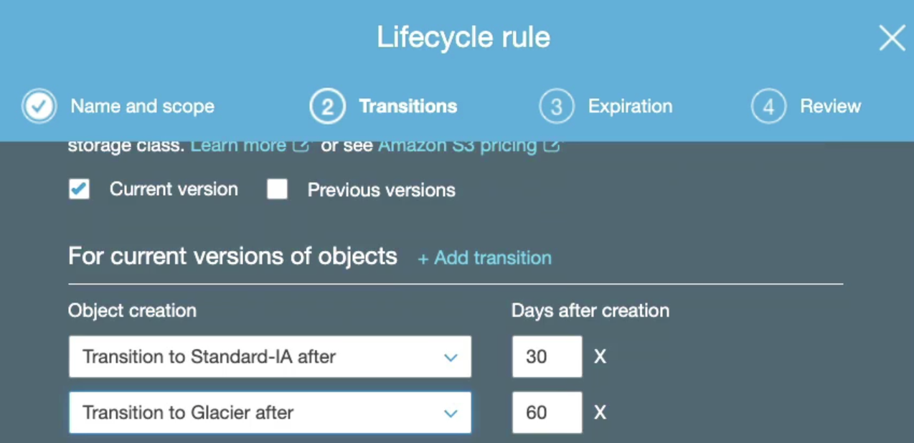

# Storage

AWS storage services are grouped into three categories – block storage, file storage, and object storage.

## File Storage

File storage is ideal when you require centralized access to files that need to be easily shared and managed by multiple host computers. Typically, this storage is mounted onto multiple hosts, and requires file locking and integration with existing file system communication protocols.

File storage systems are often supported with a network attached storage (NAS) server

## Block Storage

Block storage splits files into fixed-size chunks of data called blocks that have their own addresses, which improve read access.

Outside of the address, no additional metadata is associated with each block.

Block storage in the cloud is analogous to direct-attached storage (DAS) or a storage area network (SAN)

Amazon EC2 instance store provides temporary block-level storage for an instance. The storage is located on disks that are physically attached to the host computer. It is deleted when the EC2 instance is deleted. 

Instance store is ideal if you host applications that replicate data to other EC2 instances such as Kafka or Hadoop.


## Object Storage

Objects are stored in a flat structure instead of a hierarchy. We can store almost any type of data, and there is no limit to the number of objects stored, which makes it readily scalable.

## Amazon Elastic Block Storage EBS

Amazon EBS is attached to EC2 instance, is HA, and can be backed up. EVS volume can be attached to a new EC2 instance, normally there is a 1 to 1 relation between volume and EC2 instance. Except for multi-attach EBS.

the maximum amount of storage you can have is 16 TB.

EBS snapshots are incremental backups that only save the blocks on the volume that have changed after your most recent snapshot.

EBS snapshots can be used to create multiple new volumes, whether they’re in the same Availability Zone or a different one

## S3

[Amazon S3](https://s3.console.aws.amazon.com/s3/get-started?region=us-west-1) allows people to store objects (files) in **buckets** (directories), which must have a globally unique name (cross users!). They are defined at the region level. **Object** in a bucket, is referenced as a **key** which can be seen as a file path in a file system. The max size for an object is 5 TB but big file needs to be uploaded in multipart using 5GB max size.

S3 supports versioning at the bucket level. So file can be restored from previous version, and even deleted file can be retrieved from a previous version.

### Use cases

* Backup and restore
* DR
* Archive
* [Data lakes](https://aws.amazon.com/big-data/datalakes-and-analytics/)
* Hybrid cloud storage: seamless connection between on-premises applications and S3 with AWS Storage Gateway.
* Cloud-native application data


[GETTING started](https://docs.aws.amazon.com/AmazonS3/latest/userguide/GetStartedWithS3.html)

### Security control

Objects can also be encrypted, and different mechanisms are available:

* **SSE-S3**: server-side encrypted S3 objects using keys handled & managed by AWS using AES-256 protocol must set `x-amz-server-side-encryption: "AES256"` header in the POST request.
* **SSE-KMS**: leverage AWS Key Management Service to manage encryption keys. `x-amz-server-side-encryption: "aws:kms"` header. Server side encrypted. It gives user control of the key rotation policy and audit trail.
* **SSE-C**: when we want to manage our own encryption keys. Server-side encrypted. Encryption key must be provided in HTTP headers, for every HTTP request made. HTTPS is mandatory
* **Client Side Encryption**: encrypt before sending object.


Explicit DENY in an IAM policy will take precedence over a bucket policy permission.

### S3 Website

We can have static web site on S3. Once html pages are uploaded, setting the properties as static web site from the bucket. The bucket needs to be public, and have a security policy to allow any user to `GetObject` action. The URL may look like: `<bucket-name>.s3-website.<AWS-region>.amazonaws.com`

* **Cross Origin resource sharing CORS**: The web browser requests won’t be fulfilled unless the other origin allows for the requests, using CORS Headers `Access-Control-Allow-Origin`. If a client does a cross-origin request on our S3 bucket, we need to enable the correct CORS headers: this is done by adding a security policy with CORS configuration like:

```xml
<CORSConfiguration>
    <CORSRule>
        <AllowedOrigin>enter-bucket-url-here</AllowedOrigin>
        <AllowedMethod>GET</AllowedMethod>
        <MaxAgeSeconds>3000</MaxAgeSeconds>
        <AllowedHeader>Authorization</AllowedHeader>
    </CORSRule>
</CORSConfiguration>
```

Finally S3 is eventually consistent.

#### S3 replication

Once versioning enabled, a bucket can be replicated in the same region or cross regions. S3 replication is done on at least 3 AZs. Each AZ can be up to 8 data centers. One DC down does not impact S3 availability. The replication is done asynchronously. SRR is for log aggregation for example, while CRR is used for compliance and DR or replication across accounts. Delete operations are not replicated.

### S3 Storage classes

When uploading a document into an existing bucket we can specify the storage class for keep data over time. Different levels are offered with different cost and SLA.

 

To prevent accidental file deletes, we can setup MFA Delete to use MFA tokens before deleting objects.

Amazon **Glacier** is for archiving, like writing to tapes. 

We can transition objects between storage classes. For infrequently accessed object, move them to STANDARD_IA. For archive objects, that we don’t need in real-time, use GLACIER or DEEP_ARCHIVE. Moving objects can be automated using a lifecycle configuration

At the bucket level, a user can define lifecycle rules for when to transition an object to another storage class.

 

To improve performance, a big file can be split and then uploaded with local connection to the closed edge access and then use AWS private network to copy between buckets in different region.

[S3 to Kafka lab](https://ibm-cloud-architecture.github.io/refarch-eda/use-cases/connect-s3/)


## Elastic File System (EFS)

Fully managed NFS file system. [FAQ](https://aws.amazon.com/efs/faq/)


## Snowball

Move TB of data in and out AWS using physical device to ship data. The edge has 100TB and compute power to do some local processing on data. Snow mobile is a truck with 100 PB capacity. Once on site, it is transferred to S3.

Snowball Edge brings computing capabilities to allow data pre-processing while it's being moved in Snowball, so we save time on the pre-processing side as well.

## Hybrid cloud storage

Storage gateway expose an API in front of S3. Three gateway types:

* **file**: S3 bucket accessible using NFS or SMB protocols. Controlled access via IAM roles. File gateway is installed on-premise and communicate with AWS.
* **volume**: this is a block storage using iSCSI protocol. On-premise and visible as a local volume backed by S3.
* **tape**: same approach but with virtual tape library. Can go to S3 and Glacier.

### Storage comparison

* S3: Object Storage
* Glacier: Object Archival
* EFS: Network File System for Linux instances, POSIX filesystem
* FSx for Windows: Network File System for Windows servers
* FSx for Lustre: High Performance Computing Linux file system
* EBS volumes: Network storage for one EC2 instance at a time
* Instance Storage: Physical storage for your EC2 instance (high IOPS)
* Storage Gateway: File Gateway, Volume Gateway (cache & stored), Tape Gateway
* Snowball / Snowmobile: to move large amount of data to the cloud, physically
* Database: for specific workloads, usually with indexing and querying