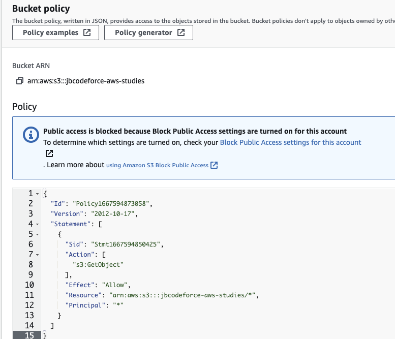
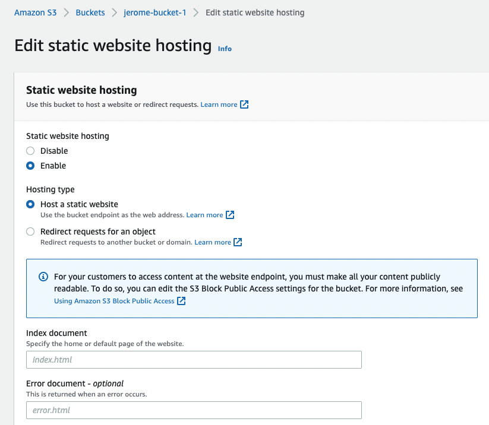
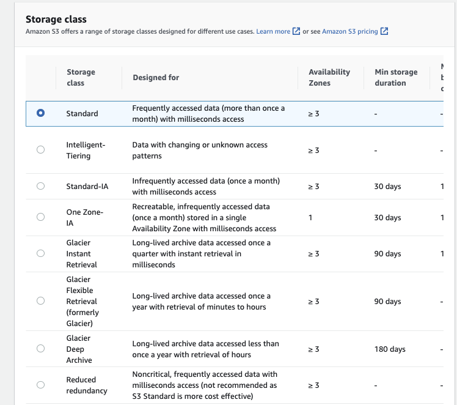

# Storage

AWS storage services are grouped into three categories – block storage, file storage, and object storage.

## File Storage

File storage is ideal when you require centralized access to files that need to be easily shared and managed by multiple host computers. Typically, this storage is mounted onto multiple hosts, and requires file locking and integration with existing file system communication protocols.

File storage systems are often supported with a network attached storage (NAS) server

## Block Storage

Block storage splits files into fixed-size chunks of data called blocks that have their own addresses, which improve read access.

Outside of the address, no additional metadata is associated with each block.

Block storage in the cloud is analogous to direct-attached storage (DAS) or a storage area network (SAN)

Amazon EC2 instance store provides temporary block-level storage for an instance. The storage is located on disks that are physically attached to the host computer. It is deleted when the EC2 instance is deleted. 

Instance store is ideal if you host applications that replicate data to other EC2 instances such as Kafka or Hadoop.

## Object Storage

Objects are stored in a flat structure instead of a hierarchy. We can store almost any type of data, and there is no limit to the number of objects stored, which makes it readily scalable.

## Amazon Elastic Block Storage EBS

Elastic Block Store Volume is a network drive attached to the EC2 instance. It is locked to an AZ, and uses provisioned capacity in GBs and IOPS. It is HA, and can be backed up.


* Create a EBS while creating the EC2 instance and keep it not deleted on shutdown
* EBS volume can be attached to a new EC2 instance, normally there is a 1 to 1 relation between volume and EC2 instance. Except for multi-attach EBS.
* The maximum amount of storage you can have is 16 TB.
* Once logged, add a filesystem, mount to a folder and modify boot so the volume is mounted at start time. Which looks like:

```shell
# List existing block storage, verify our created storage is present
lsblk
# Verify file system type
sudo file -s /dev/xdvf
# Create a ext4 file system on the device 
sudo mkfs -t ext4 /dev/xvdb
# make a mount point
sudo mkdir /data
sudo mount  /dev/xvdb /data
# Add entry in /etc/fstab with line like:
/dev/xvdb /data ext4 default,nofail 0 2
```

* EBS is already a redundant storage, replicated within an AZ.
* EC2 instance has a logical volume that can be attached to two or more EBS RAID 0 volumes, where write operations are distributed among them. It is used to increate IOPS without any fault tolerance. If one fails, we lost data. It could be used for database with built-in replication or Kafka.
* RAID 1 is for better fault tolerance: a write operation is going to all attached volumes.

### Volume types

When creating EC2 instances, you can only use the following EBS volume types as boot volumes: gp2, gp3, io1, io2, and Magnetic (Standard)

* **gp2 or gp3**: SSD, used for most workload up to 16 TB at 16000 IOPS max  (3 IOPS per GB brustable to 3000)
* **io 1** or **io 2**: critical app with large database workloads. max ratio 50:1 IOPS/GB. Min 100 iops and 4G to 16T
* **st 1**: HDD. Streaming workloads requiring consistent, fast throughput at a low price. For Big data, Data warehouses, Log processing. Up to 16 TiB.
* **sc 1**: throughput oriented storage.  500G- 16T, 500MiB/s. Max IOPs at 250. Used for cold HDD, and infrequently accessed data.

Encryption has a minimum impact on latency. It encrypts data at rest and during snapshots.
* Provisioned IOPS (PIOPS) SSD: used for critical apps with sustained IOPS performance, even more than 16k IOPS. 

Instance store is a volume attached to the instance, used for root folder. It is a ephemeral storage but has millions read per s and 700k write IOPS. It provides the best disk performance and can be used to have high performance cache for our applications.


If we need to run a high-performance database that requires an IOPS of 210,000 for its underlying filesystem, we need instance store and DB replication in place.

### Snapshots


EBS snapshots are incremental backups that only save the blocks on the volume that have changed after your most recent snapshot.
Used to backup disk at any point of time of a volume and store it on S3.
Snapshot Lifecycle policies helps to create snapshot with scheduling it by defining policies.
To move a volume to another AZ or data center we can create a volume from a snapshot.

EBS snapshots can be used to create multiple new volumes, whether they’re in the same Availability Zone or a different one

### EBS Multi-attach

Only for io1 or io2 EBS type, a volume can be attached to multiple EC2 instances (up to 16) running in the same AZ. Each instance has full R/W permission. 
The file system must be cluster aware.

## S3 - Simple Storage Service

[Amazon S3](https://s3.console.aws.amazon.com/s3/get-started?region=us-west-1) allows people to store objects (files) in **buckets** (directories), which must have a globally unique name (cross users!). They are defined at the region level. **Object** in a bucket, is referenced as a **key** which can be seen as a file path in a file system. The max size for an object is 5 TB but big file needs to be uploaded in multi-part using 5GB max size.

S3 has 11 9's high durability of objects across **multiple AZ** (At least 3). Availability varies with storage class, S3 standard is 99.99%. 

S3 supports **strong consistency** for all operations with a read-after-write consistency.

S3 supports versioning at the bucket level. So file can be restored from previous version, and even deleted file can be retrieved from a previous version.

Within the S3 console we will see all buckets in one view (its is a global service). But the buckets are created within a region and are local to the region. 

### Use cases

* Backup and restore
* Disaster Recovery
* Archive
* [Data lakes](https://aws.amazon.com/big-data/datalakes-and-analytics/) and big data analytics
* Hybrid cloud storage: seamless connection between on-premises applications and S3 with AWS Storage Gateway.
* Cloud-native application data
* Media hosting
* Software delivery
* Static website

[GETTING started](https://docs.aws.amazon.com/AmazonS3/latest/userguide/GetStartedWithS3.html)

### Security control

* By default a bucket access is not public, see the `Block Public Access` setting. Can be enforced at the account level and need to be disable at the account level, before doing it at the bucket level (amazon S3 > block public access settings for this account > edit block public access settings for this account).

    

* To control access with policies we need to disable this, and then define Bucket policy.
* **S3 Bucket Policy**: is security policy defined in S3 console, and also allows cross-account access control. Can be set at the bucket or object level.
* Explicit DENY in an IAM policy will take precedence over a [bucket policy permission](https://docs.aws.amazon.com/AmazonS3/latest/userguide/example-bucket-policies.html).
* Define policies from [examples](https://docs.aws.amazon.com/AmazonS3/latest/userguide/example-bucket-policies.html) or using [policy generator tool](https://awspolicygen.s3.amazonaws.com/policygen.html).

    

    And copy paste the generated policy

    

* By default, when another AWS account uploads an object to your S3 bucket, that account (the object writer) owns the object, has access to it, and can grant other users access to it through ACLs. Bucket owner can take ownership of all objects. It is recommended to disable ACL and use identity and bucket policies. 
* Objects can also be encrypted, and different mechanisms are available:

    * **SSE-S3**: server-side encrypted S3 objects using keys handled & managed by AWS using AES-256 protocol must set `x-amz-server-side-encryption: "AES256"` header in the POST request.
    * **SSE-KMS**: leverage AWS Key Management Service to manage encryption keys. `x-amz-server-side-encryption: "aws:kms"` header. Server side encrypted. It gives user control of the key rotation policy and audit trail.
    * **SSE-C**: when we want to manage our own encryption keys. Server-side encrypted. Encryption key must be provided in HTTP headers, for every HTTP request made. HTTPS is mandatory.
    * **Client Side Encryption**: encrypt before sending object.


* An IAM principal can access an S3 object if the user IAM permissions allow it or the resource policy allows it and there is no explicit deny.

### S3 Website hosting

We can have static website on S3. Once html pages are uploaded, setting the properties as static web site from the bucket. The bucket needs to be public, and have a security policy to allow any user to `GetObject` action. The URL may look like: `<bucket-name>.s3-website.<AWS-region>.amazonaws.com`



* Example of pushing a mkdocs site to s3 after enabling public access

```sh
mkdocs build
aws s3 sync ./site s3://jbcodeforce-aws-studies 
# The url is at the bottom of the bucket in the website under the Bucket website endpoint for example:
http://jbcodeforce-aws-studies.s3-website-us-west-2.amazonaws.com
```

* **Cross Origin Resource Sharing CORS**: The web browser requests won’t be fulfilled unless the other origin allows for the requests, using CORS Headers `Access-Control-Allow-Origin`. If a client does a cross-origin request on our S3 bucket, we need to enable the correct CORS headers: this is done by adding a security policy with CORS configuration like:

```xml
<CORSConfiguration>
    <CORSRule>
        <AllowedOrigin>enter-bucket-url-here</AllowedOrigin>
        <AllowedMethod>GET</AllowedMethod>
        <MaxAgeSeconds>3000</MaxAgeSeconds>
        <AllowedHeader>Authorization</AllowedHeader>
    </CORSRule>
</CORSConfiguration>
```

### S3 replication

Once versioning enabled on source and target, a bucket can be replicated in the same region (SRR) or cross regions (CRR). S3 replication is done on at least 3 AZs. One DC down does not impact S3 availability. The replication is done asynchronously. SRR is for log aggregation for example or live replication between production and test, while CRR is used for compliance and DR or replication across AWS accounts. Delete operations are not replicated.

Must give proper IAM permissions to S3. When replication is set, only new objects are replicated. To replicate exiting objects use S3 Batch Replication.

By default delete markers are not replicated by with the advanced options we can enable it.

### S3 Storage classes

When uploading a document into an existing bucket we can specify the storage class to keep data over time. Different levels are offered with different cost and SLA.

 

With **Intelligent Tiering**, S3 automates the process of moving objects to the most cost-effective access tier based on access frequency. With **One Zone IA**, there is a risk of data loss in the event of availability zone destruction, and some objects may be unavailable when an AZ goes down. **Standard** is the most expensive storage option. **Standard IA** has a separate retrieval fee.

Amazon **Glacier** is for archiving, like writing to tapes. The pricing includes storage and object retrieval cost.
**Glacier Deep Archive** (also named Bulk) is the lowest cost storage option for long-term archival and digital preservation. Deep Archive can take several hours (from 12 to 48 hours) depending on the retrieval tier.

We can transition objects between storage classes. For infrequently accessed object, move them to STANDARD_IA. For archive objects, that we don’t need in real-time, use GLACIER or DEEP_ARCHIVE. Moving objects can be automated using a lifecycle configuration.

To prevent accidental file deletions, we can setup MFA Delete to use MFA tokens before deleting objects.

At the bucket level, a user can define lifecycle rules for when to transition an object to another storage class.

 

 and

 

To improve performance, a big file can be split and then uploaded with local connection to the closed edge access and then use AWS private network to copy between buckets in different region.

[S3 to Kafka lab](https://jbcodeforce.github.io/refarch-eda/use-cases/connect-s3/)

**Storage Class Analysis** can continuously monitor your bucket and track how your objects are accessed over time. This tool generates detailed reports on the percentage of data retrieved and by age groups. You can use this report to manage lifecycle policies. 

**Storage Lens** provides a dashboard on all S3 activities and is automatically enabled.

### Other features

* **Secure FTP**: server to let you send file via SFTP
* **Pre-signed URL**: share object with URL with temporary access. Can be done with the command: `aws s3 presign`
* **S3 select and Glacier Select**: to retrieve a smaller set of data from an object using SQL.
* **Amazon Macie**: is a machine learning security service to discover, classify and protect sensitive data stored in S3. 
* **Object lock**: to meet regulatory requirements of write once read many storage.

### FAQ

???- "The last one MB of each file in bucket contains summary information that you want to expose in a search what to use?"
    Byte-Range fetch allows you to read only a portion of data from the object. Since the summary is a small part of each, it is efficient to directly read the summary rather than downloading an entire object from S3. 

???- "Pricing factors"
    Frequency of access, storage cost, retrieval cost and retrieval time.
    The S3 Intelligent Tiering automatically changes storage class depending on usage to optimize cost. S3 lifecycle is based on age and can be defined with rules.

## Elastic File System (EFS)

Fully managed NFS file system. [FAQ](https://aws.amazon.com/efs/faq/) for multi AZs. (3x gp2 cost), controlled by using security group. This security group needs to add in bound rule of type NFS connected / linked to the SG of the EC2.

* Only Linux based AMI. POSIX filesystem. Encryption is supported using KMS.
* 1000 concurrent clients
* 10GB+/s throughput, bursting or provisioned, grow to petabyte.


* Support different performance mode, like max I/O or general purpose
* Select regional (standard or default) or one zone availabiltiy and durability. 
* Billed for what you use.
* Support storage tiers to move files after n days. Used on infrequent access, so lifecycle management move file to EFS-IA.
* Use amazon EFS util tool in each EC2 instance to mount the EFS to a target mount point.
* Is defined in a subnet, so the EC2 needs to specify in which subnet it runs.


## Snowball

Move TB of data in and out AWS using physical device to ship data. The edge has 100TB and compute power to do some local processing on data. Snow mobile is a truck with 100 PB capacity. Once on site, it is transferred to S3.

Snowball Edge brings computing capabilities to allow data pre-processing while it's being moved in Snowball, so we save time on the pre-processing side as well.

## Hybrid cloud storage

Storage gateway expose an API in front of S3. Three gateway types:

* **file**: S3 bucket accessible using NFS or SMB protocols. Controlled access via IAM roles. File gateway is installed on-premise and communicate with AWS.
* **volume**: this is a block storage using iSCSI protocol. On-premise and visible as a local volume backed by S3.
* **tape**: same approach but with virtual tape library. Can go to S3 and Glacier.

### Storage comparison

* S3: Object Storage
* Glacier: Object Archival
* EFS: Network File System for Linux instances, POSIX filesystem
* FSx for Windows: Network File System for Windows servers
* FSx for Lustre: High Performance Computing Linux file system
* EBS volumes: Network storage for one EC2 instance at a time
* Instance Storage: Physical storage for your EC2 instance (high IOPS)
* Storage Gateway: File Gateway, Volume Gateway (cache & stored), Tape Gateway
* Snowball / Snowmobile: to move large amount of data to the cloud, physically
* Database: for specific workloads, usually with indexing and querying