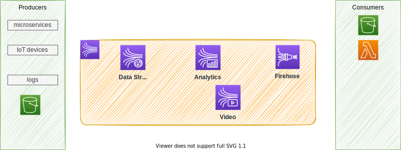
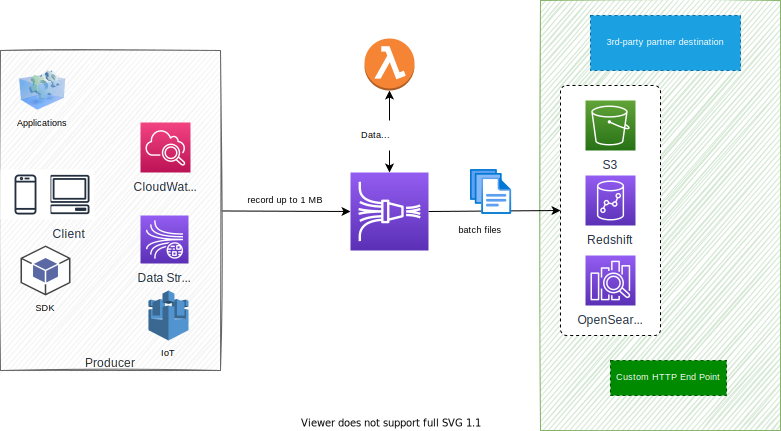

# Kinesis services

Designed to process real-time streaming data. 

 

Three main different components are: 

* **Kinesis Streams**: low latency streaming ingest at scale. They offer patterns for data stream processing. It looks similar to Kafka, but MKS is the Kafka deployment.
* **Kinesis Analytics**: perform real-time analytics on streams using SQL. This Apache Flink as managed service.
* **Kinesis Firehose**: load streams into S3, Redshift, ElasticSearch. No administration, auto scaling, serverless.

## [Kinesis Data Streams](https://aws.amazon.com/kinesis/data-analytics/)

It is a distributed data stream into Shards for parallel processing. 


/it uses a public end point and applications can authenticate using IAM role. Kinesis Data Streams is using a throughput provisining model, a shard can inject 1 Mb/s or 1000 msg /s with an egress of 2Mb/s. Adding shards help to scale the throughput. A single shard supports up to 5 messages per second, so a unique consumer gets records every 200ms. Adding more consumers on the same shard, the propagation delay increases and throughput per consumer decreases. With 5 consumers, each receives 400kB max every second.

Producer sends message with `Partition Key`. A sequence number is added to the message to note where the message is in the Shard. 

* Retention from 1 to 365 days.
* Capable to replay the messages.
* Immutable records, not deleted by applications.
* Message in a shard, can share partition key, and keep ordering.
* Producer can use SDK, or Kinesis Producer Library (KPL) or being a Kinesis agent.
* Consumer may use SDK and Kinesis Client Library (KCL), or being one of the managed services like: Lambda, Kinesis Data Firehose, Kinesis Data Analytics.
* For consuming side, each Shard gets 2MB/s out.
* It uses enhanced fan-out if we have multiple consumers retrieving data from a stream in parallel. This throughput automatically scales with the number of shards in a stream.
* Pricing is per Shard provisioned per hour.
* The capacity limits of a Kinesis data stream are defined by the number of shards within the data stream. The limits can be exceeded by either data throughput or the number of reading data calls. Each shard allows for 1 MB/s incoming data and 2 MB/s outgoing data. You should increase the number of shards within your data stream to provide enough capacity.

There is an On-demand mode, pay as you go, with a default capacity of 4MB/s or 4000mg/s. Pricing per stream, per hour and data in/out per GB. 

Captured Metrics are: # of incoming/outgoing bytes, # incoming/outgoing records, Write / read provisioned throughput exceeded, and iterator age ms.

### Deployment

Using CDK, see example in [cdk/kinesis](https://github.com/jbcodeforce/big-data-tenant-analytics/tree/main/cdk/kinesis), but can be summarized as:

```python
from aws_cdk import (
    aws_kinesis as kinesis
)

kinesis.Stream(self, "SaaSdemoStream",
    stream_name="bg-jobs",
    shard_count=1,
    retention_period=Duration.hours(24)
)
```

Using CLI:

```sh
aws kinesis create-stream --stream-name ExampleInputStream --shard-count 1 --region us-west-2 --profile adminuser
```

### Producer

Producer applications are done using Kinesis Producer Library (KPL) and they can batch events, and perform retries. Internally KPL uses queue to bufferize messages.  Example of python code using boto3 and KPL:

```python
STREAM_NAME = "companies"
my_session = boto3.session.Session()
my_region = my_session.region_name
kinesis_client = boto3.client('kinesis',region_name=my_region)

def sendCompanyJson():
    company={"companyID" : "comp_4",
            "industry": "retail",
            "revenu": 29080,
            "employees": 14540,
            "job30": 4,
            "job90":13,
            "monthlyFee": 460.00,
            "totalFee": 1172.00
    }
    companyAsString =json.dumps(company)
    print(companyAsString)
    kinesis_client.put_record(
                StreamName=STREAM_NAME,
                Data=companyAsString,
                PartitionKey="partitionkey")
```

#### AWS CLI

Produce:

```sh
aws kinesis put-record --stream-name test --partition-key user1 --data "user signup" --cli-binary-format raw-in-base64-out
```

### Consumer

#### AWS CLI

Consume:

```sh
# Describe the stream
aws kinesis describe-stream --stream-name test
# Get some data
aws kinesis get-shard-iterator --stream-name test --shard-id shardId--00000000 --shard-iterator-type TRIM_HORIZON
# The returned message gave the next message iterator that should be used in the next call.
aws kinesis get-records --shard-iterator <the-iterator-id>
```

## Kinesis Data Firehose

Firehose is a fully managed service for delivering real-time streaming data to various supported destinations.



It can delegates the record transformation processing to a custom Lambda function, but it supports different format already. It outputs batch files to the target destinations. Batch is based on 60s (or more) window or 1 MB of data. Therefore it is a near real-time service. Failed records can go to a S3 bucket.

As a managed services it also support auto scaling.

IAM role need to be referenced to write to S3.

## [Kinesis Data Analytics](https://aws.amazon.com/kinesis/data-analytics/)

This is a managed service to transform and analyze streaming data in real time using Apache Flink, an open-source framework and engine for processing data streams. It can consume records from different source, and in this demonstration we use Kinesis Data Streams.


The underlying architecture consists of a **Job Manager** and n **Task Managers**. 

* The **JobManager** controls the execution of a single application. It receives an application for execution and builds a Task Execution Graph from the defined Job Graph. It manages job submission and the job lifecycle then allocates work to Task Managers
* The **Resource Manager** manages Task Slots and leverages underlying orchestrator, like Kubernetes or Yarn.
* A **Task slot** is the unit of work executed on CPU.
* The **Task Managers** execute the actual stream processing logic. There are multiple task managers running in a cluster. 

The number of slots limits the number of tasks a TaskManager can execute. After it has been started, a TaskManager registers its slots to the ResourceManager


### When to choose what

As Apache Flink is an open-source project, it is possible to deploy it in a Kubernetes cluster, using Flink operator. This will bring you with the most flexible solution as you can select the underlying EC2 instances needed, to optimize your cost. Also you will have fine-grained control over cluster settings, debugging tools and monitoring.

While Kinesis Data Analytics helps you to focus on the application logic, which is not simple programming experience, as stateful processing is challenging, there is no management of infrastructure, monitoring, auto scaling and high availability integrated in the service.

In addition to the AWS integrations, the Kinesis Data Analytics libraries include more than 10 Apache Flink connectors and the ability to build custom integrations. 


### Considerations

When connecting to Kinesis Data Streams, we need to consider the number of shards and the constraint on the throughput to desing the Flink application to avoid getting throttled. As introduced previously, with one Flink Application, we may need to pause around 200ms before doing the next GetRecords.

### Deployment Flink App to Kinesis Data Analytics

 
### Deeper dive

* [Amazon Kinesis Data Analytics for SQL Applications Developer Guide](https://docs.aws.amazon.com/kinesisanalytics/latest/dev/examples.html)
* [Getting started](https://docs.aws.amazon.com/kinesisanalytics/latest/java/get-started-exercise.html#get-started-exercise-7-cli) with example on how to create application with CLI.s
* [AWS Kafka and DynamoDB for real time fraud detection](https://catalog.us-east-1.prod.workshops.aws/workshops/ad026e95-37fd-4605-a327-b585a53b1300/en-US)
* [Real Time Streaming with Amazon Kinesis](https://catalog.us-east-1.prod.workshops.aws/workshops/2300137e-f2ac-4eb9-a4ac-3d25026b235f/en-US)