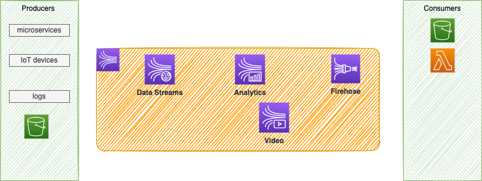

# Kinesis services

Designed to process real-time data. 

 

Three main different components are: 

* **Kinesis Streams**: low latency streaming ingest at scale. They offer patterns for data stream processing. It looks similar to Kafka, but MKS is the Kafka deployment.
* **Kinesis Analytics**: perform real-time analytics on streams using SQL. This Apache Flink as managed service.
* **Kinesis Firehose**: load streams into S3, Redshift, ElasticSearch. No administration, auto scaling, serverless.

## Data Streams

Distributed data stream into Shards for parallel processing. Producer sends message with `Partition Key` and a throughput of 1 Mb/s or 1000 msg /s per Shard. A sequence number is added to the message to note where the message was in the Shard. 

* Retention from 1 to 365 days
* Replay the messages
* Immutable records, not deleted by applications.
* Message in a shard, can share partition key, and keep ordering.
* Producer can use SDK, or Kinesis Producer Library (KPL) or being a Kinesis agent.
* Consumer may use SDK and Kinesis Client Library (KCL), or being one of the managed services like: Lambda, Kinesis Data Firehose, Kinesis Data Analytics
* For consuming side, each Shard gets 2MB/s out
* Pricing is per Shard provisioned per hour

There is an On-demand mode, pay as you go, with a default capacity of 4MB/s or 4000mg/s. Pricing per stream, per hour and data in/out per GB. 

captured Metrics are: # of incoming/outgoing bytes, # incoming/outgoing records, Write / read provisioned throughput exceeded, and iterator age ms.

### Producer

#### AWS CLI

Produce:

```sh
aws kinesis put-record --stream-name test --partition-key user1 --data "user signup" --cli-binary-format raw-in-base64-out
```

### Consumer

#### AWS CLI

Consume:

```sh
# Describe the stream
aws kinesis describe-stream --stream-name test
# Get some data
aws kinesis get-shard-iterator --stream-name test --shard-id shardId--00000000 --shard-iterator-type TRIM_HORIZON
# The returned message gave the next message iterator that should be used in the next call.
aws kinesis get-records --shard-iterator <the-iterator-id>
```
## Data Firehose

Firehose is a fully managed service for delivering real-time streaming data to various supported destinations.

## Stream analytics

