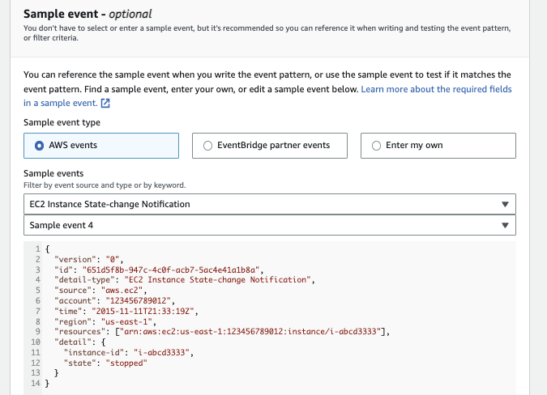

# Monitoring and Audit

## [CloudWatch](https://docs.aws.amazon.com/cloudwatch/)

CloudWatch collects monitoring and operational data in the form of logs, metrics, and events, and visualizes it using automated dashboards so you can get a unified view of your AWS resources, applications, and services that run in AWS and on-premises. The basic features set:

* correlate your metrics and logs to better understand the health and performance of your resources.
* create alarms based on metric value thresholds or anomalous metric behavior based on machine learning algorithms. 

### [CloudWatch Metrics](https://docs.aws.amazon.com/cloudwatch/)

CloudWatch provides metrics for every services in AWS. Metric represents a variable to measure like CPU utilization, Network inbound traffic... 

Metrics are within a VPC so belong to namespaces. They have timestamps and heve up to 10 attributes or dimensions.

* To monitor our EC2 instance memory usage, we need to use a Unified CloudWatch Agent to push memory usage as a custom metric to CW.

### CloudWatch Logs

Concepts:

* Log groups to groups logs, representing an application.

    

* Log streams: instances within an application / log files or containers.

    

Priced for retention period, so expiration policies can be defined. 

CloudWatch can send logs to S3, Kinesis Firehose, Kinesis Data Streams, Lambda,... 

Can define filters to reduce logs or trigger CloudWatch alarms, or add insights to query logs and for Dashboards. Here are simple filter:

Use Subscription Filter to get near real-time logs to targeted sink:

Logs Insights helps to define query to search within the logs. 

### CloudWatch Agent

By default EC2 instances do not send logs to CloudWatch. We need to run agent on EC2 to push log files we want. We need to use an IAM role that let the EC2 instance be able to send logs to CW.

The new Unified Agent send logs and system-level metrics. 

### CloudWatch Alarms

Alarms are used to trigger notification from any metrics. The states of an alarm are: OK, INSUFFICIENT_DATA, ALARM. A period specifies the lenght of time in seconds to evaluate the metric.

The target of the alarm may be to stop, reboot, terminate, recover of an EC2 instance, trigger an Auto Scaling Action for EC2, or send notification to SNS.

## [Event Bridge](https://docs.aws.amazon.com/eventbridge/)

Amazon EventBridge is a serverless event bus service (Formerly CloudWatch Event), which can send message to Lambda functions, SQS, SNS based on rules. The new marketing positioning is: EventBridge is a serverless service for building scalable event-driven applications, enabling highly agile software development via fully managed and secure integrations, cutting costs and reducing time to production.

By default there is an EventBridge event hub already created.

The following figure illustrates the typical source of events and how EventBridge can process them and send JSON to different sinks. Filtering logic may be applied.

We can also integrate to Partners SaaS services like Datadog, Zendeck. We can define our own custom app to integrate with the Event bus. We can also archive events to be able to replay them.

* When creating rules (See when EC2 is stopped)

    

* we can use a sandbox feature to test the event type we want to work on 

    

* and define and test the rule.

    

* then specify the target, for example a SNS topic.

    

It can infer the data schema from the event as source, and use a SchemaRegistry. The SchemaRegitry will help generate code for our applications. 

From this schema definition, in OpenAPI 2.0 format, we can get code sample to get rhe definition of the events and the marshalizer. 

In term of solution design, we can define a central event based to aggregate all the events from AWS Organizations in a single AWS account or region. Apps in different accounts can be authorized to send event to this central hub via resource-based policy.

* [Tutorial](https://docs.aws.amazon.com/eventbridge/latest/userguide/eb-tutorial.html)
* [Amazon EventBridge CDK Construct Library Event ](https://docs.aws.amazon.com/cdk/api/v2/docs/aws-cdk-lib.aws_events-readme.html)

## CloudWatch Insight

CloudWatch Container Insights collects, aggregates, and summarizes metrics and logs from your containerized applications and microservices. Available for ECS, EKS, K8S on EC2s. 

CloudWatch Lambda Insights simplifies the collection, visualization, and investigation of detailed compute performance metrics, errors, and logs to isolate performance problems and optimize your Lambda environment.

Application Insight is to set up monitoring and gain insights to your application health so you can quickly detect and diagnose problems and reduce the mean time to resolution

Contributor Insights allows you to create realtime Top N time series reports by analyzing CloudWatch Logs based on rules you define. The rule matches log events and reports the top Contributors, where a "Contributor" is a unique combination of the fields defined in the rule. It can be used to identify the heaviest network users, find the URLs that generate the most erroes.

* [EKS workshop with CloudWatch container insight](https://www.eksworkshop.com/intermediate/250_cloudwatch_container_insights/)

## [CloudTrail](https://aws.amazon.com/cloudtrail/)

A managed service to provides governance, audit capabilities for all activities (API calls) and events within an Account. Can be across regions and accounts on a single, centrally controlled platform. We can use CloudTrail to detect unusual activity in our AWS accounts.

By default, trails are configured to log management events (operations performed on AWS resources). Data events are not logged.

This is a usage-based paid service.

CloudTrail Insight is used to detect unusual activity in AWS account.

## [Config](https://docs.aws.amazon.com/config/index.html#lang/en_us)

Record and evaluate configurations against compliance rules of your AWS resources. For example can be used to continuously monitor our EC2 instances to assess if they have a specific port exposed.

AWS Config allows you to remediate noncompliant resources that are evaluated by AWS Config Rules. AWS Config applies remediation using AWS Systems Manager Automation documents. This is done at the Action level of a config rule.

## Putting them together

If we define an Elastic Load Balancer then, 

* **CloudWatch** will help us to monitor incoming connections metric, visualize error codes as % over time, and supports dashbaord to get performance monitoring.
* **Config** will help us to track security group rules, configuration changes done on the load balancer, as well as defining compliance rules to ensure SSL certificates are always assigned to LB.
* **CloudTrail** tracks who made any changes to the configuration with API calls.

## Deeper Dive

* [CDK sample: CDK Python Backup & Cloudwatch event](https://github.com/aws-samples/aws-cdk-examples/tree/master/python/ec2-cloudwatch) to illustrate a cloudwatch event rule to stop instances at UTC 15pm everyday
* [CloudWatch Container Insights for EKS cluster workshop](https://www.eksworkshop.com/intermediate/250_cloudwatch_container_insights/)