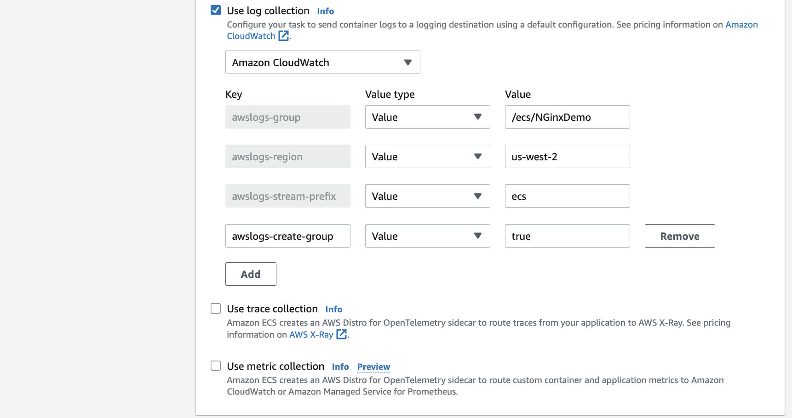
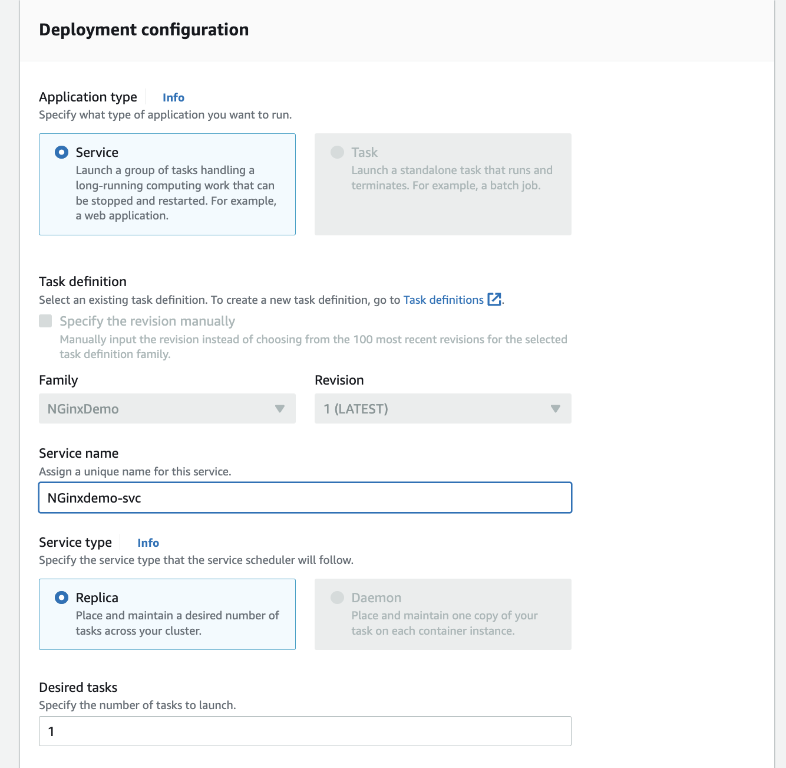

# ECS playground

## Deploy NGinx docker image on Fargate

1. Create an ECS cluster if you do not have one
1. Add a task definition to use NGInx demo hello docker image

    

    There is no need to specify environment variables in this demonstration.

    Specify the environment like EC2 or Fargate and then the CPU needs

    

    There is not need to add a `Task role` as the container is not accessing AWS services via API. No Storage neither.

    Use log collection to CloudWatch, but not needed to send trace to AWS X-Ray and metrics to AWS Distro.

    

1. As this is a web app, we need to create a service: Select the ECS cluster as target environment

    

    Then the service with one replica to start with:

    

    The deployment paraneters control the % allocated during deployment:

    

    Be sure to select the VPC where the ECS cluster is defined (`not sure about that`) then the subnets, and a specific security group on port 80 coming from the ALB ()

    

    As we want to facade with an ALB, we do not want to setup a public IP address with a ENI. 

    

1. Get DNS name of the application or from the ALB

    * If you created a public IP address then an ENI was created, and going to the ENI definition will let you access to the DNS name, something like: `ec2-34-216-228-13.us-west-2.compute.amazonaws.com` 