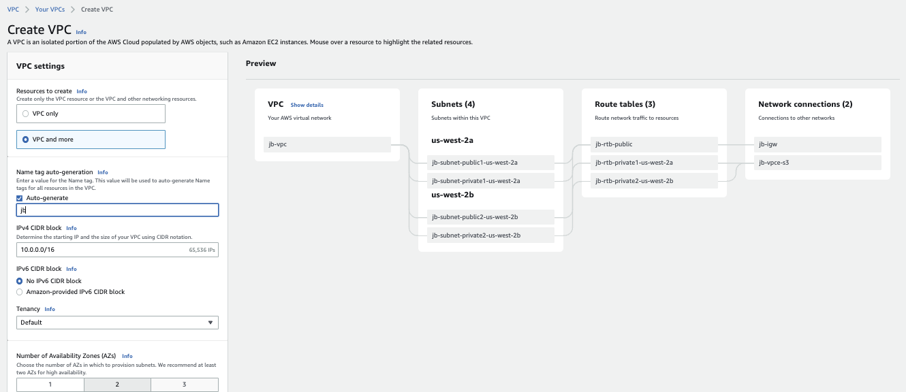
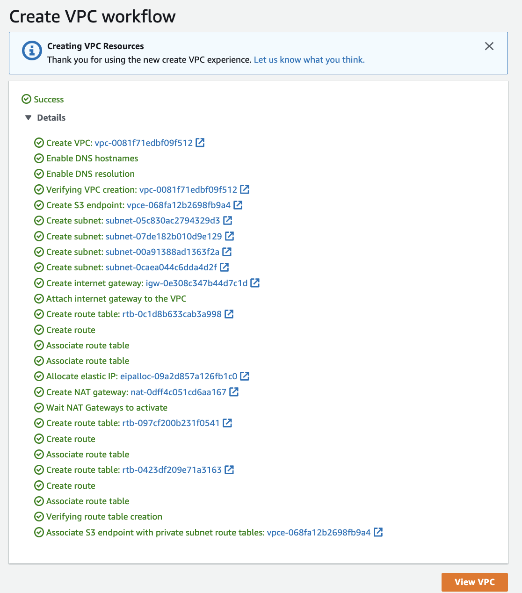

# Getting started

Access the [AWS console](https://us-west-2.console.aws.amazon.com/) from which we can login as root user or as an IAM user: my account alias `boyerje`: [https://boyerje.signin.aws.amazon.com/console](https://boyerje.signin.aws.amazon.com/console)
and user: `aws-jb`.

The credentials and API key are in `~/.aws/credentials`

## AWS CLI common commands

We can access AWS using the CLI or the SDK which both use access keys generated from the console (> Users > jerome > Security credentials > Access Keys).

The keys are saved in `~/.aws/credentials`


* Installation: [aws cli](https://aws.amazon.com/cli/)
* The cli needs to be configured: `aws configure` with the credential, key and region to access. Use IAM user to get a new credentials key.

Test with some commands:

```sh
aws --version
# get your users
aws iam list-users
```

* [VPC scenario with CLI - Tutorial](https://docs.aws.amazon.com/vpc/latest/userguide/VPC_Scenarios-cli.html)
* [Use CloudShell in west-2 region for using aws cli](https://us-west-2.console.aws.amazon.com/cloudshell)
* [aws-shell] is also available to facilitate the user experience in your laptop terminal console.


When using CLI in a EC2 instance always use an IAM role to control security credentials. This role can come with a policy authorizing exactly what the EC2 instances should be able to do. Also within a EC2 instance, it is possible to use the URL http://169.254.169.254/latest/meta-data to get information about the EC2. We can retrieve the IAM Role name from that metadata.


## Defined users and groups with IAM

See [summary on IAM](../../#iam-identity-and-access-management)

* Search for IAM and then...
* login to the account [https://jbcodeforce.signin.aws.amazon.com/console](https://jbcodeforce.signin.aws.amazon.com/console]) with admin user `jerome`
* Create groups (Developers), define basic policies.
* Add users (mathieu) assign him to a group

## Define policies

Attached to the group level.

## Playing with Apache HTTP

Create a EC2 t2.micro and add the following script in the `User Data` field (Under Advanced Details while configuring new EC2 instance) so when the instance starts it executes this code.

```shell
#!/bin/bash
# update OS
yum update -y
# Get Apache HTTPd
yum install -y httpd
# Start the service
systemctl start httpd
# Enable it cross restart
systemctl enable httpd
> Created symlink from /etc/systemd/system/multi-user.target.wants/httpd.service to /usr/lib/systemd/system/httpd.service
# Get the availability zone
EC2-AZ=$(curl -s http://169.254.169.254/latest/meta-data/placement/availability-zone)
# Change the home page by changing /var/www/html/index.html
echo "<h1>Hello from $(hostname -f)</h1>" > /var/www/html/index.html
# or use the following
echo "<h3>Hello World from $(hostname -f) in AZ= $EC2_AZ </h3>" > /var/www/html/index.html
```

## SSH to EC2

* Get public IP address of the EC2 instanceh/
* Get pem certificate for the CA
* Issue the command where the certificate is:

```sh
ssh -i EC2key.pem ec2-user@35.91.239.193
```

### Troubleshooting

* Connection timeout: Any timeout (not just for SSH) is related to security groups or a firewall. This may also means a corporate firewall or a personal firewall is blocking the connection.
* `Permission denied (publickey,gssapi-keyex,gssapi-with-mic)`: You are using the wrong security key or not using a security key. 
* able to connect yesterday, but not today: When you restart a EC2 instance, the public IP of your EC2 instance will change. 

### EC2 Instance Connect

Access the EC2 terminal inside the web browser using SSH. Select the instance and then `Connect` button at the top. 
It comes with aws cli. Never enter any account id inside `aws configure` inside an EC2 instance, use IAM role instead.

Go to the EC2 instance, Action > Security > Modify IAM Roles. For example adding  the DemoEC2Role which as iam read only access, so we do `aws iam list-users` command.


## A High availability WebApp deployment summary

Based on the AWS essential training, here is a quick summary of the things to do for a classical HA webapp deployment.


1. Create a VPC with private and public subnets, using at least 2 AZs. This is simplified with the new console which creates all those elements in one click:

    

    The results, with all the networking objects created, look like below:

    

1. Verify routing table for public subnet and private subnets. 
1. Add security group to the VPC using HTTP and HTTPS to the internet gateway
1. Start EC2 to one of the public subnet and define user data to start your app. Here is an example

    ```sh
    #!/bin/bash -ex
    yum -y update
    curl -sL https://rpm.nodesource.com/setup_15.x | bash -
    yum -y install nodejs
    mkdir -p /var/app
    wget https://aws-tc-largeobjects.s3-us-west-2.amazonaws.com/ILT-TF-100-TECESS-5/app/app.zip
    unzip app.zip -d /var/app/
    cd /var/app
    npm install
    npm start
    ```

1. Get the security key with .pem file for the public certificate
1. Be sure the inbound rules include HTTP and HTTPS on all IPv4 addresses defined in the security group.  

## Create a EC2 instance with Terraform

* Build a main.tf (/Code/Studies/terraform/learn-terraform-aws-instance/main.tf) like below, which uses the aws provider
to provision a micro EC2 instance:

    ```json
    terraform {
    required_providers {
        aws = {
        source  = "hashicorp/aws"
        version = "~> 3.27"
        }
    }

    required_version = ">= 0.14.9"
    }

    provider "aws" {
    profile = "default"
    region  = "us-west-2"
    }

    resource "aws_instance" "app_server" {
    ami           = "ami-830c94e3"
    instance_type = "t2.micro"

    tags = {
        Name = "ExampleAppServerInstance"
    }
    }

    ```

    Resource blocks contain arguments which you use to configure the resource. 
    Arguments can include things like machine sizes, disk image names, or VPC IDs.

```sh
terraform apply
# inspect state
terraform show
```

## Install nginx inside a EC2 t2.micro.

Be sure to have a policy to authorize HTTP inbound traffic on port 80 for 0.0.0.0/0.

## Define load balancer


## AWS Cloud9

AWS Cloud9 is a cloud-based integrated development environment (IDE) that lets you write, run, and debug your code with just a browser

1. Go to the AWS Management Console, select Services then select Cloud9 under Developer Tools.
1. Select Create environment.
1. Enter Development into Name and optionally provide a Description.
1. You may leave Environment settings at their defaults of launching a new t2.micro EC2 instance which will be paused after 30 minutes of inactivity.
1. Once ready, your IDE will open to a welcome screen.
1. Verify the environment with `aws  sts get-caller-identity`


us-west-2:7927a56d-cccc-46e6-9fc2-66a5eb463dc6

arn:aws:dynamodb:us-west-2:403993201276:table/UnicornSensorData

## Deploy a Web App on AWS Elastic Beanstalk

Elastic Beanstalk is an easy-to-use service for deploying and scaling web applications and services developed with Java, .NET, PHP, Node.js, Python, Ruby, Go, and Docker on familiar servers such as Apache, Nginx, Passenger, and IIS

[Guide](https://aws.amazon.com/getting-started/guides/deploy-webapp-elb/)


