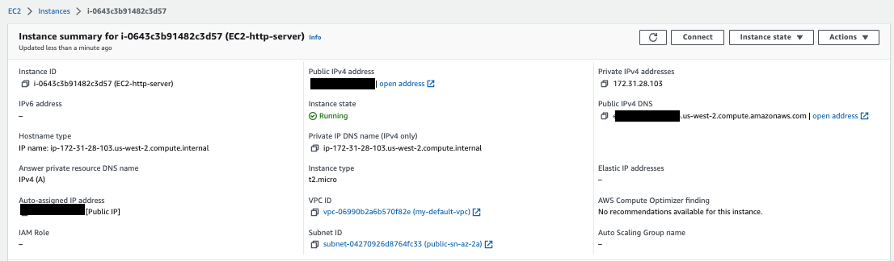
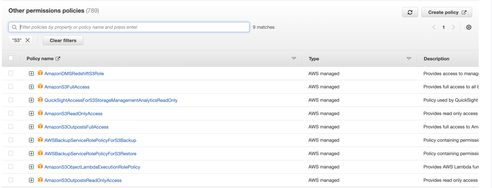

# Getting started

## Defined users and groups with IAM

See [summary on IAM](../../infra/security/#iam-identity-and-access-management)

* Access the [AWS console](https://us-west-2.console.aws.amazon.com/) from which we can login as root user or as an IAM user: `aws-jb` for AWS account. (Or using personal account login to the account [https://jbcodeforce.signin.aws.amazon.com/console](https://jbcodeforce.signin.aws.amazon.com/console]) with admin user `jerome`.
* In the IAM service, create groups (Developers, Adminstrators), define basic policies.

### Define security policies

Attached to the group level.

## AWS CLI common commands

We can access AWS using the CLI or the SDK which both user access keys generated from the console (> Users > jerome > Security credentials > Access Keys).

The keys are saved in `~/.aws/credentials` in different profile
* A named profile is a collection of settings and credentials that you can apply to a AWS CLI command. When you specify a profile to run a command, the settings and credentials are used to run that command.
* Installation: [aws cli](https://aws.amazon.com/cli/)
* The cli needs to be configured: `aws configure` with the credential, key and region to access. Use IAM user to get a new credentials key. The credentials and API key are in `~/.aws/credentials` in default profile

Test with some commands:

```sh
aws --version
# get your users
aws iam list-users
# For a given profile
aws iam list-users --profile hackaton
```

* [VPC scenario with CLI - Tutorial](https://docs.aws.amazon.com/vpc/latest/userguide/VPC_Scenarios-cli.html)
* [Use CloudShell in west-2 region for using aws cli](https://us-west-2.console.aws.amazon.com/cloudshell)
* [aws-shell]() is also available to facilitate the user experience in your laptop terminal console.


When using CLI in a EC2 instance always use an IAM role to control security credentials. This role may come with a policy authorizing exactly what the EC2 instance should be able to do. 

Also within a EC2 instance, it is possible to use the URL http://169.254.169.254/latest/meta-data to get information about the EC2. We can retrieve the IAM Role name from that metadata.


## Deploying Apache HTTP on EC2

Create a EC2 t2.micro instance with AWS Linux, a public IP address, a security group with SSH enabled from anywhere and HTTP on port 80 accessible from the internet. Associate the EC2 with a Key Pair  so we can do SSH on the instance (and download the .pem file). The free tier is elligible to 30 GB of disk. Under the `Advanced details` section, add the following `bash` script in the `User Data` field:

```shell
#!/bin/bash
# update OS
yum update -y
# Get Apache HTTPd
yum install -y httpd
# Start the service
systemctl start httpd
# Enable it cross restart
systemctl enable httpd
> Created symlink from /etc/systemd/system/multi-user.target.wants/httpd.service to /usr/lib/systemd/system/httpd.service
# Get the availability zone
EC2-AZ=$(curl -s http://169.254.169.254/latest/meta-data/placement/availability-zone/)
# Change the home page by changing /var/www/html/index.html
echo "<h1>Hello from $(hostname -f)</h1>" > /var/www/html/index.html
# or use the following
echo "<h3>Hello World from $(hostname -f) in AZ= $EC2_AZ </h3>" > /var/www/html/index.html
```

Once launched, from the console, get the DNS name or the public IP address and try a curl or use your web browser to that HTTP address (not https).

### Troubleshooting

* Connection timeout: Any timeout (not just for SSH) is related to security groups or a firewall rule. This may also mean a corporate firewall or a personal firewall is blocking the connection. Go to the security group and look at inbound rules.
* `Permission denied (publickey,gssapi-keyex,gssapi-with-mic)`: You are using the wrong security key or not using a security key. 
* "Able to connect yesterday, but not today": When you restart a EC2 instance, the public IP of your EC2 instance will change, so prefer to use the DNS name and not the IP @. 


### SSH to EC2

* Get public IP address of the EC2 instance
* Get pem certificate for the CA while you created the EC2 via the Key pair (e.g. `my-key-pair.pem`)
* Issue the following command where the certificate is to open a SSH session

```sh
ssh -i my-key-pair.pem ec2-user@35.91.239.193
```

you should get the prompt:

```sh
Last login: Wed Nov  2 17:24:30 2022 from ec2-18-237-140-165.us-west-2.compute.amazonaws.com

       __|  __|_  )
       _|  (     /   Amazon Linux 2 AMI
      ___|\___|___|

https://aws.amazon.com/amazon-linux-2/
```

### EC2 Instance Connect

Access the EC2 terminal inside the web browser using SSH. Select the instance and then `Connect` button at the top. 



It comes with the `aws cli`. Never enter any account id inside `aws configure` inside an EC2 instance, use IAM role instead.

For example to access another service (like IAM), we need an IAM Role added to the EC2 instance: go to the EC2 instance, `Action > Security > Modify IAM Roles` add `DemoEC2Role` for example. We should be able to do `aws iam list-users` command.

### Access to service within the EC2

To access to external AWS service we need to use IAM role. So define a Role in IAM 


with the Permission Policy linked to the resource you try to access, for example select on S3 policies to be able to access S3 bucket. 



On an existing EC2 we can use the menu `Actions > Security > Modify IAM Roles`.   

## A High availability WebApp deployment summary

Based on the AWS essential training, here is a quick summary of the things to do for a classical HA webapp deployment.


1. Create a VPC with private and public subnets, using at least 2 AZs. This is simplified with the new console which creates all those elements in one click:

    

    The results, with all the networking objects created, look like below:

    

1. Verify routing table for public and private subnets. 
1. Add security group to the VPC using HTTP and HTTPS to the internet gateway.
1. Start EC2 to one of the public subnet and define user data to start your app. Here is an example

    ```sh
    #!/bin/bash -ex
    yum -y update
    curl -sL https://rpm.nodesource.com/setup_15.x | bash -
    yum -y install nodejs
    mkdir -p /var/app
    wget https://aws-tc-largeobjects.s3-us-west-2.amazonaws.com/ILT-TF-100-TECESS-5/app/app.zip
    unzip app.zip -d /var/app/
    cd /var/app
    npm install
    npm start
    ```

1. Get the security key with .pem file for the public certificate
1. Be sure the inbound rules include HTTP and HTTPS on all IPv4 addresses defined in the security group.  

## Create a EC2 instance with Terraform

* Build a main.tf [labs/terraform-vpc](https://github.com/jbcodeforce/aws-studies/tree/main/labs/terraform-vpc), which uses the aws provider to provision a micro EC2 instance:

    ```json
    terraform {
    required_providers {
        aws = {
        source  = "hashicorp/aws"
        version = "~> 3.27"
        }
    }

    required_version = ">= 0.14.9"
    }

    provider "aws" {
        profile = "default"
        region  = "us-west-2"
    }

    resource "aws_instance" "app_server" {
        ami           = "ami-830c94e3"
        instance_type = "t2.micro"

        tags = {
            Name = "ExampleAppServerInstance"
        }
    }

    ```

    Resource blocks contain arguments which you use to configure the resource. 
    Arguments can include things like machine sizes, disk image names, or VPC IDs.

```sh
terraform apply
# inspect state
terraform show
```

## Install nginx inside a EC2 t2.micro.

Be sure to have a policy to authorize HTTP inbound traffic on port 80 for 0.0.0.0/0.

## Define load balancer


## AWS Cloud9

AWS Cloud9 is a cloud-based integrated development environment (IDE) that lets you write, run, and debug your code within a web browser.

1. Go to the AWS Management Console, select Services then select Cloud9 under Developer Tools.
1. Select Create environment.
1. Enter Development into Name and optionally provide a Description.
1. You may leave Environment settings at their defaults of launching a new t2.micro EC2 instance which will be paused after 30 minutes of inactivity.
1. Once ready, your IDE will open to a welcome screen.
1. Verify the environment with `aws  sts get-caller-identity`

## ECR for Container Registry

Amazon Elastic Container Registry (Amazon ECR) is an AWS managed container image registry service that is secure, scalable, and reliable.

See [Getting started guide](https://docs.aws.amazon.com/AmazonECR/latest/userguide/what-is-ecr.html) which can be summarized as

* Your client must authenticate to Amazon ECR registries as an AWS user before you can push and pull images. 
* You can control access to your repositories and the images within them with repository policies.

[ECR public gallery](https://gallery.ecr.aws/) includes docker images to be reusable.

## Deploy a Web App on AWS Elastic Beanstalk

Elastic Beanstalk is an easy-to-use service for deploying and scaling web applications and services developed with Java, .NET, PHP, Node.js, Python, Ruby, Go, and Docker on familiar servers such as Apache, Nginx, Passenger, and IIS

[Guide](https://aws.amazon.com/getting-started/guides/deploy-webapp-elb/)


