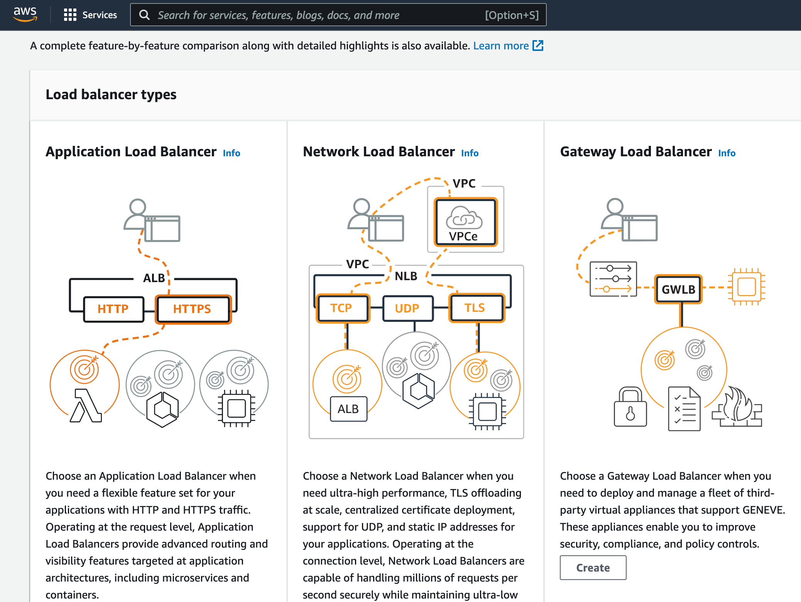

# Getting started

General [AWS console](https://us-west-1.console.aws.amazon.com/) from which we can login as root user or as an IAM user.

Or the one for my account alias `jbcodeforce`: [https://jbcodeforce.signin.aws.amazon.com/console](https://jbcodeforce.signin.aws.amazon.com/console)
and user jerome

The credentials and API key are in `~/.aws/credentials`

* Select a region to create your resources: N California
* Look at the services.

## AWS CLI common commands

We can access AWS using the CLI or the SDK which both use access keys generated from the console (> Users > jerome > Security credentials > Access Keys).

The keys are saved in `~/.aws/credentials`


* Installation: [aws cli](https://aws.amazon.com/cli/)
* The cli needs to be configured: `aws configure` with the credential, key and region to access. Use IAM user to get a new credentials key.
* [Tutorial](https://docs.aws.amazon.com/vpc/latest/userguide/VPC_Scenarios-cli.html)
* [aws-shell] is also available to facilitate the user experience in your laptop terminal console.

```sh
aws --version
# get your users
aws iam list-users
```

When using CLI in a EC2 instance always use an IAM role to control security credentials. This role can come with a policy authorizing exactly what the EC2 instances should be able to do. Also within a EC2 instance, it is possible to use the URL http://169.254.169.254/latest/meta-data to get information about the EC2. We can retrieve the IAM Role name from that metadata.


## Defined users and groups with IAM

[my summary on IAM](/aws/#iam-identity-and-access-management)

* Search for IAM and then...
* login to the account [https://jbcodeforce.signin.aws.amazon.com/console](https://jbcodeforce.signin.aws.amazon.com/console]) with admin user `jerome`
* Create groups (Developers), define basic policies.
* Add users (mathieu) assign him to a group

## Define policies

Attached to the group level.


## A High availability WebApp deployment summary

Based on the AWS essential training, here is a quick summary of the things to do for a classical HA webapp deployment.


1. Create a VPC with private and public subnets, using at least 2 AZs. This is simplified with the new console which creates all those elements in one click:

    

    The results, with all the networking objects created, look like below:

    

1. Verify routing table for public subnet and private subnets. 
1. Add security group to the VPC using HTTP and HTTPS to the internet gateway
1. Start EC2 to one of the public subnet and define user data to start your app. Here is an example

    ```sh
    #!/bin/bash -ex
    yum -y update
    curl -sL https://rpm.nodesource.com/setup_15.x | bash -
    yum -y install nodejs
    mkdir -p /var/app
    wget https://aws-tc-largeobjects.s3-us-west-2.amazonaws.com/ILT-TF-100-TECESS-5/app/app.zip
    unzip app.zip -d /var/app/
    cd /var/app
    npm install
    npm start
    ```

1. Get the security key with .pem file for the public certificate
1. Be sure the inbound rules include HTTP and HTTPS on all IPv4 addresses defined in the security group.  

## Create a EC2 instance with Terraform

* Build a main.tf (/Code/Studies/terraform/learn-terraform-aws-instance/main.tf) like below, which uses the aws provider
to provision a micro EC2 instance:

    ```json
    terraform {
    required_providers {
        aws = {
        source  = "hashicorp/aws"
        version = "~> 3.27"
        }
    }

    required_version = ">= 0.14.9"
    }

    provider "aws" {
    profile = "default"
    region  = "us-west-2"
    }

    resource "aws_instance" "app_server" {
    ami           = "ami-830c94e3"
    instance_type = "t2.micro"

    tags = {
        Name = "ExampleAppServerInstance"
    }
    }

    ```

    Resource blocks contain arguments which you use to configure the resource. 
    Arguments can include things like machine sizes, disk image names, or VPC IDs.

```sh
terraform apply
# inspect state
terraform show
```

## Install nginx inside a EC2 t2.micro.

Be sure to have a policy to authorize HTTP inbound traffic on port 80 for 0.0.0.0/0.

In the `user data` field add web server:

```sh
#!/bin/bash
yum update -y
yum install -y httpd
systemctl start httpd
systemctl enable httpd
echo "<h1>Hello from $(hostname -f)</h1>" > /var/www/html/index.html
```

## Define load balancer



## Deploy a Web App on AWS Elastic Beanstalk

Elastic Beanstalk is an easy-to-use service for deploying and scaling web applications and services developed with Java, .NET, PHP, Node.js, Python, Ruby, Go, and Docker on familiar servers such as Apache, Nginx, Passenger, and IIS

[Guide](https://aws.amazon.com/getting-started/guides/deploy-webapp-elb/)


