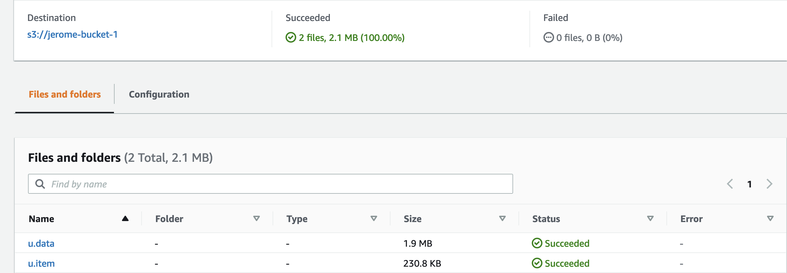

# S3 storage aggregation with Storage Lens and Organization

!!! Info
    Created 1/11/2023


The goal of this lab is to demonstrate single view in S3 Storage Lens of S3 buckets created in multiple regions in multiple accounts.

## Requirements

* Get one organization to centralize 2 child accounts.
* Get S3 bucket for the 2 account each in 2 regions
* Create a Storage Lens dashboard to see consolidated metrics

## AWS Organizations

AWS Organizations is an AWS service that helps you aggregate all of your AWS accounts under one organization hierarchy.

* Invite or create an account from Organization


* Enable trusted access from S3 Storage Lens to Organization, to aggregate storage metrics and usage data for all member accounts in your organization.

## S3 Storage Lens

A service that aggregates your usage and activity metrics and displays the information in an interactive dashboard on the Amazon S3 console or through a metrics data export that can be downloaded in CSV or Parquet format.


* [Optional] Add account to be S3 Storage Lens administrator


* Create a S3 Storage Lens dashboard with a region to keep dashboard state:


* Still in the same form, you should see the organization linked to the service, and include all accounts and all regions:


* Can select metrics and defined new metrics, here we use the free ones:


    Metrics will help to find out how much storage you have across the entire organization. Which are the fastest-growing buckets and prefixes...   

    We can specify advanced metrics to get prefix-level aggregation. Free metrics are available for queries for a 14-day period, and advanced metrics are available for queries for a 15-month period.

* We export metrics generated every day, in CSV or Parquet format, and save result in the parent account's s3 bucket:


* Finally the data should be encrypted at rest, so using S3 managed keys will be the default:


The dashboard is created and will get data in the next 24h to 48h.

Lens pricing can be found in the Management and Analytics tab in [S3 pricing page.](https://aws.amazon.com/s3/pricing/)

## Add files in buckets

* Account 1 (boyerje): add buckets in regions us-west-2 and us-east-1

```sh
aws w3 cp ... s3://jb-data-set/
```

* Account 2 (jerome boyer): add buckets in regions us-west-1 




## Resources

* [S3 Storage Lens user guide](https://docs.aws.amazon.com/AmazonS3/latest/userguide/storage_lens_basics_metrics_recommendations.html)