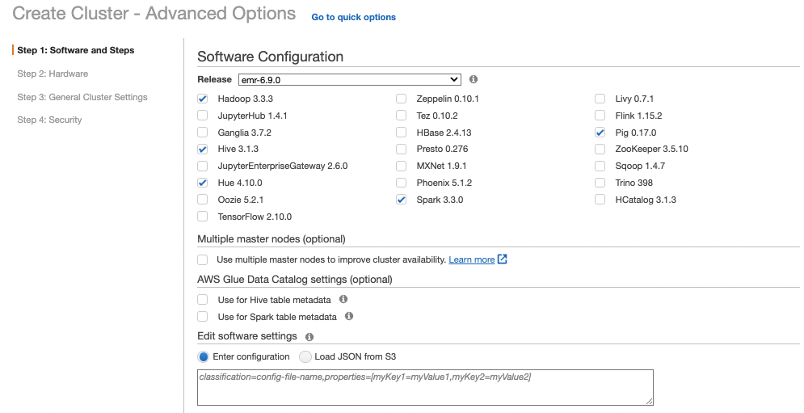
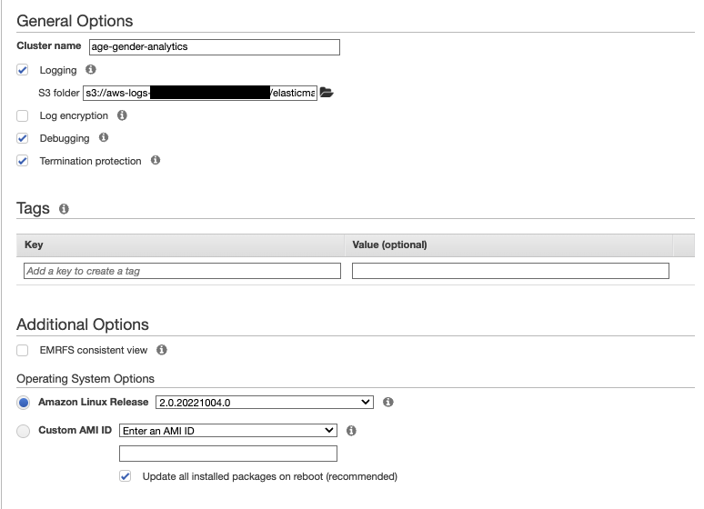
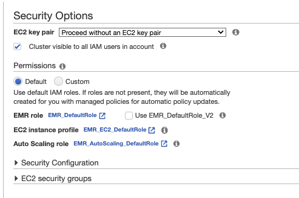

# Data analytics with Spark and EMR

## Simple demo

The marketing department has personal information in CSV files and wants to run analytics on gender, age groups...

* Hundred CSV files are in S3 bucket. Using `s3-dist-cp` to move them into the EMR cluster.
* Use EMR to run spark job
* Define Spark processing in python to read all CSV files from HDFS then group records by age and gender then count records and order the results in descending mode. Result in HDFS
* Copy result back to S3.

### Steps

1. Create a cluster with Spark runtime

    

1. Do not change the networking or cluster config...

    

1. Change the EC2 type to m5 large if the selected region supports it and use only one instance for the core node:

    

1. Set a clusster name:

    

1. Do not use key pair as we do not need to SSH on core node

    

1. Once the cluster is started, get the URL of the HDFS console and keep note of the associated port number

1. Update the master security groups to authorize access to the port number from anywhere 0.0.0.0/0. Be sure to use `Custom TCP` protocol

1. Open the URL in a web browser