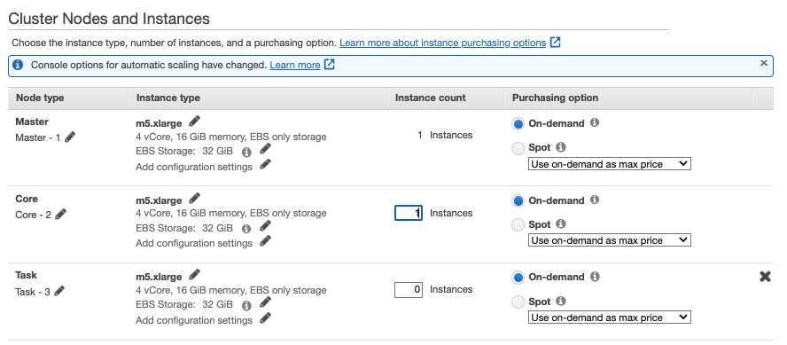

# Data analytics with Spark and EMR


## Gender - Age Analytics

This is based on the tutorial from A Cloud Guru on Data Analytics with Spark and EMR, with some new adaptation.  

???+ "The problem statement"

    The marketing department has personal information in thousand of CSV files and wants to run analytics by counting the gender per age groups...

    * Hundred CSV files are in S3 bucket. Using `s3-dist-cp` to move them into the EMR cluster.
    * Use EMR to run spark job
    * Define Spark processing in python to read all CSV files from HDFS then group records by age and gender then count records and order the results in descending mode. Result in HDFS
    * Copy result back to S3.

!!! Error
    11/29 Still issue in S3 to HDFS steps

### Manual Steps

1. Create a EMR cluster last version (6.9) with Spark runtime 3.3, Hadooep, Hue, Hive and Fig

    

1. Do not change the networking or cluster config...

    

1. Change the EC2 to m4.large if it is available within the AWS Region you selected and use only one instance for the core node:

    

1. Set a cluster name:

    

1. Do not use key pair as we do not need to SSH on core node

    


1. Once the cluster is started, get the URL of the HDFS Name Node console and keep note of the associated port number

    

1. Update the `Security Groups for Master `: 

    

     to authorize access to the port number from anywhere 0.0.0.0/0. Be sure to use `Custom TCP` protocol for the Inbound rule:

    

1. Open the `HDFS Name Node` URL in a web browser to get visibility into the files in our Hadoop cluster.

    

1. Upload data files (folder upload) to S3 bucket.
1. use `s3-dist-cp` as a Step to copy data from S3 to HDFS. 

    

    Here is the arguments to use:

    ```sh
    s3-dist-cp --src=s3://jb-data-set/user-data-acg/ --dest=hdfs:///
    ```

    

1. Create a step to run the python code
1. Create a S3 bucket as target for the output: `s3://jb-data-set/gender-age-output`
1. Define a new Step with s3-disp-cp from HDFS to S3. 

    ```sh
    s3-dist-cp --src=hdfs:///results --dest= s3://jb-data-set/gender-age-output
    ```


spark-summit hdfs://pyspark-script/gender-age-count.py

s3://emr-scripts-403993201276/scripts/gender-age-count.py 

### CLI based

Under the labs/analytics/ folder.

* Create the EMR cluster with Spark, Hadoop and Hive (version 6.9)

```sh
./emr-starting/create-cluster.sh
```

* Under `gender-age/data` folder unzip the `user-data-acg.zip` then upload the `user-data-acg` folder to a s3 bucket
* Upload data to s3 bucket

    ```sh
    aws s3 cp gender-age/data/user-data-acg s3://jb-data-set/
    ```
* Deploy the S3 to HDFS step

    ```sh
    cd gender-age
    ./s3-to-hdfs.sh
    ```
* Start the python
* Copy the HDFS result to S3

### Clean up

* Delete cluster: `./emr-starting/delete-cluster.sh`
* Delete S3 bucket content and buckets
* Remove `emr` roles in IAM
