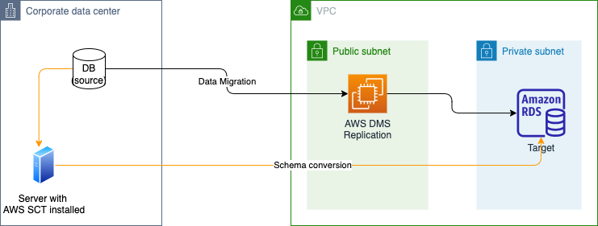
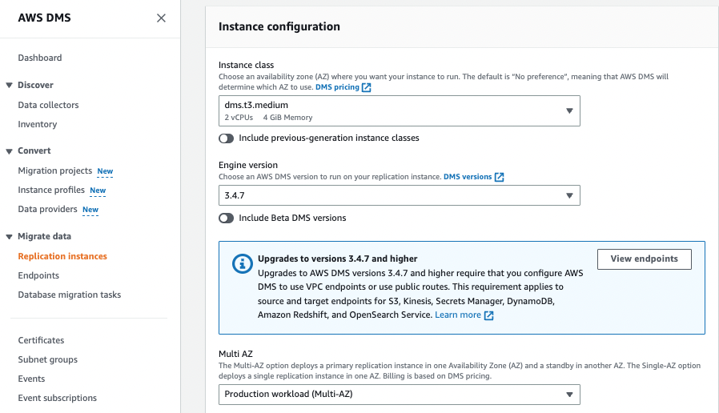

# Resilience

Resiliency is the ability of a workload to recover from infrastructure or service disruptions, dynamically acquire computing resources to meet demand, and mitigate disruptions, such as misconfigurations or transient network issues.

Apply the sharing responsibility of resiliency. 

## Fault isolation concepts

* Control plane is a complex orchestration with many dependencies so are more difficult to make them resilient. But the lower level of APIs makes it less risky. Still they will fail more often. Latency is not a strong requirement, 100s ms.   
* Do not rely on Auto Scaling Group for EC2 in case of AZ failure, but plan for overcapacity to support the load after AZ failure.
* Examples of control plan and data plane

    | Service | Control plane | Data plane |
    | --- | --- | --- |
    | Amazon S3 | create bucket, put bucket policy | GetObject, PutObject |
    | DynamoDB | Create table, update table | GetItem ... |
    | ELB | CreateLoadBalancer, CreateTargetGroup | The load balancer itself |
    | Route 53 | CreateHostedZone ... | DNS resolution, health checks |
    | IAM | CreateRole | Authn, Authz |
    | RDS | Create DB instance | The data base |

* Static stability: system still running even dependencies fail without the need to make changes. Use the following approaches: prevent circular dependencies, pre-provision capacity, maintain existing state, eliminate synchronous interaction.
* One way AWS achieve static statbility is by removing control plane deplendencis from the data plane in AWS services. 
* Relying on data plane operaions for recovery can help make your system more staticall stable, this may include pre-provisioning resources, or relying on data plane operations.

## Region, AZ

* Non-AZ affinity: a write operation can cross AZs and with data replications it can make a lot of hops 
* AZ-affinity helps to reduce the number of hops, but it enforces using NLB and not ALB.

## AWS Partitions

There are Isolated infrastructure and services. There are commercial partition, China , and GovCloud partition. Within a partition there are regions.
Not cross IAM definition sharing. 

| Type | Service | Planes |
| --- | --- | --- | 
| Zonal  | RDS, EC2, EBS | Control plane is regional while data plane is zonal |
| Regional | S3, SQS, DynamoDB | Control plane  and data plane are regional |
| Global | CloudFront, Global accelerator, Route 53, IAM |  Control plane is single region  and data plane is global |

There are three categories of global services: partitional, Edge and globally-scoped operations.
Global services havd a single control plane and a distributed, highly available data plane.
Avoid control plane dependencies in global services in your recovery path, implement static stability.

## Cell-based architecture and shuffle sharding

Goal is to reduce the blast-radius. Use the concept of `Cell` which is a construct to isolate compute, routing, and storage (workload). Cells are not AZs but cross AZs. Cell shares nothing with each other. Cell can scale-up and out. Cell have a maximum size.

It is not fitting for all type of workloads. 

API Gateway uses this Cell-based architecture.

Some e-commerce fullfilment delivery centers use cell-based architecture. 

Considerations to address:

* Cell size
* Router robustness
* Partitioning dimension
* Cross-cell use cases
* Cell migration
* Alignment to AZs and Regions

Shards is another construct to isolate blast radius, but now at the level of resources.  Any serverless services is using the concept of shuffle sharding. 

## High Availability

Availability = uptime / (uptime + downtime)

Availability = a1 * a2 *.... * an  . It cannot be better than it's least available dependency.

Spare components improves availability.

### Measuring availability

Metrics to consider:

* Mean time between failure MTBF, try to increase it
* Mean time to detection MTTD
* Mean time to repair MTTR

* consider server-side and client-side request success rate. Define what unit of work to be used: HTTP request, message in queue, async job.
* define downtime, for example, drop below 95% availabiltiy for any API during a 5 minutes window. 

**Use CW embedded metric format EMF to combine logs and metrics**

## Latency

Latency impacts availability. Analyze histograms for latency distribution trends. Use percentiles and trimmed man to measure latency.

## Multi-AZ patterns: AZ gray failure

* System follows differential observability. 
* Different perspective: system versus application

Detection tools:

* cloudwatch contributor insights. 

## Disaster recovery

[Review the core principles of DR](https://jbcodeforce.github.io/architecture/DR/) and then the [AWS options whitepaper](https://docs.aws.amazon.com/whitepapers/latest/disaster-recovery-workloads-on-aws/disaster-recovery-options-in-the-cloud.html).

### [Data Migration Service](https://docs.aws.amazon.com/dms/latest/userguide/Welcome.html)

As a managed service, AWS DMS is a server (EC2) in the AWS Cloud that runs replication software, to move data from one database to another running in AWS. Schema transformation can be performed using Schema Conversion Tool (SCT). SCT can run on-premises. 

Sources can be on-premises DBs, and the targets can still be on-premises DBs but really a lot of AWS data store like RDS, Redshift, DynamoDB, S3, Elasticache, Kinesis data streams, DocumentDB... 

We can use continuous replication with DMS:

First (1) use the AWS Schema Conversion Tool to convert the source schema and code to match that of the target database, then (2) use the AWS Database Migration Service to migrate data from the source database to the target database.

Example of configuration, with EC2 instance type, engine version, allocated storage space for the replication instance, network connectivity...

Once server is defined, we need to define data provider to specify source and target endpoints and create a migration project to do schema conversion (from Oracle or SQL server to MySQL or PostgreSQL as target). 

It is possible to leverage AWS Database Migration Service (AWS DMS) as a bridge between Amazon S3 and Amazon Kinesis Data Streams as an easier way to do so: See [Streaming Data from S3 to Kinesis using DMS](https://aws.amazon.com/blogs/big-data/streaming-data-from-amazon-s3-to-amazon-kinesis-data-streams-using-aws-dms/). AWS DMS allows migration of full and change data capture (CDC) files to these services.

* [DMS FAQ](https://aws.amazon.com/dms/faqs/)

### Replication to Aurora

For MySQL engine we have different options:

* Use RDS DB snapshot from RDS and restore it in Aurora
* Create an Autora read replica from the RDS MySQL source, when replication lag is 0, we can then promote Aurora as Write and Read.
* For external MySQL, use XtraBackup to create a file backup, upload it to S3 and import the file into Aurora from S3. Or use `mysqldump` utility to move to Aurora MySQL DB.
* Use DMS if both DBs run in parallel

### [AWS Backup](https://docs.aws.amazon.com/aws-backup/latest/devguide/whatisbackup.html)

Fully-managed service that makes it easy to centralize and automate data protection across AWS services, in the cloud, and on premises. It supports cross-region backups and in multiple AWS accounts across the entire AWS Organization. 
Src: EC2, EBS, EFS, Amazon FSx for windows, Lustre, and Storage Gateway, RDS, DynamoDB..

Target is S3 bucket or Vault Lock.

Vault lock is used for Write Once Read Many state. It is to defend on malicious delete as backup cannot be deleted. 

We can create automated backup schedules and retention policies, lifecycle policies to expire unncecessary backups after a period of time.

AWS Backup helps to support the regulatory compliance or business policies for data protection.

### [Application Discovery Service](https://docs.aws.amazon.com/application-discovery/latest/userguide/what-is-appdiscovery.html)

Managed service to help plan the migration to the AWS cloud by collecting usage and configuration data about the on-premises servers. It is integrated with AWS Migration Hub, which simplifies your migration tracking as it aggregates your migration status information into a single console.

It offers two ways of performing discovery: 

* Agentless: work on VM inventory, configuration, and performance history
* Agent-based: by deploying AD Agent on each of your VMs and physical servers, it collects static configuration data, detailed time-series system-performance information, inbound and outbound network connections, and processes that are running.

## Resilience Patterns

* client side, use circuit braker, retries with jitter, multiplexing connection with new protocol like HTTP/3, gRPC
* server side, apply caching strategy, cache-aside is more resilient, inline cache, like DynamoDB DAX, may be a single point of failure. 
