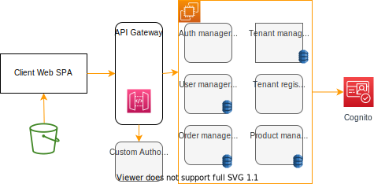
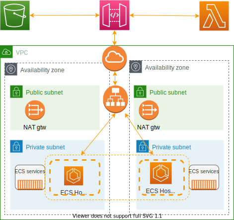

# Software as a Service

A licensing and delivery model whereby software is centrally managed and hosted by a provider and available to customers on a subsciption or pay-per-user basis.

Everything done in SaaS is about multi-tenancy, data isolation and sharing resources like compute, storage. 

Footprint scales dynamically based on aggregate load of all tenants. All tenants are managed via a single operational control plane or lens.

Analytics are important to understand how our customers are using our platform, and how to optimize the usage and platform.

Features are deployed to all tenants, more quickly via DevOps adoption. 

There are multiple patterns for multi-tenancy, some linked to business requirements and sometime technical reasons: 

* **Silo**: Each tenant gets unique set of infrastructure resources. As environments are partitioned, there is no cross-tenant impacts. Agility is compromised. Needed for strong regulatory and compliance. We can tune the configuration per tenant and get specific SLAs. It costs more and operations are more complex. The analytics services need to aggregate from those silos. Tenant may be mapped to AWS Account and a linked account to aggregate billing. Or based in VPC.
* **Bridge**: a mix of silo and pool. Can be applied to the different level of the solution architecture, for example, web and data tier can be pool, and app layer in silo.
* **Pool**: shared resources, centralized management, simplified deployment. Compliance is a challenge and cross-tenant impacts with a all or nothing availability. The advantages are cost optimization and operation. 

## Agility

Agility is the major requirements to go to SaaS, which means:

* On-boarding without friction: including environment provisioning.
* Frequent feature release: get to customer's hands as quick as possible. Release on daily release may be possible.
* Rapid market response, to pivot to a new direction.
* Instant customer feedback: with metrics on feature adoption.

The important metrics to consider:

* Usage, consumption, system/tenant health.
* Survey and customer satisfaction.
* Engagement data.

## Landscape

The following figure illustrates the classical components of a SaaS architecture:

* **Frictionless On-Boarding**: complex solution to provision all the environment.
* **Authentication**: identity is a very important element of SaaS. Connect users to tenant.
* **App services**: build microservices with multitenancy.
* **Storage partitioning**: or data partitioning, how to isolate data for tenant.
* **Tenant isolation**: needs to have strong boundaries, not just authentication. Need to classify your tenants and build APIs to support those classifications. Apply policies.
* The administration services are supporting the SaaS business. 
* **Metering and billing**: how to get tenant metrics and how to isolate billing.

The conceptual architecture includes the following components with specific microservices:

{ width=600 }

_Amazon cognito is used as an OpenID identity provider_.

Which maps to the following provisionned environment with classical HA deployment within a region / VPC, two AZs, private and public subnets and gateway & application load balancer. 

{ width=600 }

Microservices runs in ECS as containers. 

IAM roles and policies are used to support isolation. 
 
Silo Isolation model may be achieve with VPC per tenant or account per tenant driven. 

Bridge or Pool runs in the SaaS vendor VPC, and Web and App tiers are shared and persist data in same DB (may be different schema or a dedicated tenantID column in tables). 

IAM policies should help isolating some resources in AWS services like S3 bucket or dynamoDB tables, while other like queues can be shared. 

## Operations

For SaaS, we need to focusing on monitoring the environments and applications health, and sometime at the tenant level (tenant experience). May be considering the following dashboard elements:

* Most active tenants.
* Tenant resources consumption.
* Feature / services usage.

* *consumption* is for resource usages, more an internal metric. % of resource used by a tenant. 
* *metering* is a billing construct: # of users, product features usage,... 

Those numbers are very important to get how the revenue are coming from and the cost too. The figure below illustrates a classical e-commerce market place use case where basic tier customers are using a lot of resources and do not generate a lot of revenue, as they are trying product features and no more, while advanced tier better target their usage and own sell operation and therefore are generating bigger revenue. 

What to measure when focusing on consumption? request count, execution time (latency of a function), CPU impact, Memory impact?

## Deeper dive

The content on this note comes from:

* [Saas at AWS](https://aws.amazon.com/solutions/saas/#)
* [Tod Golding form AWS SaaS factory: Deconstructing SaaS: A Deep Dive into Building Multi-tenant Solu](https://www.youtube.com/watch?v=kmVUbngCyOw) has the diagrams above plus a deep discussion on how to secure and support tenants to access pooled resources like content in DynamoDB. (Need further study)
* [Serverless SaaS documentation](https://docs.aws.amazon.com/wellarchitected/latest/saas-lens/serverless-saas.html)
* [DevCon 2022: Building a customizable, multi-tenant serverless orchestration framework for bulk-data ingestion](https://broadcast.amazon.com/videos/611469?ref=home&src=featured-playlist)
* [SaaS youtube playlist](https://www.youtube.com/playlist?list=PLKnVwO5e7SXQ3K4pFnF66AlZ-ljLAIxHB)