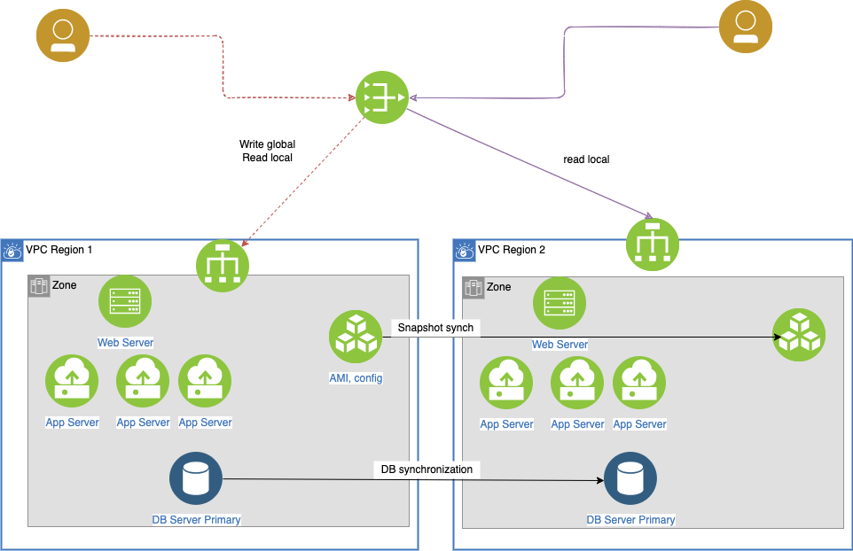
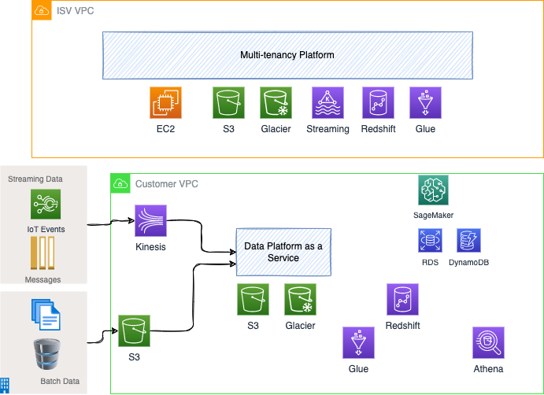

# Solution design with AWS services

This section presents some example of SA designs.

## What Time App Deployment

* Starting simple with one EC2 and the webapp deployed on it. Upgrading the EC2 instance type, brings the webapp down. Use Elastic IP address so client keep IP @.

    

???- "Note"
    Recall that you need to be able to SSH to the EC2 instance, install Java or Python or nodejs, scp the tar of you app to the linux EC2 /home/users or somewhere else. Do not forget to use the .pem file downloaded when creating the EC2. `scp -i ec2host.pem ...`

* But to be more efficient we can add a DNS domain and subdomain with Route 53 records, two ELBs with Health Checks, one per AZ, restricted security groups and public and private subnets, auto scaling group, and may be use one reserved EC2 instance per AZ to reduce long term cost.

    

## Disaster Recovery Solution

We try to address disaster and recovery for different needs, knowing that not all applications need active/active deployment.

### Backup multi-regions

The simplest resilience solution is to use backup and restore mechanism. Data and configuration can be moved to S3 in the second region. For even longer time we can use Glacier. Use database service to ensure HA at the zone level, and replicate data within AZ.

RPO will be average time between snapshots - and RTO at the day level.

### Warm region

For applications, where we want to limit out of services time, the approach is to replicate AMI images so app servers, in DR region, can be restarted quickly. And Database are replicated and warm on the second region. Web servers are also warm but not receiving traffic.

If something go down in region 1, the internet facing router (53) will route to local balancers in second region.

RTO is now in minutes, and RPO average time between DB snapshots. 

### Active - Active between multi regions

#### Write global - read local pattern

Users close to one region will read from this region and all write operations go to a global service / region.

Database replications and snapshot replications are done to keep data eventually consistent between regions. Those synchronisations are in sub second.

#### Write to origin - read local pattern

To increase in complexity, R/W can go the local region. So when a user writes new records, he/she is associated to a region, so the application is sharding the data. When the user moved to another region, write operation will still go to the first region, while read could happened on the region close to him.

This applies to applications with write to read ratio around 50%.

#### Write / read local (anti) pattern

This pattern uses two master DB, one in each region so user can write and read locally. Dual writes, in each region, at the same time may generate the same key but record will have different data. 
You have inconsistency, and it is difficult to figure out, and rollback.
So use this pattern only if you cannot do the two previous patterns.

### AWS Services supporting HA and DR multi-regions

* [S3](../../infra/storage/#s3)
* [EBS](../../infra/storage/#amazon-elastic-block-storage-ebs)
* [dynamoDB](../../data/#dynamodb)

## SaaS deployment for an ISV

See also [SaaS considerations](./saas.md).

The ISV provides a data platform to manage data with performance and feature set compare to data warehouse but at the scale and low cost of data lake. 
On top of the data their platform helps to develop ML model, visualize data and build integrate view of distributed, structured and unstructured data.

They developed a multi-tenancy SaaS platform to manage their customer deployments. Customers will create instance of this managed service in their own VPC and integrate with their own data source and data pipeline, to organize this data processing into data ingestion, data engineering, serving layer and analytics. Part of their platform is also to provide easy integration into AWS data services like Kinesis, S3, RDS, Redshift…
This ISV is gathering data from the customer usage of their platform, get real time metrics, and manage all this in the AWS cloud using existing managed services as S3, Glacier for long persistence, streaming, redshift,…

* [Kinesis]() 