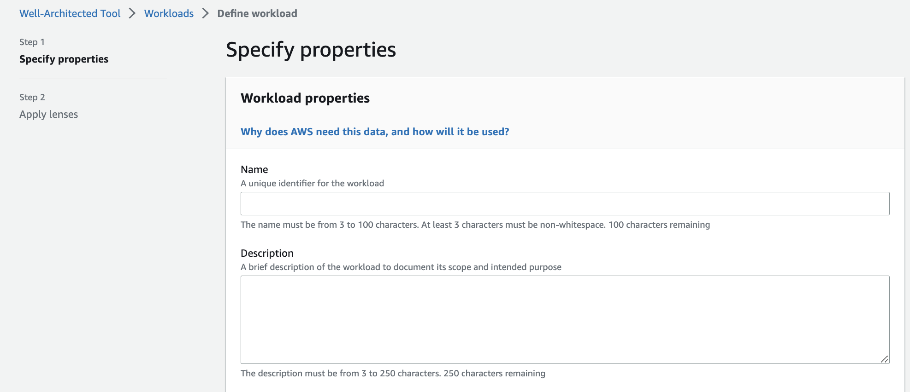
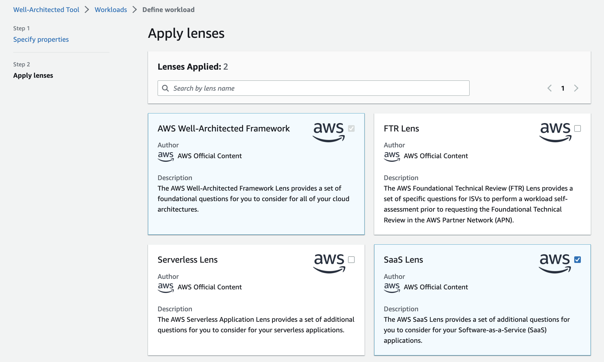

# AWS Well Architectured

The [AWS Well-Architected Framework](https://docs.aws.amazon.com/wellarchitected/latest/framework/welcome.html) helps you understand the pros and cons of decisions you make while building systems on AWS. 

By using the Framework, customers will learn architectural best practices for designing and operating reliable, secure, efficient, and cost-effective systems in the cloud.

Those are the questions to ask for designing a cloud native solution by understanding the potential impact . All hardware are becoming software.

**Workload** represents interrelated applications, infrastructure, policies, governance and operations. 

## Six pilards

When architecting technology solutions, never neglect the six pillars of:

* [Operational Excellence](#operational-excellence)
* [Security](#security)
* [Reliability](#reliability)
* [Performance Efficiency](#performance-efficiency)
* [Cost Optimization](#cost-optimization)
* [Sustainability](#sustainability)

## Design Principles

* **Stop guessing your capacity needs**: use as much or as little capacity as you need, and scale up and down automatically.
* **Test systems at production scale**, then decommission the resources. 
* **Automate to make architectural experimentation easier**.
* **Allow for evolutionary architectures**: the capability to automate and test on demand lowers the risk of impact from design changes. This allows systems to evolve over time so that businesses can take advantage of innovations as a standard practice.
* **Drive architectures using data**: In the cloud, you can collect data on how your architectural choices affect the behavior of your workload. This lets you make fact-based decisions on how to improve your workload.
* **Improve through game days** to simulate events in production. This will help you understand where improvements can be made and can help develop organizational experience in dealing with events.

### Jumpstart an assessment

In AWS console, search for `well architected`.

With Lenses to define a set of question to ask.

### Operational Excellence

Support development and run workloads effectively, gain insight into their operations, and to continuously improve supporting processes and procedures. 

Four area of focus:

* **Organization**: define clear responsabilities, roles, and success interdependencies.
* **Prepare**: design telemetry (logs, metrics...), improve flow, mitigate deployment risks, understand operational readiness.
* **Operate**: understand workload health, operation health, achievement of business outcome. Runbooks and playbooks should define escalation process, and define owneship for each action.
* **Evolve**: learn from experience, make improvements, share with teams.

**Design principles:**

* Perform operations as code.
* Make frequent, small, reversible changes.
* Refine operations procedures frequently. Set up regular game days to review and validate that all procedures are effective.
* Anticipate failure: Perform “pre-mortem” exercises to identify potential sources of failure so that they can be removed or mitigated. 
* Learn from all operational failures.

Use established runbooks for well-understood events, and use playbooks to aid in investigation and resolution of issues. 

AWS CloudWatch is used to aggregate and present business, workload, and operations level views of operations activities.

#### Assessment

| Questions to assess|
| --- |
| How do you determine what your priorities are? |
| How do you structure your organization to support your business outcomes? | 
| How does your organizational culture support your business outcomes? |
| How do you design your workload so that you can understand its state? | 
| How do you reduce defects, ease remediation, and improve flow into production? |
| How do you mitigate deployment risks? |
| How do you know that you are ready to support a workload? |
| How do you understand the health of your workload? |
| How do you understand the health of your operations? |
| How do you manage workload and operations events? |
| How do you evolve operations? |

#### Deeper dive

* [100 and 200 labs](https://www.wellarchitectedlabs.com/operational-excellence/)

### Security

Emcompass the ability to protect data, systems and assets by controlling access and get visibility on who does what.

* Design principles

    * Apply security at all layers
    * Automate security best practices
    * Protect data in transit and at rest

| Questions to assess|
| --- |
| How do you manage identities for people and machines? |
| How do you manage permissions for people and machines? |
| How do you detect and investigate security events? |
| How do you protect your network resources? | 
| How do you protect your compute resources? |
| How do you classify your data? |
| How do you protect your data at rest? |
| How do you protect your data in transit? |
| How do you anticipate, respond to, and recover from incidents? |

CloudTrail logs, AWS API calls, and CloudWatch provide monitoring of metrics with alarming, and AWS Config provides configuration history. 

Ensure that you have a way to quickly grant access for your security team, and automate the isolation of instances as well as the capturing of data and state for forensics.

### Reliability

The ability of a workload to perform its intended function correctly and *consistently*. Reliability requires that your workload be aware of failures as they occur and take action to avoid impact on availability. Workloads must be able to both withstand failures and automatically repair issues.

* Design principles:

    * Automatically recover from failure
    * Test recovery procedures
    * Scale horizontally to increase aggregate workload availability
    * Stop guessing capacity: monitor demand and workload utilization, and automate the addition or removal of resources to maintain the optimal level to satisfy demand without over- or under-provisioning
    * Manage change in automation

Before architecting any system, define foundational requirements that influence reliability:

| Questions to assess| Comments |
| --- | --- |
| How do you manage service quotas and constraints? | |
| How do you plan your network topology? | |
| How do you design your workload service architecture? | |
| How do you design interactions in a distributed system to prevent failures? | Search to improve mean time between failures (MTBF) |
| How do you design interactions in a distributed system to mitigate or withstand failures? | Look to improve mean time to recovery (MTTR) |
| How do you monitor workload resources? | Monitor Logs and metrics |
| How do you design your workload to adapt to changes in demand? |  Add or remove resources automatically to adapt to the demand |
| How do you implement change? |  Controlled changes to deploy new feature, patched or replaced in a predictable manner | 
| How do you back up data? | Helps to address [RTO and RPO](https://jbcodeforce.github.io/architecture/DR/#concepts) |
| How do you use fault isolation to protect your workload? | Components outside of the boundary should not be affected by the failure. |
| How do you design your workload to withstand component failures? | | 
| How do you test reliability? | testing is the only way to ensure that it will operate as designed |
| How do you plan for disaster recovery (DR)? | Regularly back up your data and test your backup files to ensure that you can recover from both logical and physical errors |

Use AZ, regions and bulkhead (elements of an application are isolated into pools so that if one fails, the others will continue to function)

* [Lab from AWS](https://www.wellarchitectedlabs.com/reliability/)

### Performance efficiency

Use computing resources efficiently to meet system requirements, and to maintain that efficiency as demand changes and technologies evolve.

* Design principles:

    * Democratize advanced technologies: delegate to your cloud vendor.
    * Go global in minutes
    * Use serverless architectures
    * Experiment more often
    * Consider mechanical sympathy: always use the technology approach that aligns best with your workload goal

In AWS, compute is available in three forms: instances, containers, and functions. Storage is available in three forms: object, block, and file. Databases include relational, key-value, document, in-memory, graph, time series, and ledger databases.

| Questions to assess| Comments |
| --- | --- |
| How do you select the best performing architecture? | Use a data-driven approach to select the patterns and implementation for your architecture and achieve a cost effective solution. |
| How do you select your compute solution? | Varies based on application design, usage patterns, and configuration settings |
| How do you select your storage solution? | The optimal storage solution for a system varies based on the kind of access method (block, file, or object), patterns of access (random or sequential), required throughput, frequency of access (online, offline, archival), frequency of update (WORM, dynamic), and availability and durability constraints |
| How do you select your database solution? | Consider requirements for availability, consistency, partition tolerance, latency, durability, scalability, and query capability | 
| How do you configure your networking solution? | varies based on latency, throughput requirements, jitter, and bandwidth |
| How do you evolve your workload to take advantage of new releases? | |
| How do you monitor your resources to ensure they are performing? | |
| How do you use tradeoffs to improve performance? |  improve performance by trading consistency, durability, and space for time and latency. |

Amazon **CloudWatch** is a monitoring and observability service that provides you with data and actionable insights to monitor your workload, respond to system-wide performance changes, optimize resource utilization, and get a unified view of operational health

AWS [cloudformation](https://aws.amazon.com/cloudformation/) to define infrastructure as code.

### Cost optimization

Run systems to deliver business value at the lowest price point possible.

* Design principles:

    * Implement Cloud Financial Management practices / team
    * Adopt a concumption model
    * Measure overall efficiency: Measure the business output of the workload and the costs associated with delivering it
    * Stop spending mone on undifferentiated heavy lifting

| Questions to assess| Comments |
| --- | --- |
| How do you govern usage? | | 
| How do you monitor usage and cost? | |
| How do you decommission resources? | |
| How do you evaluate cost when you select services? | Trade off between low level service like EC2, S3, EBS versus higher level like DynamoDB | 
| How do you meet cost targets when you select resource type, size and number? | |
| How do you plan for data transfer charges? | | 

 As your requirements change, be aggressive in decommissioning resources, entire services, and systems that you no longer require.

### Sustainability

Focuses on environmental impacts, especially energy consumption and efficiency.

 * Scale infrastructure to continually match user load and ensure that only the minimum resources required to support users are deployed
 * identify redundancy, underutilization, and potential decommission targets
 * Implement patterns for performing load smoothing and maintaining consistent high utilization of deployed resources to minimize the resources consumed. 
 * Monitor workload activity to identify application components that consume the most resources.
 * Understand how data is used within your workload, consumed by your users, transferred, and stored.
 * Lifecycle data to more efficient, less performant storage when requirements decrease, and delete data that’s no longer required.
 * Adopt shared storage and single sources of truth to avoid data duplication and reduce the total storage requirements of your workload
 * Back up data only when difficult to recreate
 * Minimize the amount of hardware needed to provision and deploy
 * Use automation and infrastructure as code to bring pre-production environments up when needed and take them down when not used.

## More readings

* [system design exercices using AWS services](https://jbcodeforce.github.io/architecture/system-design/)
* [Disaster Recovery AWS](https://aws.amazon.com/disaster-recovery/)