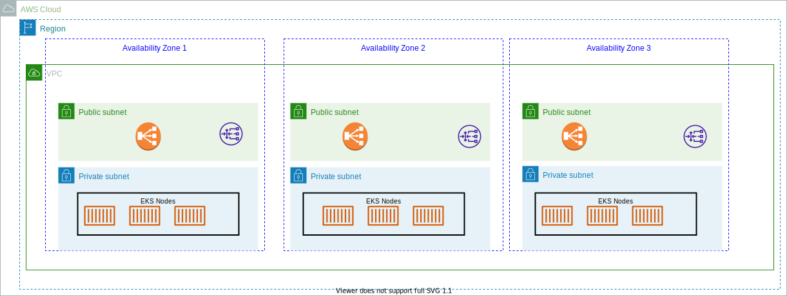

# Elastic Kubernetes Service

[Amazon EKS](https://aws.amazon.com/eks/) is a fully managed Kubernetes service. It supports EC2 to deploy worker nodes or Fargate to deploy serverless containers. 



The EKS node types are:

* managed node groups: EC2 (could be On-demand or spot instances) created by you, assigned to a ASG managed by EKS. 
* self-managed nodes: nodes created by you and attached to EKS cluster by an ASG.
* AWS Fargate, which represents a cost optimized deployment for EKS worker nodes.

Data volumes (EBS, EFS, FSx) are defined with StorageClass and they need to have Container Storage Interface compliant driver.

## ECS comparisons

* An EC2 instance with the ECS agent installed and configured is called a container instance. In Amazon EKS, it is called a worker node.
* An ECS container is called a task. In Amazon EKS, it is called a pod.
* While Amazon ECS runs on AWS native technology, Amazon EKS runs on top of Kubernetes.

## What to do the first time

1. Download `eksctl` ([eksctl.io](https://github.com/weaveworks/eksctl)). (it installs kubectl)

    ```sh
    brew tap weaveworks/tap
    brew install weaveworks/tap/eksctl
    ```

1. Be sure to have a EC2 key pair, if not create one with

    ```sh
    aws ec2 create-key-pair --region us-west-2 --key-name myKeyPair
    ```

1. Create IAM Role with EKS Cluster role and attach the required Amazon EKS IAM managed policy to it. Kubernetes clusters managed by Amazon EKS make calls to other AWS services on your behalf to manage the resources that you use with the service.

    ```sh
    # under the folder labs/eks
    aws iam create-role \
        --role-name myAmazonEKSClusterRole \
        --assume-role-policy-document file://"eks-cluster-role-trust-policy.json"
    # Attach the required Amazon EKS managed IAM policy to the role.
    aws iam attach-role-policy \
        --policy-arn arn:aws:iam::aws:policy/AmazonEKSClusterPolicy \
        --role-name myAmazonEKSClusterRole
    ```

## Working with cluster

1. Create cluster to be deployed on EC2, in a VPC, subnets, and security groups. It can be done with different ways:

    * Using cloudformation: 
    
    ```sh
    aws cloudformation create-stack \
        --region us-west-2 \
        --stack-name my-eks-vpc-stack \
        --template-url https://s3.us-west-2.amazonaws.com/amazon-eks/cloudformation/2020-10-29/amazon-eks-vpc-private-subnets.yaml
    ```

    * Using `eksctl`:

    ```sh
    eksctl create cluster \
        --name my-cluster \
        --region us-west-2 \
        --with-oidc \
        --ssh-access \
        --ssh-public-key myKeyPair \
        --instance-types=m5.xlarge \
        --managed
    ```

    Find cluster credentials were added in ~/.kube/config

1. As an alternate, create Fargate profile to declare which pods run on Fargate. 

    * [see instructions](https://docs.aws.amazon.com/eks/latest/userguide/fargate-getting-started.html). 
    * Fargate profiles are associated to namespaces. 
    * Only private subnets are supported for pods that are running on Fargate. 
    * Pods that match a selector are scheduled on Fargate. 
    * Kubernetes affinity/anti-affinity rules do not apply and aren't necessary with Amazon EKS Fargate pod.

1. Verify nodes and pods

    ```sh
    kubectl get nodes -o wide
    # 
    kubectl get pods --all-namespaces -o wide
    ```

1. Add resources like node group, with IAM role of WorkerNode 


### Delete cluster

* List all services

```sh
kubectl get svc --all-namespaces
```

* Delete any services that have an associated EXTERNAL-IP value. These services are fronted by an Elastic Load Balancing load balancer, and you must delete them in Kubernetes to allow the load balancer and associated resources to be properly released.

```sh
kubectl delete svc <service-name>
```

* Delete the cluster

```sh
estctl delete cluster --name <cluster name>
```