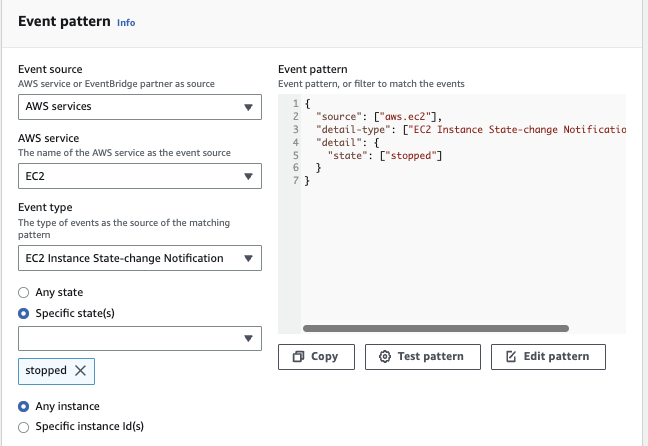

# EventBridge

[Amazon EventBridge](https://aws.amazon.com/eventbridge/) is a serverless event bus service (Formerly CloudWatch Event), which can send message to Lambda functions, SQS, SNS based on rules. The new marketing positioning is: EventBridge is a service for building scalable event-driven applications, enabling highly agile software development via fully managed and secure integrations, cutting costs and reducing time to production.

By default there is an EventBridge event hub already created.

We can ingest, filter, transform and deliver events without writing custom code. 

The following figure illustrates the typical source of events and how EventBridge can process them and send JSON to different sinks. Filtering logic may be applied.

We can also integrate to Partners SaaS services like Datadog, Zendeck. We can define our own custom app to integrate with the Event bus. We can also archive events to be able to replay them.

* When creating rules (See when EC2 is stopped)

    

* we can use a sandbox feature to test the event type we want to work on 

    

* and define and test the rule.

    

* then specify the target, for example a SNS topic.

    

It can infer the data schema from the event as source, and use a SchemaRegistry. The SchemaRegitry will help generate code for our applications. 

From this schema definition, in OpenAPI 2.0 format, we can get code sample to get rhe definition of the events and the marshalizer. 

In term of solution design, we can define a central event based to aggregate all the events from AWS Organizations in a single AWS account or region. Apps in different accounts can be authorized to send event to this central hub via resource-based policy.

* [Tutorial](https://docs.aws.amazon.com/eventbridge/latest/userguide/eb-tutorial.html)
* [Amazon EventBridge CDK Construct Library Event ](https://docs.aws.amazon.com/cdk/api/v2/docs/aws-cdk-lib.aws_events-readme.html)
