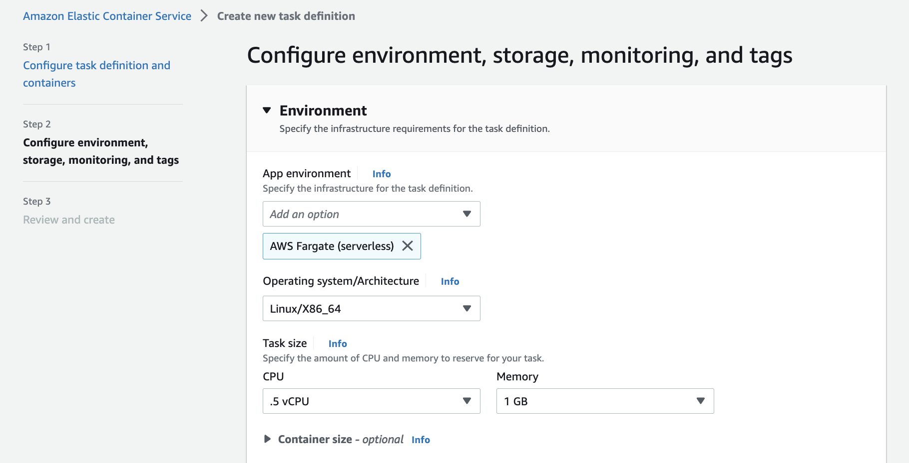
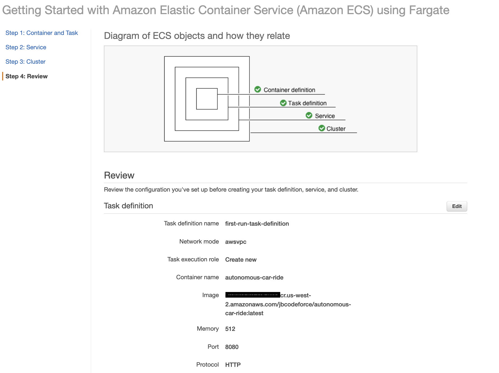
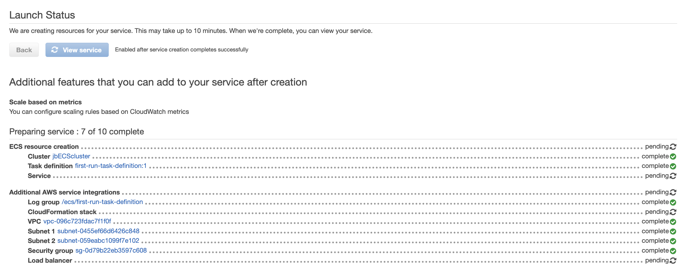

# Serverless

Serverless would optimize for getting to market quickly, would remove the most amount of undifferentiated heavy lifting and allow dev teams to move as quickly as possible. 

## Container

A container is a standardized unit that packages your code and its dependencies. This package is designed to run reliably on any platform, because the container creates its own independent environment

The difference between containers and virtual machines (VMs) can be illustrated by the following figure:

{ width=700 }

In AWS, containers run on EC2 instances. For example, you might have a large instance and run a few containers on that instance. While running one instance is easy to manage, it lacks high availability and scalability. Most companies and organizations run many containers on many EC2 instances across several Availability Zones

## Amazon Elastic Container Service (Amazon ECS)

[Amazon ECS](https://aws.amazon.com/ecs/) is an end-to-end container orchestration service that helps you spin up new containers and manages them across a cluster of EC2 instances, without managing a control plane.
It maintains application availability and allows you to scale your containers up or down to meet your application's capacity requirements.

Integrated with familiar features like Elastic Load Balancing, EBS volumes, VPC, and IAM. Simple APIs let you integrate and use your own schedulers or connect Amazon ECS into your existing software delivery process.

It is possible to run container into two modes: EC2 or Fargate. For EC2 we can create those instances upfront or use an auto scaling group and start instances. We need to install the Amazon ECS container agent on each EC2 instances, the docker engine, and manage the EC2 ourselves...

{ width=500 }

With Fargate, as a serverless approach, only specifying container configuration, services... are needed.

{ width=500 }

It is possible to have Fargate and EC2 auto scaling group inside your ECS cluster.

ECS with EC2 launch type is charged based on EC2 instances and EBS volumes used. ECS with Fargate launch type is charged based on vCPU and memory resources that the containerized application requests.

The container is run by defining Task and Service. Here is task definition example, which includes capacity and the docker image reference:

Running the task, creates a Service (we can also define the service and deploy it):

[See demo for NGInx for detailed configuration](../playground/ecs.md)

1. Create a task definition: Specify the container images, environment variables and any resources configurations... Add a Application Load Balancer. The task definition is a text file, in JSON format, that describes one or more containers. 
1. First we create cluster: it is a regional grouping of container instances. Cluster may have one to many EC2 instances. Try to use Fargate as runtime engine.

    

    With all the resources created automatically:

    
    
    It creates a VPC with two public subnets.

    Task definitions can be defined outside of a cluster, but services are associating task to cluster, subnets, security groups...

### Service Auto Scaling

ECS service auto scaling helps to automatically increase/decrease ECS task number. It uses AWS Application Auto Scaling which specifies the service usage in term of CPU, memory and request count per target.

There are 3 ways  to define scaling rules:

* Target Tracking, based on value for a specific CloudWatch metric.
* Step Scaling, based on CloudWatch Alarm.
* Scheduled Scaling, based on a specified date/time.

### Others 

* IAM Roles are defined for each container. Other role can be added to access ECS, ECR, S3, CloudWatch, ...
* EC2 Instance Profile is the IAM Role used by the ECS Agent on the EC2 instance to execute ECS-specific actions such as pulling Docker images from ECR and storing the container logs into CloudWatch Logs
* ECS Task Role is the IAM Role used by the ECS task itself. Use when your container wants to call other AWS services like S3, SQS, etc.
* Event Brige can define a rule to run a ECS task.
* See also [ecs anywhere](https://press.aboutamazon.com/news-releases/news-release-details/aws-announces-general-availability-amazon-ecs-anywhere)

 

## [Fargate](https://aws.amazon.com/fargate/)

When running ECS and EKS on EC2, we are still responsible for maintaining the underlying EC2 instances. With Fargates we do no have to manage EC2 instances.

AWS Fargate is a purpose-built serverless compute engine for containers. Fargate scales and manages the infrastructure, it removes the need to provision and manage servers, let you specify and pay for resources per application, and improves security through application isolation by design.

It natively integrates with AWS Identity and Access Management (IAM) and Amazon Virtual Private Cloud (VPC).

It uses the following constructs:

* **Task Definition**: to define application containers, image URL, CPU and memory needed... It is immutable, so any update creates new version. It can define 1 to 10 container definitions. The container definition part includes memory reservation and cpu allocation. 
* **Task**: A running instance of a Task Definition. A task can have multiple containers running in parallel. Each task has its own Elastic Network Interface with a private IP @ from the subnet.
* **Cluster**: infrastructure isolation boundary. Tasks run in the cluster. 
* **Service**: Endpoint to support ELB integration and do mapping to tasks

**Pricing** is based on what you provision, then the task level CPU and memory and the per-second billing with one minute minimum.

To share data between containers, Fargate provides 4 GB volumes space per task, and the volume is mounted in the container.

For IAM security, the same policies can be set as we do on EC2. We still need to add an `execution role` to define access to ECR to download images and CloudWatch for monitoring.

## Step function

AWS Step Functions is a fully managed service that you can use to coordinate the components of distributed applications and microservices using visual workflows. You build small applications that each perform a discrete function (or step) in your workflow, which means that you can scale and change your applications quickly.

## AWS Elastic Beanstalk

With Elastic Beanstalk, developers upload their application. Then, Elastic Beanstalk automatically handles the deployment details of capacity provisioning, load balancing, auto-scaling, and application health monitoring.

## [AWS App runner](https://aws.amazon.com/apprunner/)

AWS App Runner, a fully managed container application service that makes it easy for customers without any prior containers or infrastructure experience to build, deploy, and run containerized web applications and APIs 

## Amazon Lightsail

Lightsail is a VPS provider and is a useful way to get started with AWS for users who need a solution to build and host their applications on AWS Cloud.
Lightsail provides developers with compute, storage, and networking capacity and capabilities to deploy and manage websites and web applications in the cloud. Lightsail includes VMs, containers, databases, content delivery network (CDN), load balancers, Domain Name System (DNS) management,

## Read more

[10 Things Serverless Architects Should Know](https://aws.amazon.com/blogs/architecture/ten-things-serverless-architects-should-know/)

