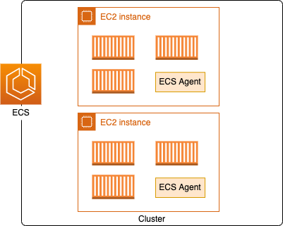

# Serverless

Serverless would optimize for getting to market quickly, would remove the most amount of undifferentiated heavy lifting and allow dev teams to move as quickly as possible. 

## Container

A container is a standardized unit that packages your code and its dependencies. This package is designed to run reliably on any platform, because the container creates its own independent environment

The difference between containers and virtual machines (VMs) can be illustrated by the following figure:

{ width=700 }

In AWS, containers run on EC2 instances. For example, you might have a large instance and run a few containers on that instance. While running one instance is easy to manage, it lacks high availability and scalability. Most companies and organizations run many containers on many EC2 instances across several Availability Zones

## Amazon Elastic Container Service (Amazon ECS)

[Amazon ECS](https://aws.amazon.com/ecs/) is an end-to-end container orchestration service that helps you spin up new containers and manages them across a cluster of EC2 instances.

To run and manage your containers, you need to install the Amazon ECS container agent on your EC2 instances.

{ width=600 }

To prepare your application to run on Amazon ECS, you create a task definition. The task definition is a text file, in JSON format, that describes one or more containers. 

Apply docker compose to Amazon ECS and Fargate

See also [ecs anywhere](https://press.aboutamazon.com/news-releases/news-release-details/aws-announces-general-availability-amazon-ecs-anywhere)

## EKS

[Amazon EKS](https://aws.amazon.com/eks/) is a fully managed Kubernetes service. 

* An EC2 instance with the ECS agent installed and configured is called a container instance. In Amazon EKS, it is called a worker node.
* An ECS container is called a task. In Amazon EKS, it is called a pod.
* While Amazon ECS runs on AWS native technology, Amazon EKS runs on top of Kubernetes.

## Fargate

When running ECS and EKS on EC2, you are still responsible for maintaining the underlying EC2 instances. With Fargates we do no have to manage EC2 instances.

AWS Fargate is a purpose-built serverless compute engine for containers. Fargate scales and manages the infrastructure, it removes the need to provision and manage servers, let you specify and pay for resources per application, and improves security through application isolation by design.

It natively integrates with AWS Identity and Access Management (IAM) and Amazon Virtual Private Cloud (VPC).

It uses the following constructs:

* **Task Definition**: to define application containers, image URL, CPU and memory needed... It is immutable, so any update creates new version. It can define 1 to 10 container definitions. The container definition part includes memory reservation and cpu allocation. 
* **Task**: A running instance of a Task Definition. A task can have multiple containers running in parallel. Each task has its own Elastic Network Interface with a private IP @ from the subnet.
* **Cluster**: infrastructure isolation boundary. Tasks run in the cluster. 
* **Service**: Endpoint to support ELB integration and do mapping to tasks

**Pricing** is based on what you provision, then the task level CPU and memory and the per-second billing with one minute minimum.

To share data between containers, Fargate provides 4 GB volumes space per task, and the volume is mounted in the container.

For IAM security, the same policies can be set as we do on EC2. We still need to add an `execution role` to define access to ECR to download images and CloudWatch for monitoring.

## Step function

AWS Step Functions is a fully managed service that you can use to coordinate the components of distributed applications and microservices using visual workflows. You build small applications that each perform a discrete function (or step) in your workflow, which means that you can scale and change your applications quickly.

## AWS Elastic Beanstalk

With Elastic Beanstalk, developers upload their application. Then, Elastic Beanstalk automatically handles the deployment details of capacity provisioning, load balancing, auto-scaling, and application health monitoring.

## Amazon Lightsail

Lightsail is a VPS provider and is a useful way to get started with AWS for users who need a solution to build and host their applications on AWS Cloud.
Lightsail provides developers with compute, storage, and networking capacity and capabilities to deploy and manage websites and web applications in the cloud. Lightsail includes VMs, containers, databases, content delivery network (CDN), load balancers, Domain Name System (DNS) management,

## Read more

[10 Things Serverless Architects Should Know](https://aws.amazon.com/blogs/architecture/ten-things-serverless-architects-should-know/)

