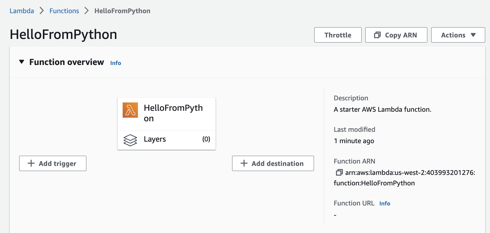
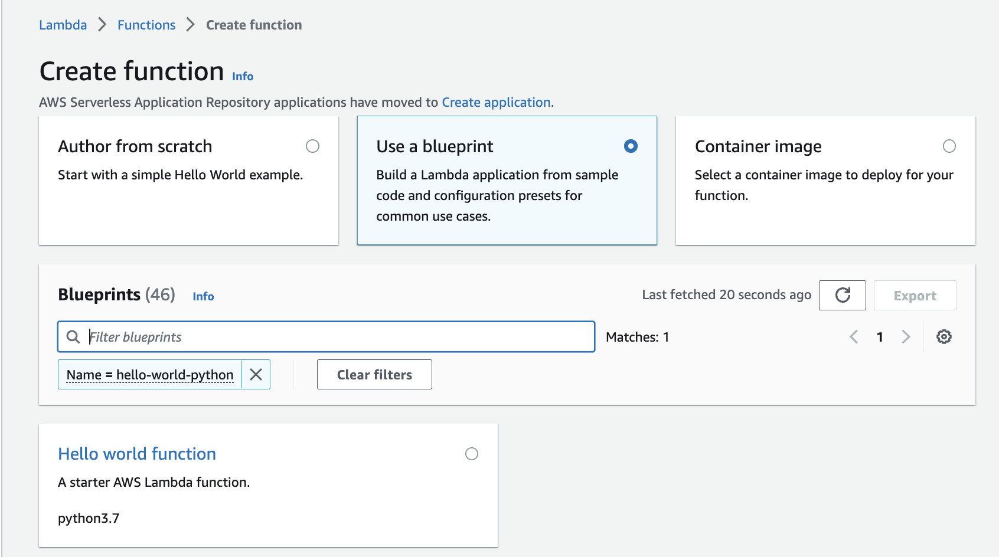
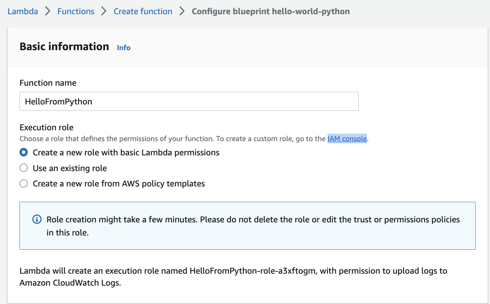
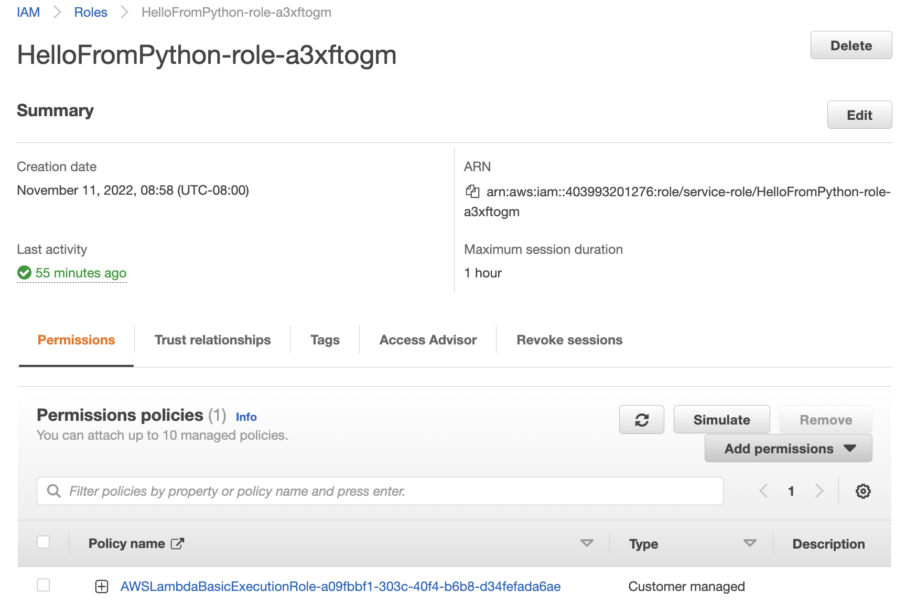

# Lambda

With AWS Lambda, we can run code without provisioning or managing servers or containers.

Upload the source code, and Lambda takes care of everything required to run and scale the code with high availability.

* [Getting started tutorial with free tier](https://aws.amazon.com/getting-started/hands-on/run-serverless-code/)

A  Lambda function has three primary components – trigger, code, and configuration.

* Triggers describe when a Lambda function should run. A trigger integrates the Lambda function with other AWS services, enabling us to run our Lambda function in response to certain API calls that occur in our AWS account.
* Configuration includes compute resources, execution timeout, IAM roles (lambda_basic_execution)...
* Code: Java, Node.js, C#, Go, or Python
* Pay only for what we use: # of requests and CPU time.
* Lambda functions always operate from an AWS-owned VPC. By default, the function has the full ability to make network requests to any public internet address — this includes access to any of the public AWS APIs. Only enable our functions to run inside the context of a private subnet in our VPC, when we need to interact with a private resource located in a private subnet.
* AWS Lambda automatically monitors Lambda functions and reports metrics through Amazon CloudWatch. To help us monitoring the code as it executes, Lambda automatically tracks the number of requests, the latency per request, and the number of requests resulting in an error and publishes the associated metrics.  We can leverage these metrics to set custom alarms.
* To reuse code in more than one function, consider creating a Layer and deploying it there. A layer is a ZIP archive that contains libraries, a custom runtime, or other dependencies.

## Criteria to use lambda.

* Per region deployment.
* Must run under 15 min.
* Memory from 128MB to 10GB.
* 100 concurrent calls.
* Code in compressed zip should be under 50MB and 250MB uncompressed.
* Disk capacity for /tmp is limited to 10GB.

## Hands-on

* Can start from a blueprint

    

* To get the function to upload logs to cloudWatch, select an existing role, or create a new one
    
    

    Here the example of role created

    

* Add the code as an implementation of an handler function:

    

* Create a test event (a request) and run the test and get the resources and logs output.

    

* Verify configuration and monitoring.

## Edge Function

When we need to customize the CDN content, we can use Edge Function to run close to the end users. 

CloudFront provides two types: CloudFront functions or Lambda@Edge.

Can be used for:

* Website security and privacy.
* Dynamic web application at the Edge.
* Search engine optimization (SEO).
* Intelligently route across origins and data centers.
* Bot mitigation at the Edge.
* Real-time image transformation.
* User authentication and authorization.

## More reading

* [Using an Amazon S3 trigger to invoke a Lambda function](https://docs.aws.amazon.com/lambda/latest/dg/with-s3-example.html).
* [Tutorial: Resize Images on the Fly with Amazon S3, AWS Lambda, and Amazon API Gateway](https://aws.amazon.com/blogs/compute/resize-images-on-the-fly-with-amazon-s3-aws-lambda-and-amazon-api-gateway/).
* [Best Practices for Developing on AWS Lambda](https://aws.amazon.com/blogs/architecture/best-practices-for-developing-on-aws-lambda/).