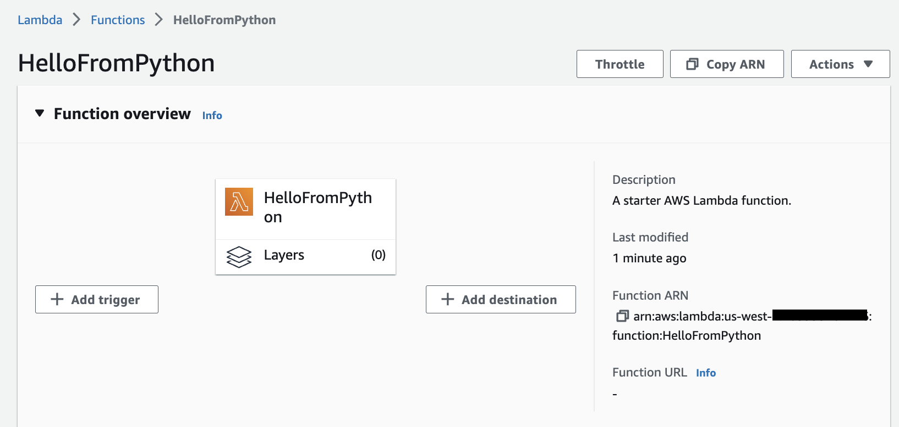
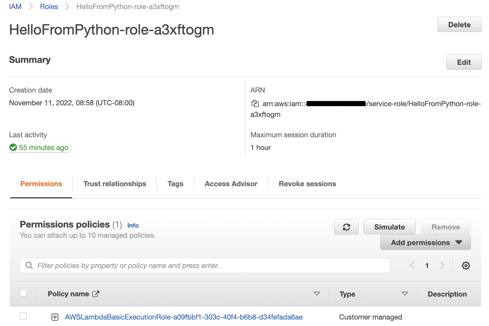
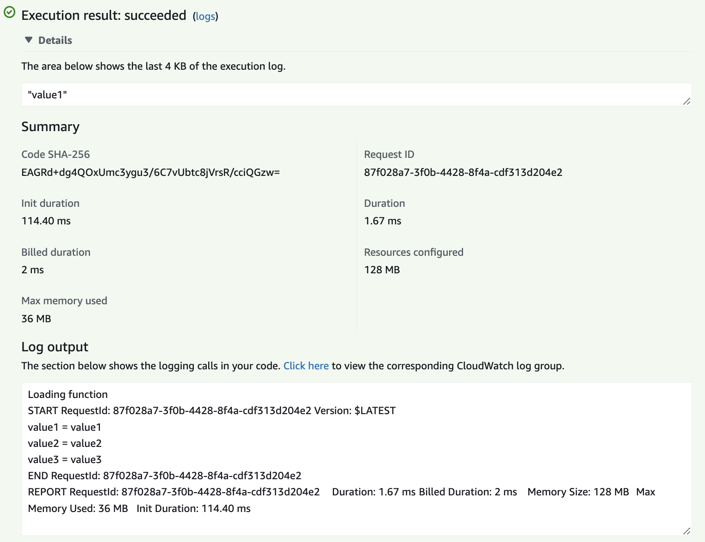

# Lambda

AWS Lambda, you can run code without provisioning or managing servers or containers.

Upload your source code, and Lambda takes care of everything required to run and scale your code with high availability.

* [Getting started tutorial with free tier](https://aws.amazon.com/getting-started/hands-on/run-serverless-code/)

A  Lambda function has three primary components – trigger, code, and configuration.

* Triggers describe when a Lambda function should run. A trigger integrates your Lambda function with other AWS services, enabling you to run your Lambda function in response to certain API calls that occur in your AWS account.
* Configuration includes compute resources, execution timeout, IAM roles (lambda_basic_execution)...
* Code: Java, Node.js, C#, Go, or Python

You pay only for what you use: # of requests and CPU time.

AWS Lambda automatically monitors Lambda functions and reports metrics through Amazon CloudWatch. To help you monitor your code as it executes, Lambda automatically tracks the number of requests, the latency per request, and the number of requests resulting in an error and publishes the associated metrics.  You can leverage these metrics to set custom alarms.

## Criteria to use lambda.

* per region deployment
* must run under 15 min
* memory from 128MB to !0G
* 100 concurrent calls
* code in compressed zip should be under 50MB and 250MB uncompressed.
* disk capacity for /tmp is limited to 10GB

## Hands-on

* Can start from a blueprint

    

* To get the function to upload logs to cloudWatch, select an existing role, or create a new one
    
    

    Here the example of role created

    

* Add your code as an implementation of an handler function:

    

* Create a test event (a request) and run the test and get the resources and logs output.

    

* Verify configuration and monitoring.

## Edge Function

When we need to customize the CDN content, we can use Edge Function to run close to the end users. 

CloudFront provides two types: CloudFront functions or Lambda@Edge.

Can be used for:

* website security and privacy
* dynamic web application at the Edge
* search engine optimization (SEO)
* intelligently route across origins and data centers
* bot mitigation at the Edge

## More reading

* [Using an Amazon S3 trigger to invoke a Lambda function](https://docs.aws.amazon.com/lambda/latest/dg/with-s3-example.html)
* [Tutorial: Resize Images on the Fly with Amazon S3, AWS Lambda, and Amazon API Gateway](https://aws.amazon.com/blogs/compute/resize-images-on-the-fly-with-amazon-s3-aws-lambda-and-amazon-api-gateway/)