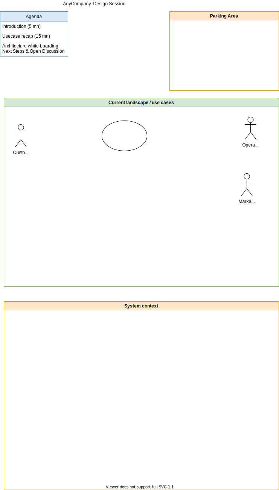

# Templates to drive some architecture and design discussions

## Whiteboard best practices

* Complement the discussion with diagrams, flows, and more engaging with participants.
* Discovery and collaborate on a one of a kind solution that the participants own.
* Take care of time management (segmentation of the agenda and what needs to be addressed )and space management (name section of the whiteboard, use 25% (agenda), 50% (main), 25% (takeaways) sections). BE PREPARE. 
* Example of sections: topics, takeaways, next steps (action for me and then action for customer)
* Brings your own supplies: markers, eraser..
* Use Uppercase, limit color
* Apply the technique of `Touch, Turn, Talk`
* Be sure to ask a participant if she/he is confortable to draw and go to the whiteboard.
* Do not assume you can keep the content of the whiteboard with a photo. Ask permission.
* For diagramming:

    * Focusing on core elements
    * Labeling elements by function, not service name
    * Asking before erasing (or using alternative methods like strikethrough or an X)
    * Planning iconography in advance

## Discover architecture requirements

This is a simple agenda, parking lots, use cases and system context map in one drawio.

